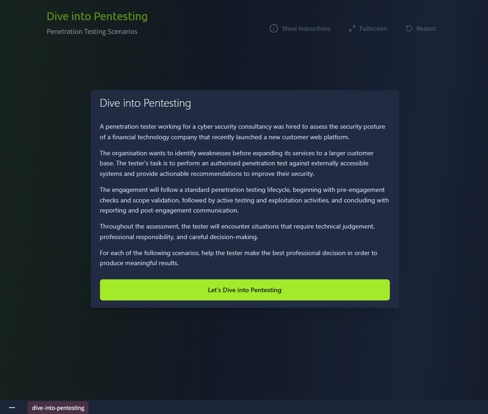
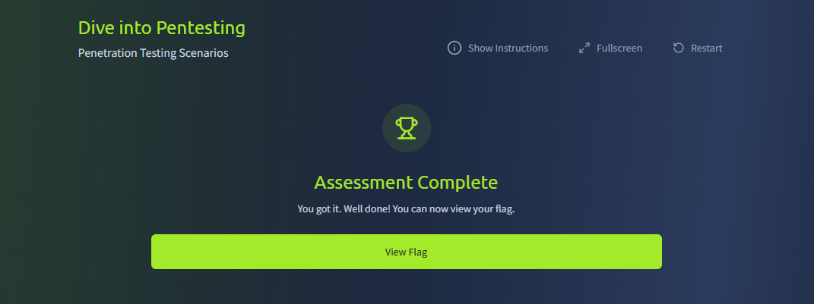

# :material-pound: Dive Into Pentesting

:material-shield-star-outline: **Path:** Jr Penetration Tester > Penetration Testing Foundations > Dive Into Pentesting

:material-calendar-month-outline: **Date:** 22-28/07/2026

:material-signal-cellular-1: **Difficulty:** Easy (THM) / Very easy (me)

---

!!! quicklinks "Quick Links"

    - [:simple-tryhackme: Dive Into Pentesting](https://tryhackme.com/room/diveintopentesting)

## :material-clipboard-text-outline: What this room covers { data-toc-label="What this room covers" }

This room covers penetration testing as a security practice and what sets it apart from malicious hacking, the main focus areas of web application and network pentesting, and the relationship between vulnerability, threat and risk.

## :material-laptop: What I did / learned { data-toc-label="What I did / learned" }

### Penetration Testing vs Malicious Hacking

The core factors that separate a penetration tester from a malicious attacker are authorisation, scope, coverage and responsibility.

A pentester works only with authorisation, stays inside a defined scope, aims for broad coverage across a system, and is accountable for their actions and their impact.

A malicious attacker does none of that: no authorisation, no scope limits, no interest in broad coverage (they just want the easiest path in), and no accountability for the damage they cause.

### Web Application Penetration Testing

Web app pentesting looks for gaps and weaknesses in a web application. It's usually done from a user's perspective, poking at the app's UI and APIs to see how it handles input, authentication, authorisation, sessions and data. The main areas assessed:

_Authentication_{ .sj-lead } how the app handles credentials: password policy, account lockout, MFA, resistance to brute-force and credential stuffing, the password-reset flow, and the login logic overall.

_Authorisation_{ .sj-lead } whether access controls hold up, and whether the app resists vertical and horizontal privilege escalation.

_Session management_{ .sj-lead } how sessions are created, kept and ended: fixation risks, proper invalidation on logout, idle timeouts, secure cookie attributes, and CSRF protection.

_Input and output validation_{ .sj-lead } how safely the app handles data: injection protection, data-type validation, and output handling.

_Security configuration_{ .sj-lead } gaps in server and app config: security headers, error handling, rate limiting, crypto settings, and any unnecessary services or features left exposed.

### Network Penetration Testing

Network pentesting hunts for vulnerabilities in the infrastructure that connects systems together. It can be run from an external or an internal perspective.

External testing starts with little to no inside knowledge of the exposed systems.

- Focus: internet-facing infrastructure, servers, firewalls, VPN gateways, remote-access services.
- Goal: see how exposed those systems are and how well their controls hold off unauthorised users.

Internal testing is an "assumed breach" scenario, where the attacker already has a foothold on the network.

- Focus: what an attacker could do next, moving between systems, escalating privileges, reaching sensitive data.
- Goal: assess trust relationships, access controls and segmentation, and whether the controls actually limit the blast radius of a compromise.

Areas assessed:

_Authentication mechanisms_{ .sj-lead } network-level auth: password policy, MFA enforcement, credential reuse, default credentials, and protection of services like admin portals, VPN, SSH and RDP.

_Authorisation and access controls_{ .sj-lead } network access permissions per role and trust level.

_Network segmentation and trust relationships_{ .sj-lead } trust between users and systems, firewall rules, and isolation controls.

_Configuration and patch management_{ .sj-lead } device and service config: outdated software, insecure defaults, and weak encryption protocols.

### Vulnerability, Threat and Risk

Vulnerability - a weakness in software, systems or configuration (from coding errors, insecure settings or flawed design). On its own it causes no harm; it just creates an opportunity for exploitation.

Threat - any source of danger that could compromise the confidentiality, integrity or availability (CIA) of a system. It can be malicious (cybercriminals, insider threats, automated tools) or non-malicious (system failures, human error, environmental events). These days threat actors also use AI to automate attacks, find weaknesses at scale, and speed up exploitation.

Risk - the potential damage if a threat successfully exploits a vulnerability.

Simplified: Vulnerability × Threat = Risk.

Context is everything when judging risk. A minor-looking vulnerability can be serious if it sits on a critical system, and a scary-looking one can be low risk if it's boxed into an isolated environment.

### Risk Management

Risk management is the ongoing process of finding the risks that matter and applying the right controls to reduce their impact or likelihood. It runs as a cycle:

- Identify - assets, vulnerabilities and threats that could affect the org.
- Analyse - the impact and likelihood of each risk, which sets its severity and priority.
- Mitigate - reduce or control it: patches, tighter access, better config, monitoring, redesigning weak processes.
- Monitor - keep watching so controls stay effective and new risks get caught early.

Not every risk is mitigated. A risk can be accepted when the impact is small and fixing it costs more than it's worth (e.g. an internal-only app exposing its already up-to-date server version), or transferred to a third party (e.g. cyber insurance covering the cost of a breach on a platform holding payment data).

### Why Vulnerabilities Exist

Vulnerabilities come from design, code or config flaws, and from human error:

- Human assumptions - developers aren't always security-aware and assume users will behave as intended (e.g. unrestricted file upload).
- Software bugs - logic mistakes and incomplete validation: the code works as designed but is exploitable (e.g. SQL injection).
- System complexity - misconfigurations in complex environments (APIs, microservices, databases, third-party integrations) open a way in (e.g. an exposed admin API).
- Over-customisation - heavy customisation introduces inconsistencies and gaps; standard, maintainable, patchable setups are safer (e.g. weak authentication).
- Design flaws - security added on late rather than built in from the start (e.g. MFA bypass).

### The Pentester Mindset

A good pentester's mindset:

- Understanding the system
- Attention to detail
- Constant curiosity
- Prioritising critical areas
- Thinking in context
- Creative thinking

A poor one:

- Rushing to exploitation
- Ignoring context
- Over-reliance on tools
- Making assumptions
- Tunnel vision
- Blindly following a checklist

### Common Best Practices During a Penetration Test

Good practice keeps an assessment consistent and high quality:

- Maintaining good notes
- Collecting evidence
- Managing time
- Proactive communication
- Staying professional

The room explains each of these with examples. Most of it already felt like second nature: keep notes so you can reproduce your steps and fall back on them, collect evidence so you're not re-running tests at report time, write the report as you go, flag blockers early, and frame findings by business impact rather than pure technical detail. I guess a decade in QA, leadership and now Tech Ops drilled these habits into me forever... and I will take them to my grave :D

### Ethics, Permissions and Trust

Three principles underpin any penetration test:

- Ethics - respect the scope, avoid unnecessary disruption, handle sensitive data with care, report unexpected access to highly sensitive or out-of-scope areas immediately, and redact sensitive data from reports.
- Permissions - get written permission before testing, follow the agreed scope, confirm test windows to avoid disruption, ask when in doubt, and pause and notify stakeholders if activity might exceed authorised boundaries.
- Trust - give regular status updates, communicate limitations, blockers and uncertainties, report findings accurately and clearly, give actionable remediation advice, address concerns quickly, and adapt communication for technical and non-technical audiences.

Together these keep the engagement professional, protect both the tester and the systems, and preserve the credibility of the assessment.

### Practical

A short quiz on the above: pick the best decision to stay professional during an assessment. Interesting scenario, fairly basic questions.

## :material-magnify: Power through struggle { data-toc-label="Power through struggle" }

- The only real struggle was staying engaged, so much of it already felt like second nature. I'm choosing to read that as 10+ years of QA, leadership and Tech Ops quietly paying off :white_heart:

## :material-lightbulb-on-outline: Key takeaways { data-toc-label="Key takeaways" }

- A pentest has to be authorised, scoped, run in agreed hours, and carried out with clear communication and a professional manner.
- ... I may become much better at this than I thought I would ever be :eyes:
