# :material-pound: The Brochure

:material-shield-star-outline: **Bucket:** Hacker Holidays 2026 > The Brochure

:material-calendar-month-outline: **Date:** 27/07/2026

:material-signal-cellular-1: **Difficulty:** Easy (THM) / Easy (me)

---

!!! quicklinks "Quick Links"

    - [:simple-tryhackme: The Brochure](https://tryhackme.com/room/hh-thebrochure-081f3e36)

## :material-clipboard-text-outline: The Brief { data-toc-label="The Brief" }

The room started with a recon page:

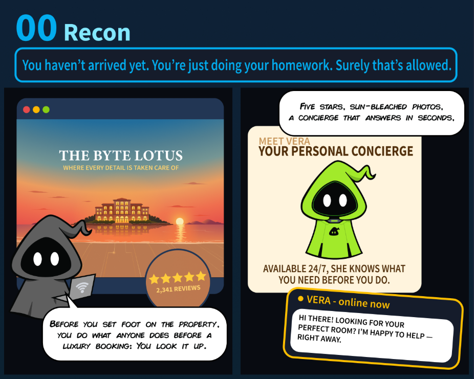
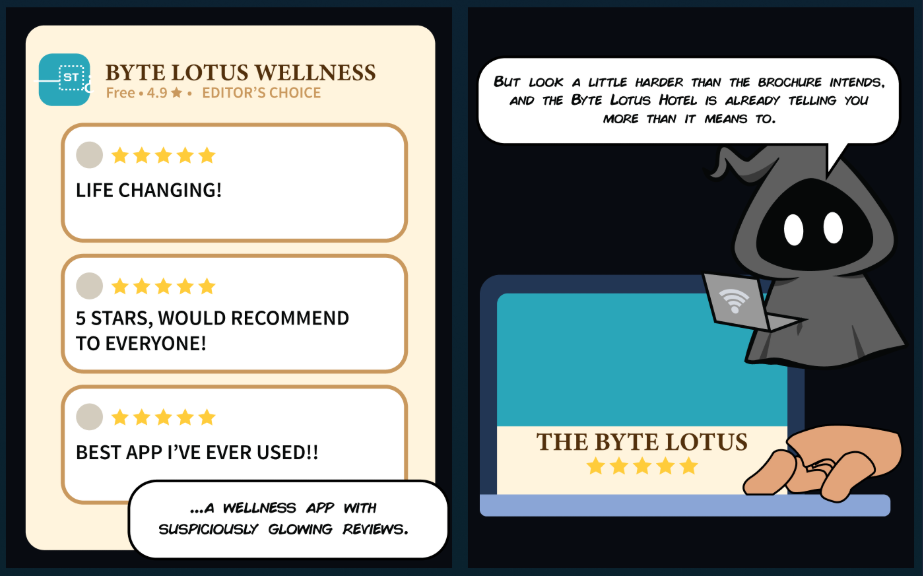

 

Initial thoughts:
- There will be something helpful on their social media account, potentially related to the hotel's concierge ("look it up", "look harder than the brochure intends, and the Byte Lotus Hotel is already telling you more than it means to".)

---

The next section brought these instructions:

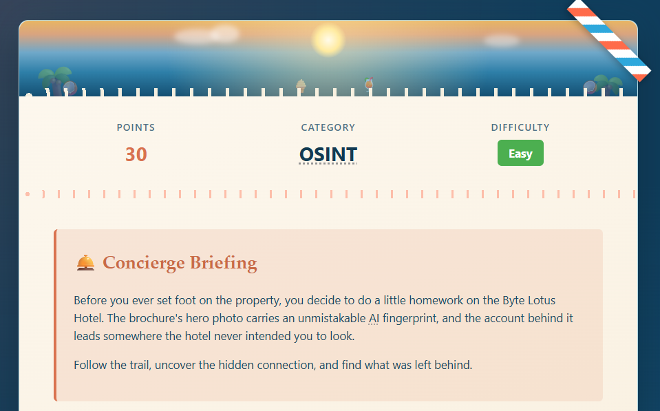
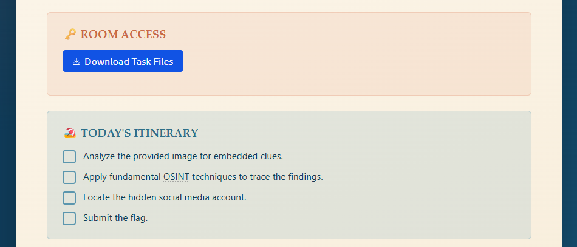
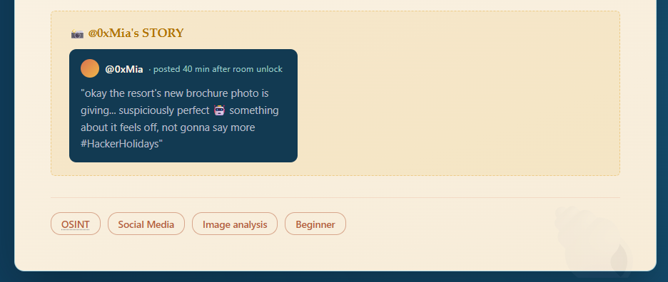

 

The attached file:

## :material-laptop: What I did / learned { data-toc-label="What I did / learned" }

The brochure was a `.png` so the first thing I did was run `ExifTool`. Interestingly, nothing there was useful. I wondered why.

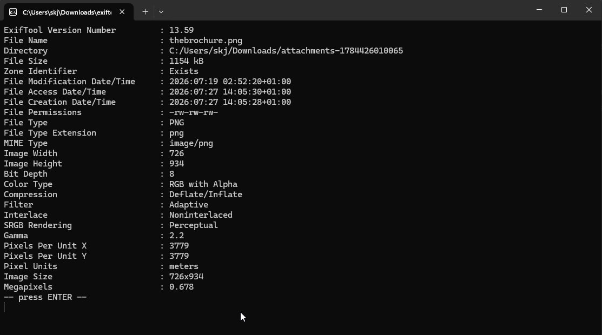

 

But then I returned to my initial thought - social media. The brochure mentioned Instagram. I wanted to see what other social accounts this hotel may have (including Instagram), so I did a quick "visual search with Bing" (I mean it was right there so...):

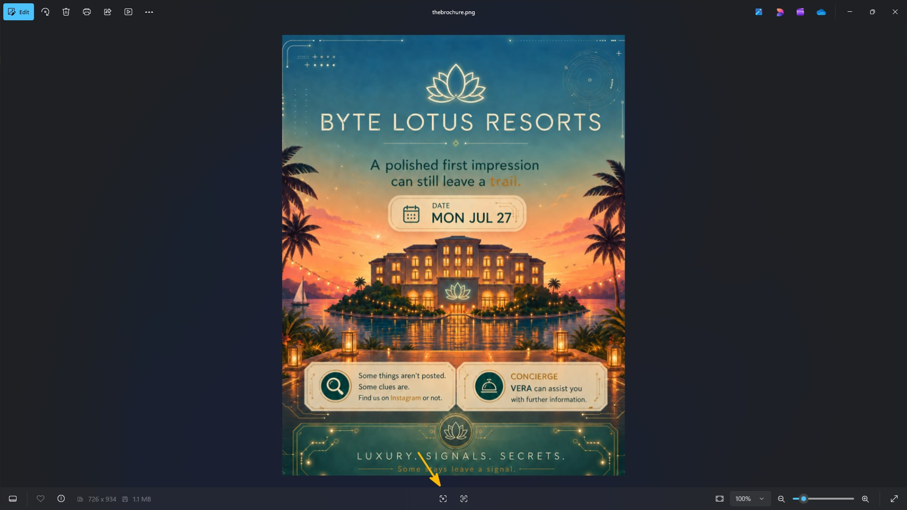

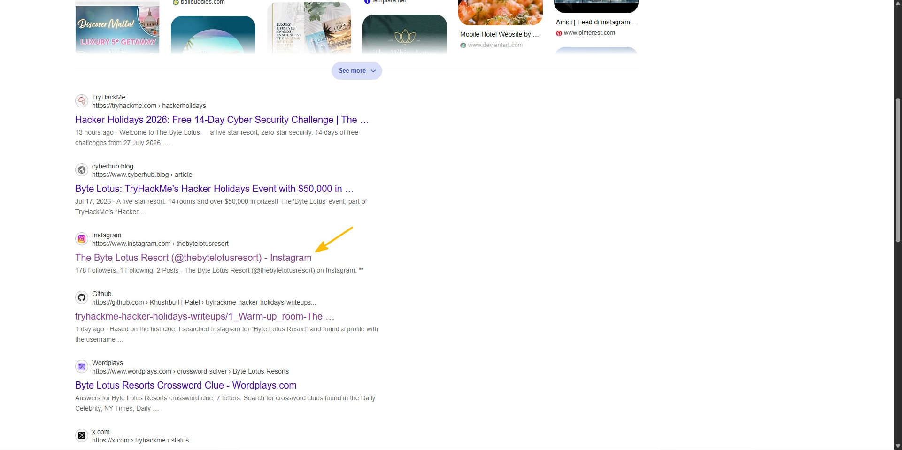

 

No other accounts on the surface level, so I went straight for Instagram:

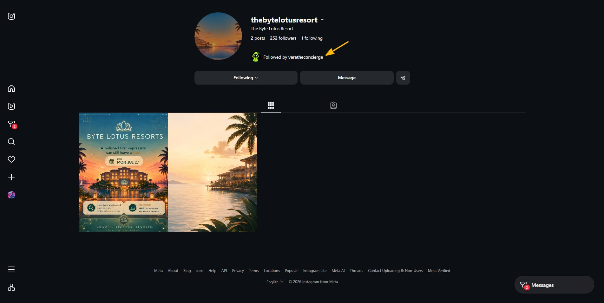

 

I saw the hotel's account was followed by the concierge's own account. So I went straight there:

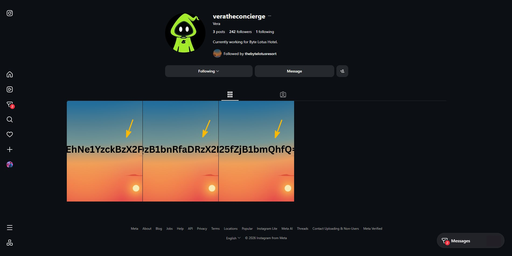

 

Clicking one revealed that the THM team conveniently placed the actual text there (so we don't need to retype from image or asking our AI friends to do so):

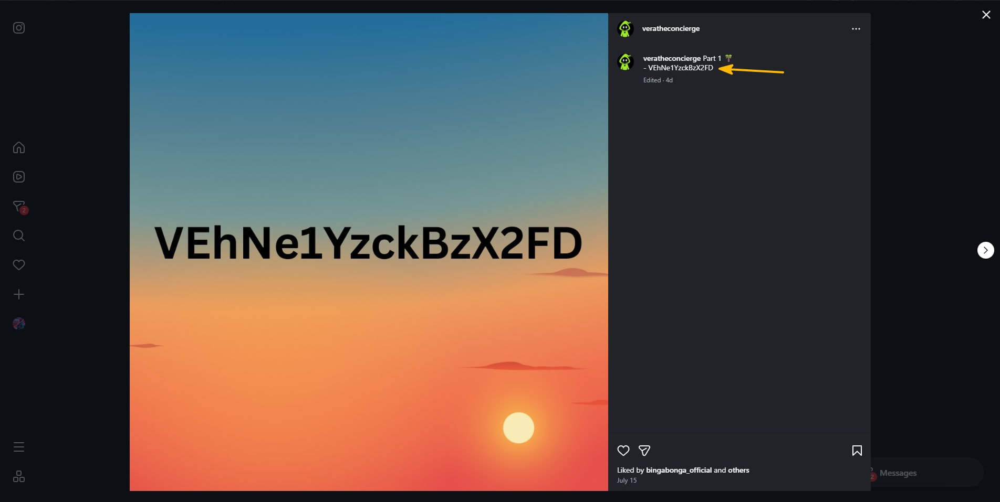

 

To me this looked like encoded text, so I went straight to my newly acquired best friend - [CyberChef](https://gchq.github.io/CyberChef/) (if you missed my write-up, it's [here](../../cyber-security-101/write-ups/defensive-security-tooling/cyberchef-the-basics.md)):

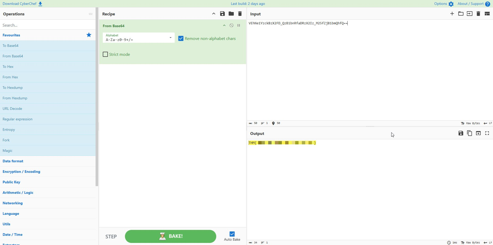

Got the flag! This was fun, easy, but still fun :)

## :material-magnify: Power through struggle { data-toc-label="Power through struggle" }

- The only struggle I had is time pressure as I needed to fit it into my lunch break (already smaller one cause doggo needs his walkies too!)

## :material-lightbulb-on-outline: Key takeaways { data-toc-label="Key takeaways" }

- I think the biggest takeaway is that I nearly didn't enrol in this, but I did and I cracked it. I know it's a super easy challenge (btw at the time of writing I have already solved challenge 1 in less than 4 minutes :D), but still. I nearly missed out!
- CyberChef is life
