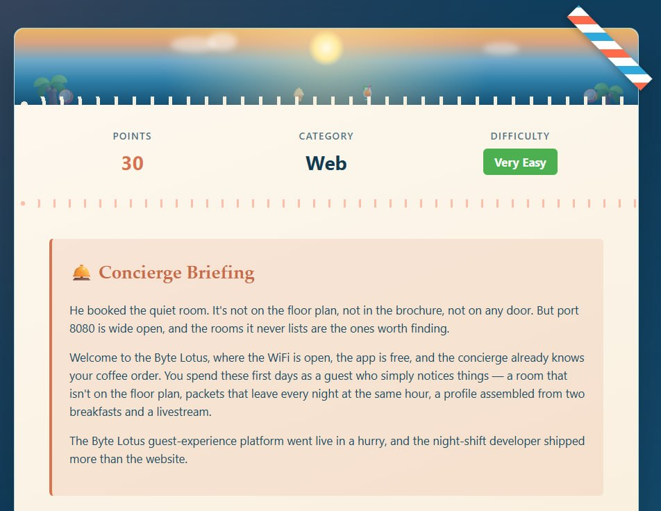
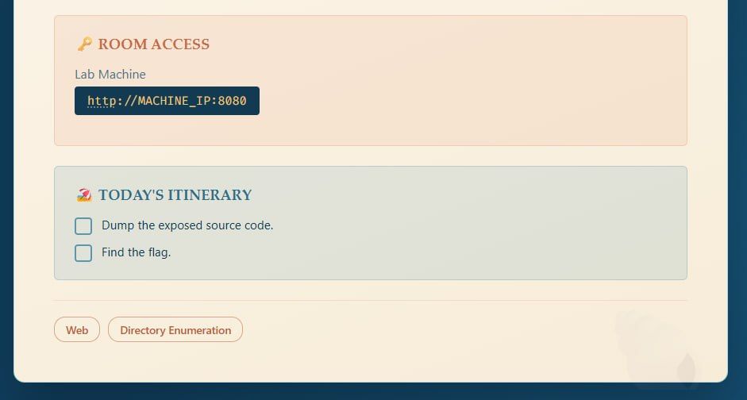
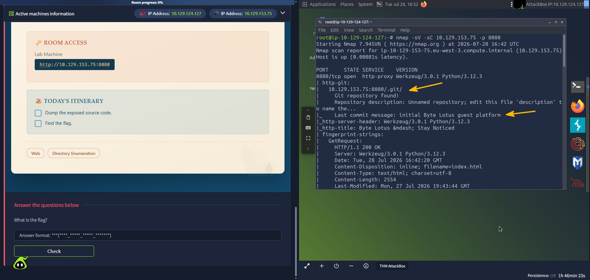
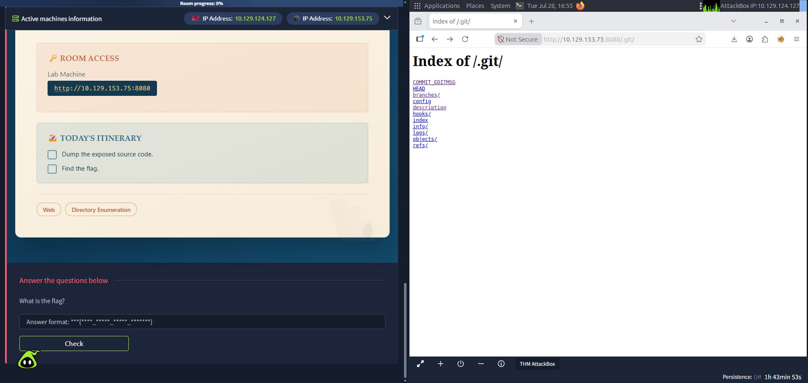
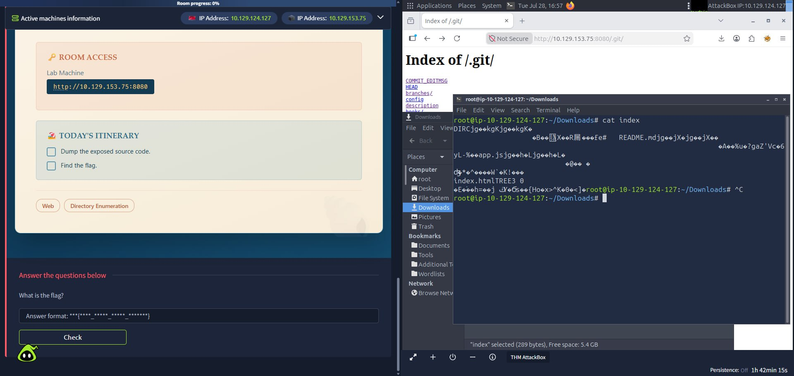
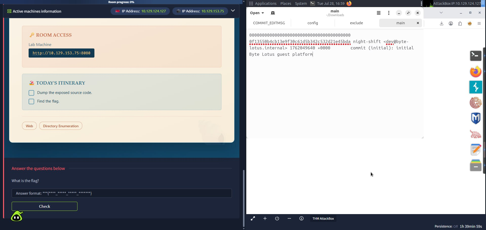
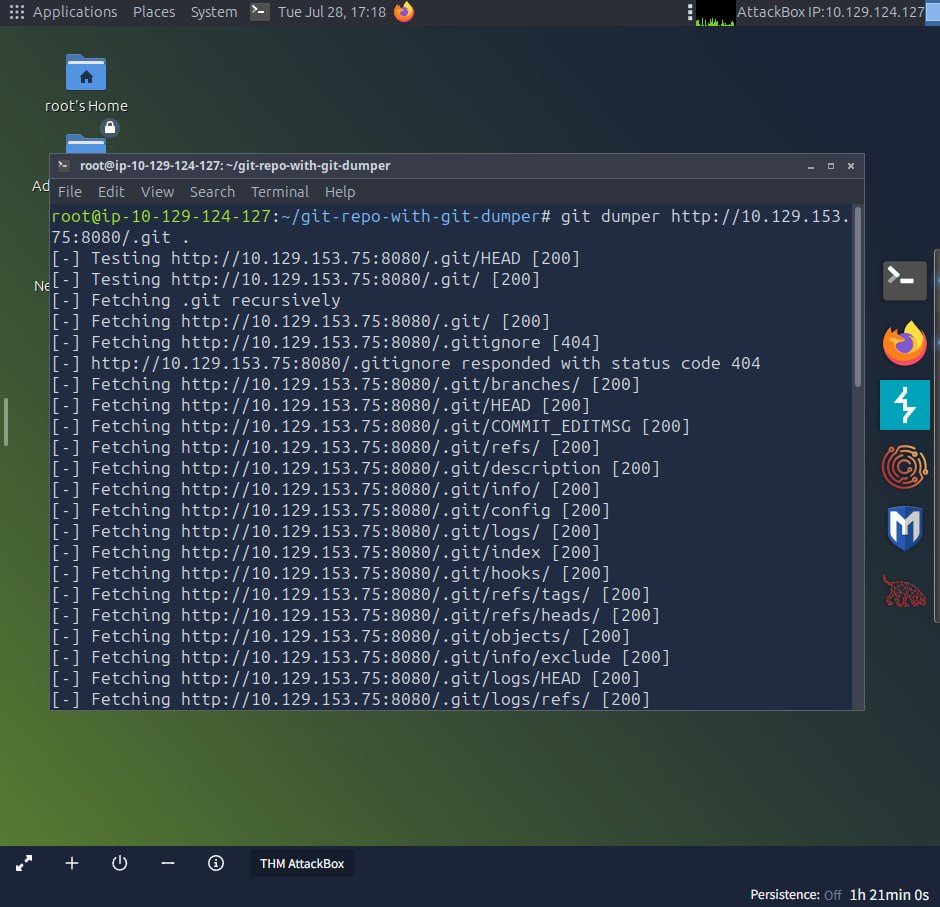
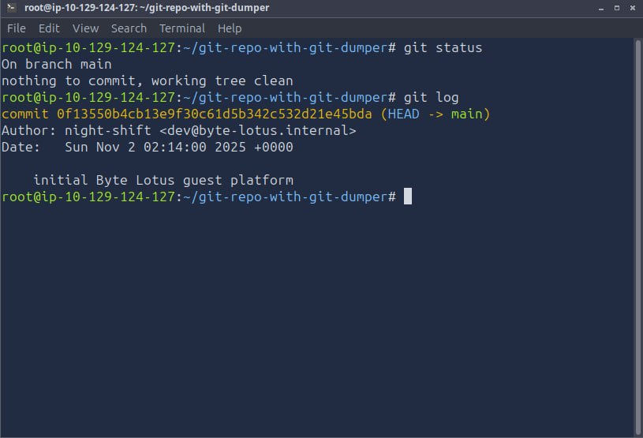
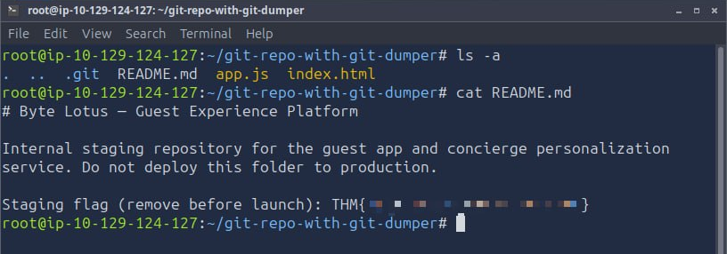

# :material-pound: Room 404

<div class="sj-meta" markdown>

:material-shield-star-outline: **Bucket:** Hacker Holidays 2026 > Room 404

:material-calendar-month-outline: **Date:** 28/07/2026

:material-signal-cellular-1: **Difficulty:** Very easy (THM) / Easy (me)

</div>

---

!!! quicklinks "Quick Links"

    - [:simple-tryhackme: Room 404](https://tryhackme.com/room/hh-room404-804573bf)

## :material-clipboard-text-outline: The brief { data-toc-label="The brief" }

The room started with the short brief:




<br>

Initial thoughts:

- I mean... check what's on port 8080 :D

## :material-laptop: What I did / learned { data-toc-label="What I did / learned" }

The first thing I did was scan the port with `nmap`:

```bash
nmap -sV -sC 10.129.153.75 -p 8080
```

<br>

In the output I saw that it exposed a `.git` folder:



<br>

First thought was excitement as I thought I'd need to exploit the service to get to `.git`, but then I realised I could have a quick nosey around via the browser first:



<br>

I started `cat`-ing some files to check what's inside in case there was something hidden there:





<br>

I then thought, perhaps the folder/files are broken when viewed from the web and I should try to `wget` it:

```bash
wget 10.129.153.75:8080/.git/
```

<br>

... I got only one file. Of course I did, I didn't add a flag for recursion :D...


```bash
wget -r -np -R "index.html*" http://10.129.153.75:8080/.git/
```

<br>

So a little breakdown of the command as a note to self:

- `-r`: to make it recursive
- `-np`: to keep scope within `.git` only (no climbing up to parent directories)
- `-R "index.html*"`: reject (do not save) files matching the pattern, here the auto-generated directory-listing pages

I got it, but the files were pretty much the same (apart from one, useless one for me) and they were in the same visual state. I concluded that `wget` wasn't pulling the repo down in a state `git` could actually use (it grabs the files, but doesn't reconstruct `git`'s objects properly).

I then got my hands on `git-dumper`, googled its [usage](https://pypi.org/project/git-dumper/), installed it (`pip install git-dumper`) and attempted to pull it down with:

```bash
git dumper http://10.129.153.75:8080/.git/
```

<br>

Couldn't run, I didn't specify the destination dir :D... (it's been a long day and doggo was judging, so I was rushing... which is against the core principles of conducting penetration testing as per my recently completed room ([Dive Into Pentesting](../../penetration-tester/jr-penetration-tester/penetration-testing-foundations/dive-into-pentesting/dive-into-pentesting.md)) :sweat_smile:)...

```bash
git dumper http://10.129.153.75:8080/.git/ .
```



<br>

I had a quick look around before diving into the obvious target (`README.md`):



<br>

Didn't find anything useful, so went straight for the `README.md`:



<br>

And there's our flag! :muscle:

## :material-magnify: Power through struggle { data-toc-label="Power through struggle" }

- No struggle per se, just powering through while rushing which is a TERRIBLE idea and I'd never ever do it at work, but I was dying to check out the challenge and my dog couldn't wait for too long :D #grownupexcuses

## :material-lightbulb-on-outline: Key takeaways { data-toc-label="Key takeaways" }

- Exposed `.git` directory (source-code disclosure) can be extremely dangerous. Leaving a repo reachable like this allows anyone to rebuild the full source, the entire commit history, and anything careless that ever got committed, like a flag... or a set of credentials!
- Do not hardcode any sensitive information ("remove before launch" is a road to a massive disaster)
