# :material-pound: Complimentary

<div class="sj-meta" markdown>

:material-shield-star-outline: **Bucket:** Hacker Holidays 2026 > Complimentary

:material-calendar-month-outline: **Date:** 29-30/07/2026

:material-signal-cellular-1: **Difficulty:** Easy (THM) / Medium (me)

</div>

---

!!! quicklinks "Quick Links"

    - [:simple-tryhackme: Complimentary](https://tryhackme.com/room/hh-complimentary-05e0b604)

## :material-clipboard-text-outline: The brief { data-toc-label="The brief" }

The room started with the short brief:

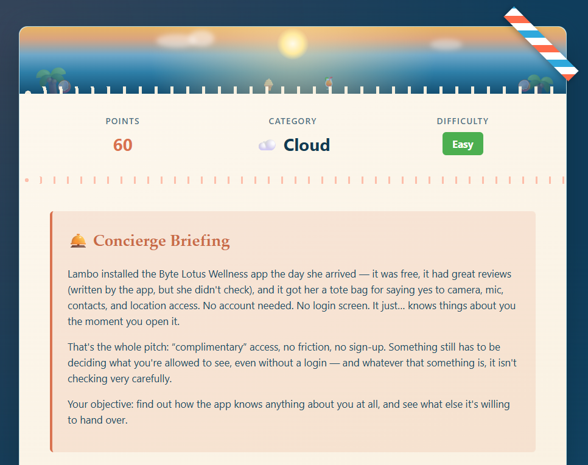
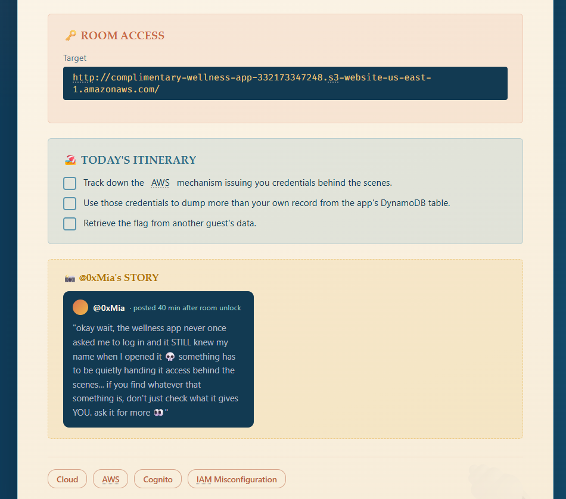

<br>

Initial thoughts:

- I know nothing about AWS (and funnily enough just spent a good chunk of the day at work figuring it out with two colleagues), but very intrigued

## :material-laptop: What I did / learned { data-toc-label="What I did / learned" }

I didn't really know what to expect, so I started slow. I followed the URL (`http://complimentary-wellness-app-332173347248.s3-website-us-east-1.amazonaws.com/`) and didn't see anything useful there:

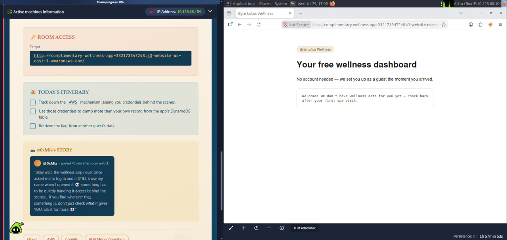

<br>

I then reviewed the network tab for the requests and found a `x-amz-security-token`:

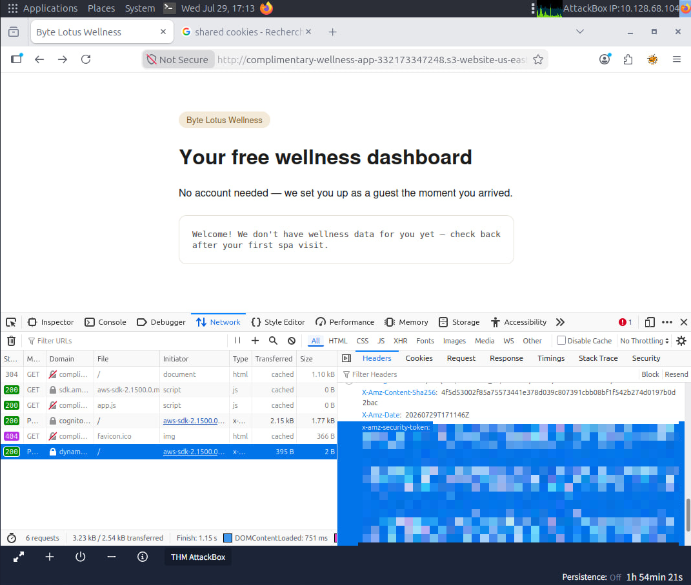

<br>

For some reason I didn't check `request` and `response` tabs, only `headers`. Can't explain it right now, maybe was rushing or overwhelmed by having a task for AWS haha. I seriously want to facepalm now, but I'm trying to be kinder to myself.

I then grabbed the app recursively with `wget -r` to see what's inside. I found `app.js`. Even though I don't really know JavaScript I was able to figure out what the app did roughly, but more importantly, it exposed `Cognito Identity Pool ID`, `AWS region`, and `DynamoDB` table name.

I remembered what the brief said: I needed to dump the DB contents. I started googling how to do it and found two commands (native AWS and `dynamodump`).

I first tried it with AWS's own command:

```bash
root@ip-10-128-68-104:~# aws dynamodb scan --table-name complimentary-GuestWellnessProfiles
```

This gave me this error:

```bash
aws: [ERROR]: An error occurred (AccessDeniedException) when calling the Scan operation: User: arn:aws:sts::739930428441:assumed-role/vulnerable-machine/i-0bea8b4dfc85974ad is not authorized to perform: dynamodb:Scan on resource: arn:aws:dynamodb:eu-west-3:739930428441:table/complimentary-GuestWellnessProfiles because no identity-based policy allows the dynamodb:Scan action
```

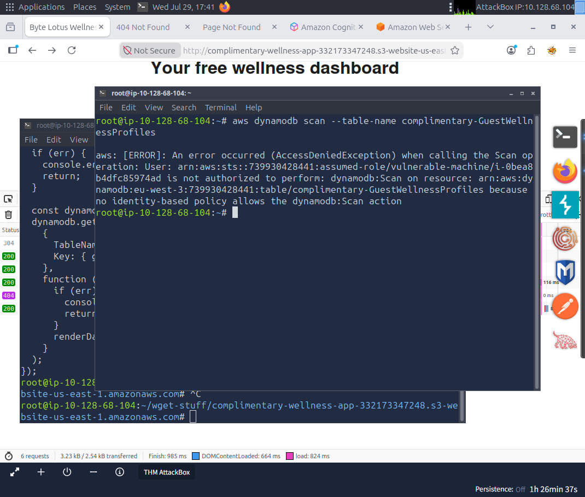

<br>

Thinking about it now it was self-explanatory that it's a permissions error, but since I've never dealt with AWS before, I decided to make sure I'm doing this correctly and reached out to google to see if there was another way. This is how I found `dynamodump`. After I installed it on the AttackBox, checked its usage and ran it, I got the same error:

```bash
root@ip-10-128-68-104:~# dynamodump -m backup -r us-east-1 -s complimentary-GuestWellnessProfiles
INFO:botocore.credentials:Found credentials from IAM Role: vulnerable-machine
INFO:root:Found 1 table(s) in DynamoDB host to backup: complimentary-GuestWellnessProfiles
INFO:root:Starting backup for complimentary-GuestWellnessProfiles..
INFO:root:Dumping table schema for complimentary-GuestWellnessProfiles
Exception in thread Thread-1:
Traceback (most recent call last):
  File "/usr/local/pyenv/versions/3.8.20/lib/python3.8/threading.py", line 932, in _bootstrap_inner
    self.run()
  File "/usr/local/pyenv/versions/3.8.20/lib/python3.8/threading.py", line 870, in run
    self._target(*self._args, **self._kwargs)
  File "/usr/local/pyenv/versions/3.8.20/lib/python3.8/site-packages/dynamodump/dynamodump.py", line 693, in do_backup
    table_desc = dynamo.describe_table(TableName=table_name)
  File "/usr/local/pyenv/versions/3.8.20/lib/python3.8/site-packages/botocore/client.py", line 565, in _api_call
    return self._make_api_call(operation_name, kwargs)
  File "/usr/local/pyenv/versions/3.8.20/lib/python3.8/site-packages/botocore/client.py", line 1017, in _make_api_call
    raise error_class(parsed_response, operation_name)
botocore.exceptions.ClientError: An error occurred (AccessDeniedException) when calling the DescribeTable operation: User: arn:aws:sts::739930428441:assumed-role/vulnerable-machine/i-0bea8b4dfc85974ad is not authorized to perform: dynamodb:DescribeTable on resource: arn:aws:dynamodb:us-east-1:739930428441:table/complimentary-GuestWellnessProfiles because no identity-based policy allows the dynamodb:DescribeTable action
```

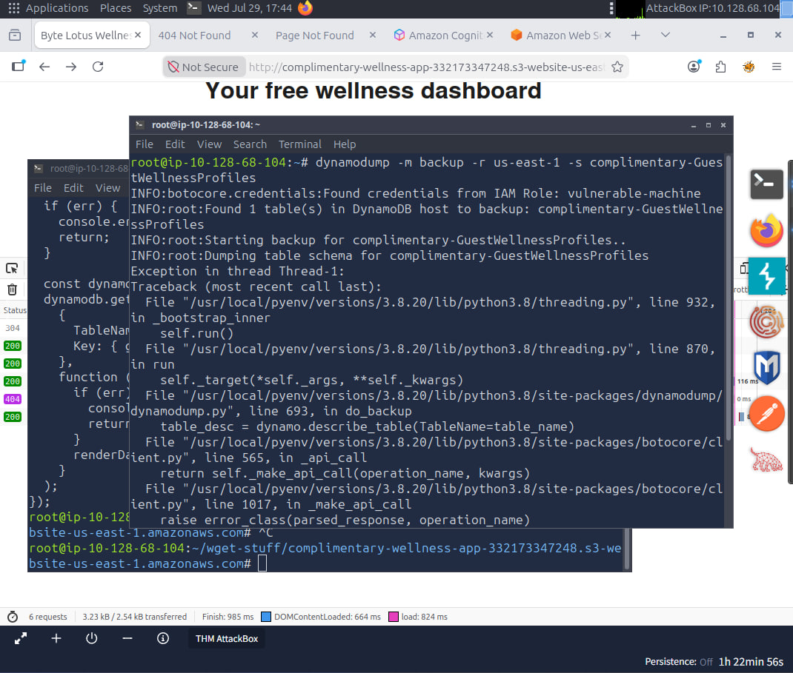

<br>

This is when I concluded, OK, I'm doing everything correctly (as in, executing the right command), and the issue is indeed in the permissions I have. Since I didn't know much about AWS at all, I reached out to Claude to explain to me how it worked.

??? note "Claude's Wisdom"

    How AWS grants credentials - the three things:

    To make authenticated AWS API calls you need: an Access Key ID, a Secret Access Key, and a Session Token (for temporary credentials). Together these form a credential set that lets you act as a particular identity within AWS.

    How Cognito Identity Pools work (which is what you found):

    When someone visits the app, AWS Cognito issues them temporary credentials automatically, even unauthenticated guests. That's by design - it lets anonymous users access certain AWS resources. The identity pool ID you found in app.js is what enables this. The app calls Cognito, Cognito returns those three things above, and now the user has temporary AWS credentials to interact with DynamoDB.

So from this explanation I could confirm I needed to change my identity, and that I was currently missing the Access Key ID and Secret Access Key to form the full credential set.

I went back to the Dev Tools and inspected the network tab again (this time checking `request` and `response` tabs, yay). This is where I had the light bulb moment:

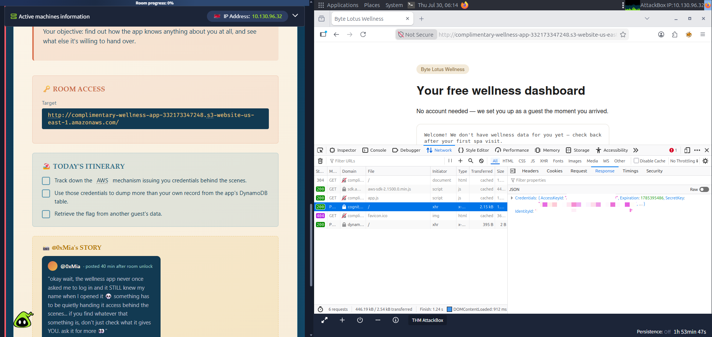

<br>

I got Access Key ID and Secret Access Key. I already had the session token so now I needed to find out how to set those within AWS. After a quick google I found the commands and ran them:

```bash
export AWS_ACCESS_KEY_ID=[redacted]
export AWS_SECRET_ACCESS_KEY=[redacted]
export AWS_DEFAULT_REGION=[redacted]
export AWS_SESSION_TOKEN=[redacted]
```

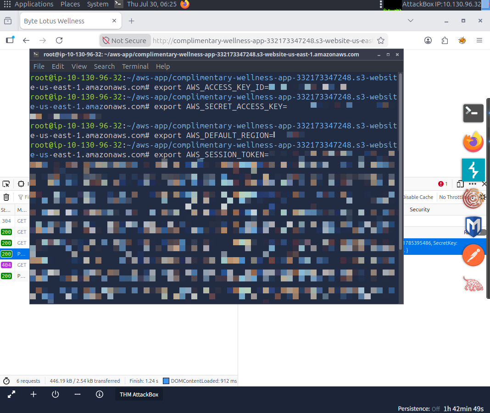

<br>

I then checked I managed to change the identity correctly:

```bash
root@ip-10-130-96-32:~/aws-app/complimentary-wellness-app-332173347248.s3-website-us-east-1.amazonaws.com# aws sts get-caller-identity
{
    "UserId": "[redacted]",
    "Account": "[redacted]",
    "Arn": "[redacted]:assumed-role/complimentary-cognito-unauth-role/CognitoIdentityCredentials"
}
```

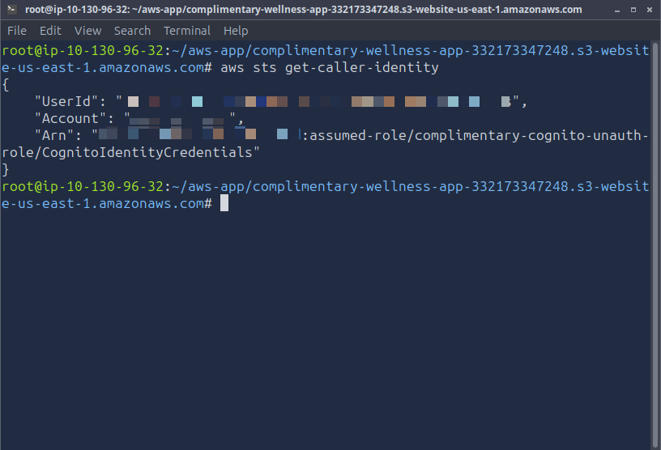

<br>

It worked. Now I reran the dump command, I used AWS as I felt it would be more "native" (than `dynamodump`):

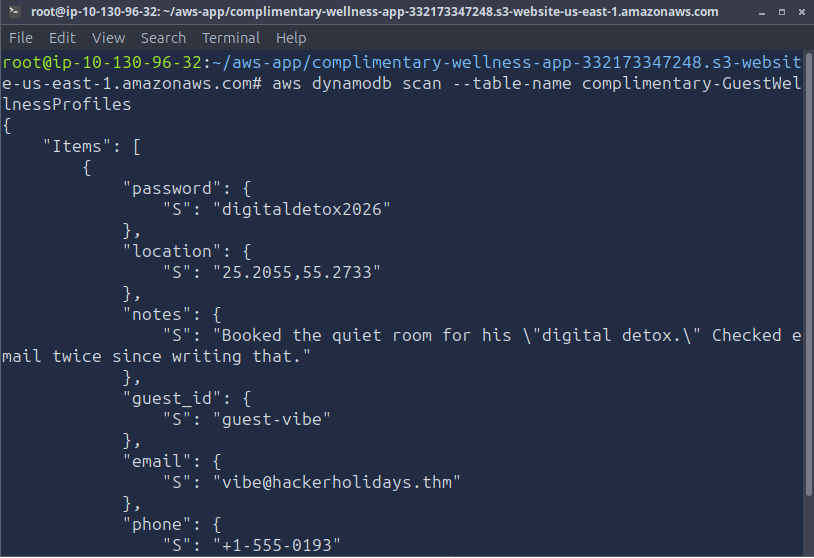

<br>

I got in, after scrolling through a bit I found the flag:

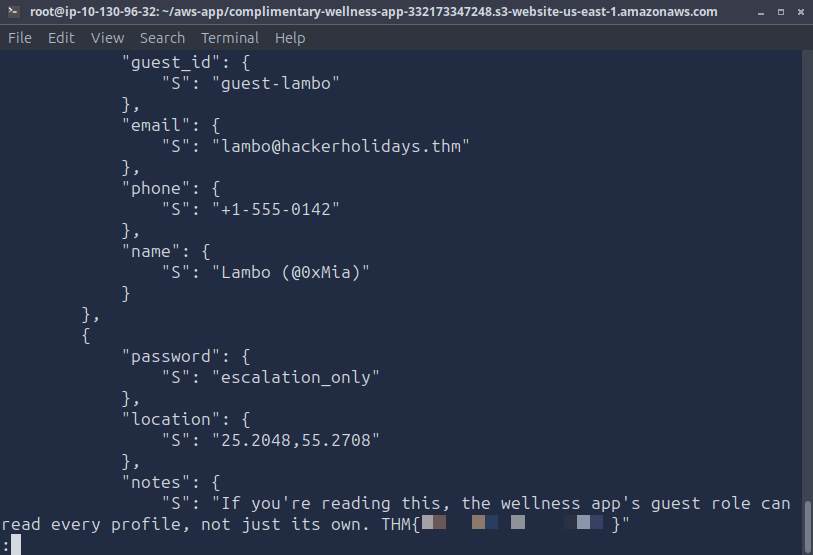


## :material-magnify: Power through struggle { data-toc-label="Power through struggle" }

Looking back at what I had to do I agree it wasn't difficult, it can be summarised in these steps:

- Followed the app URL, landed on the "free wellness dashboard" welcome page (no login needed)
- Used `wget -r` to recursively download the app, found `app.js`
- `app.js` revealed Cognito Identity Pool ID, AWS region (us-east-1), and DynamoDB table name
- Opened browser Dev Tools network tab, found that Cognito was returning temporary credentials in the response - `AccessKeyId`, `SecretKey`, `SessionToken`
- Exported those as environment variables in AttackBox terminal using `export`
- Verified identity switched from `vulnerable-machine` to `CognitoIdentityCredentials` via `aws sts get-caller-identity`
- Ran `aws dynamodb scan --table-name complimentary-GuestWellnessProfiles` and got the flag

So... yes... But I don't agree with "no prerequisites required, just bring curiosity". THM is marketing this as "beginner friendly" and marked it as easy, but how are you supposed to do the challenge if you don't know AWS / haven't completed some rooms or paths already? I consider myself a complete beginner, I've only completed Pre-Security and Cybersecurity 101 paths, did some smaller challenges and one home lab (+ technical role at work) and I was a bit overwhelmed. I just imagine someone just starting out with TryHackMe and landing this being assured they can do it, this can crash their confidence completely and deter them from something they may have otherwise found a calling for. Maybe I'm taking it too seriously, but I know if I was given that before the learning paths and other things I've done I'd have given up and never went back to it and heavily missed out on this amazing world of cybersecurity.

Saying that, I personally loved the challenge (after I overcame the overwhelm/fear of AWS lol).

## :material-lightbulb-on-outline: Key takeaways { data-toc-label="Key takeaways" }

- While giving out credentials to unauthenticated users is Cognito's correct functionality, we need to make sure that those credentials can't be used for anything sensitive or destructive
- Client-side code (app.js) exposed the DynamoDB table name directly, so once you had credentials you already knew exactly what to scan for. Don't assume front-end JS is a safe place to reference internal resource names
- Always confirm which identity you're actually running as (`aws sts get-caller-identity`) before assuming a permission error is unfixable. It told me straight away I was still the `vulnerable-machine` role, not the one I'd just captured (but I wanted to double check anyway :D)

## :material-star-outline: Bonus! { data-toc-label="Bonus!" }

??? note "More Claude's Wisdom"

    I had to ask a lot of questions regarding how AWS works, and I wanted to save this info for me for later:

    _The attackbox has its own IAM role (`vulnerable-machine`) assigned by AWS at launch. That role has certain permissions for the attackbox to function. When you run AWS CLI commands without setting credentials, it uses that role automatically via something called the instance metadata service._

    _The website visitor credentials are completely separate - they're issued by Cognito to whoever loads the webpage, unauthenticated or not. The attackbox never loaded the webpage, so it never received those credentials. That's why you had to capture them from the browser and manually export them._

    _Your curl instinct is correct - if you'd curled the page and parsed the JavaScript response that calls Cognito, you could have gotten the credentials that way too. Same result, different method._

    _And yes, your last point is the key security insight of this whole challenge: Cognito is handing temporary credentials to literally anyone who visits the page. That's intentional for guest access. The vulnerability is what those credentials are allowed to do once you have them._