# Wazuh SIEM home lab

This page is dedicated to the Wazuh home lab: the formal report of findings and analysis first, followed by an optional configuration section. There is also a separate informal [learning write-up](../../../learning/off-the-beat/home-labs/wazuh.md).

The aim of the task was to replicate the environment of a SOC Analyst: a working SIEM (Wazuh) with suspicious alerts getting triggered. To achieve this, I had to stand up and configure Wazuh from scratch (docs + AI-assisted). All alerts discussed in this write-up were triggered by me for learning purposes.

---

## Formal report

### The estate

| Host | Role | OS |
|---|---|---|
| Win11 desktop | Wazuh server (Docker/WSL2) + agent 001 | Windows 11 Home |
| Win10 desktop | agent 002 | Windows 10 Home |
| MacBook Air | agent 003 | macOS 15.6 |

### Objective

Wazuh SIEM running on a Win11 host (Docker/WSL2), with three real endpoints enrolled (Win11, Win10, MacBook Air), alerts firing from deliberately generated behaviour (including with the help of Atomic Red Team), two custom detection rules I designed and debugged (AI&#8209;assisted), and the NIST 800-53 and PCI DSS compliance dashboards captured as evidence (ISO 27001 mapped manually).

### Detections fired

| # | Attack | MITRE | Rule (level) | Host | Detection type |
|---|---|---|---|---|---|
| 1 | EICAR malware (via Defender event channel) | Malware | 62123 (12) | Win11 | Built-in + config (wired the Defender channel) |
| 2 | Create-then-elevate backdoor account | T1136.001 / T1098 / T1078.003 | 100100 (8) + 100102 (14) | Win11 | Custom correlation rule (mine) |
| 3 | Brute-force logon failures | T1110 | 60122 (5) | Win10 | Built-in |
| 4 | Reverse shell (live C2, cross-machine) | T1059 / T1071 | 100200 (13) | macOS | Custom command-monitoring rule (mine) |
| 5 | Service-installation persistence (ART atomic) | T1543.003 | 61138 (5) | Win10 | Built-in, ATT&CK-validated |
| 6 | Clear event logs (anti-forensics) | T1070 | 63103 (5) | Win10 | Built-in, ATT&CK-validated |

### Four security findings

1. **Docker silently bypasses the Windows Firewall** - it writes an inbound allow rule scoped to both private and public, exposing every published port (indexer API, dashboard) without asking. Verified with `Get-NetFirewallRule`.
2. **AV/FIM blind spot** - Defender blocked the Wazuh agent from opening the EICAR file to hash it, so FIM saw nothing at first. I fixed it by having the SIEM ingest the Defender event channel, after which the alert appeared.
3. **Default SIEM credentials** (`admin`/`SecretPassword`) - a critical misconfig (ISO 27001 A.5.17), documented as a scoped, accepted risk (LAN-only learning lab). This was not flagged by the SIEM itself.
4. **Defender caught the attacker's toolkit** - it flagged the Atomic Red Team `master.zip` three separate times during download and stripped out the log-clearing atomics. Defence-in-depth caught red-team tooling before it could run.

### Detailed incident report

The following details each alert as it would be triaged in a production SOC: what fired, what the evidence shows, the assessment, the frameworks it touches, and the recommended response. Each alert was generated in a controlled test (the offensive steps are covered in the separate learning write-up); here they are treated as genuine.

#### Unwanted software (EICAR) - Win11

On July 11, at 21:01:30.302, a rule of level 12 (id 62123) triggered, flagging potentially unwanted software:

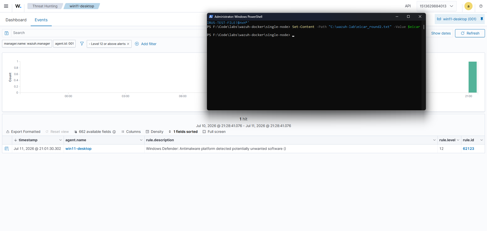

The investigation showed that an "EICAR" file was found on the machine:

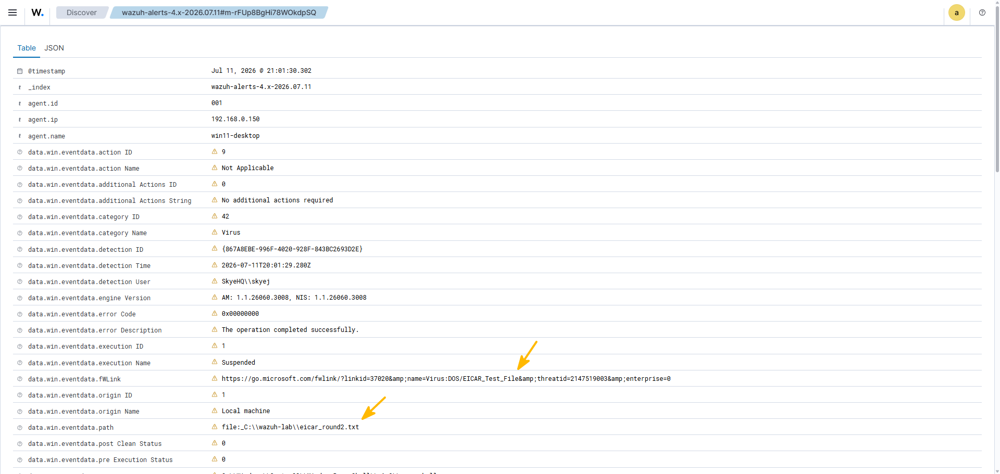

| | |
|---|---|
| **Severity** | High |
| **Observation** | Microsoft Defender detected the EICAR test file on the host and quarantined it. The alert reached Wazuh through the Windows Defender event channel. |
| **Assessment** | A confirmed malware signature on an endpoint. In production this could be the first sign of a broader compromise and warrants immediate triage. |
| **MITRE ATT&CK** | T1204 (User Execution) or T1105 (Ingress Tool Transfer), depending on how it was delivered. |
| **Violates** | ISO 27001 A.8.7 (protection against malware); NIST 800-53 SI-3 (malicious code protection). |

**Recommended response**

- Confirm the file was quarantined
- Isolate the host if the detection is genuine
- Run a full AV/EDR scan
- Establish how the file arrived (download, email, USB, lateral movement)
- Hash the file and check threat intelligence
- Sweep other hosts for the same indicator
- Reimage if compromise is confirmed

**Preventive:** maintain EDR/AV, email and web filtering, application allowlisting, and user-awareness training.

??? note "Compliance Dashboard"

    Estate-wide NIST 800-53 view for the period; the EICAR detection appears as the level-12 alert and under SI.3 (malicious code protection).

    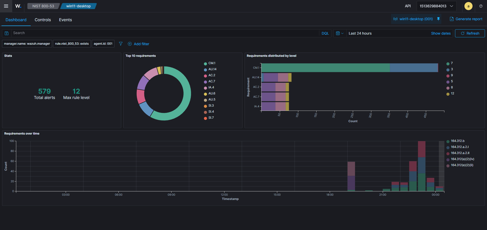

---

#### New admin account, backdoor pattern - Win11

On 12 July at 00:01:49.222 a new local account (`bdtest3`) was created (rule 100100). About 17 seconds later, at 00:02:06.925, the account was added to the local Administrators group, and my custom correlation rule fired at that same moment (rule 100102, level 14), flagging that a newly-created account had just been made an administrator. The elevation and the backdoor flag are the same event, so the sequence produces two alerts in total: the account creation, then the backdoor flag on the elevation. The events at 00:01:49.2xx ("Users Group Changed" and "Domain Users Group Changed") are part of the account creation (not the elevation).

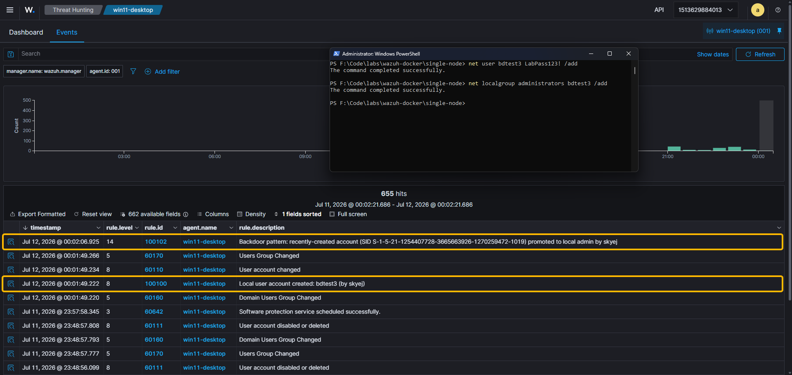

| | |
|---|---|
| **Severity** | Critical |
| **Observation** | A local account was created, then added to the local Administrators group by the same logon session within minutes: the create-then-elevate pattern. A custom correlation rule links the two events, whereas the built-in rules alert on each separately but do not connect them. |
| **Assessment** | A classic persistence and privilege-escalation sequence. Legitimate administration can look identical, so the priority is confirming whether it was authorised. If not, this is a live backdoor account. |
| **MITRE ATT&CK** | T1136.001 (Create Account: Local), T1098 (Account Manipulation), T1078.003 (Valid Accounts: Local Accounts). Tactics: Persistence, Privilege Escalation. |
| **Violates** | ISO 27001 A.5.16 (identity management), A.5.18 (access rights), A.8.2 (privileged access rights); NIST 800-53 AC-2 (account management), AC-6 (least privilege). |

**Recommended response**

- Verify whether the creation and elevation were authorised (change ticket or known task)
- If not, disable and remove the account immediately
- Investigate the account that performed the action for compromise, and rotate its credentials
- Audit for other unauthorised privileged-group changes
- Hunt for persistence and lateral movement

**Preventive:** least privilege, privileged-access management (PAM), an approval workflow for admin grants, and alerting on privileged-group changes (which this rule provides).

??? note "Compliance Dashboards"

    Compliance views for the period, showing the access-control and account-management activity from this incident (NIST 800-53 and PCI DSS).

    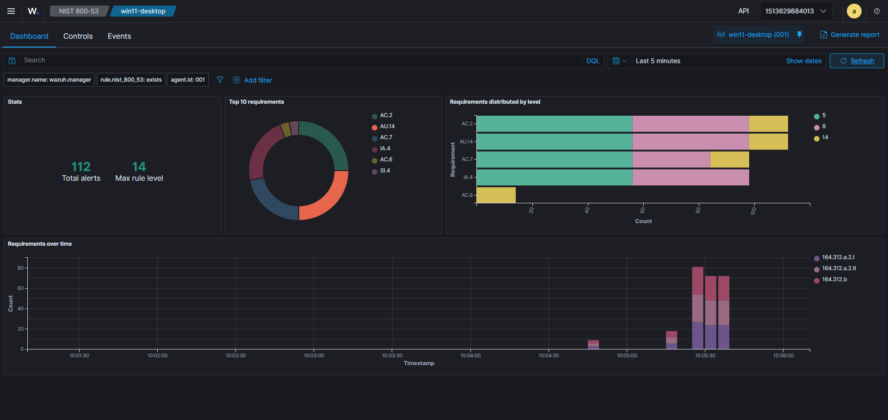

    <br>

    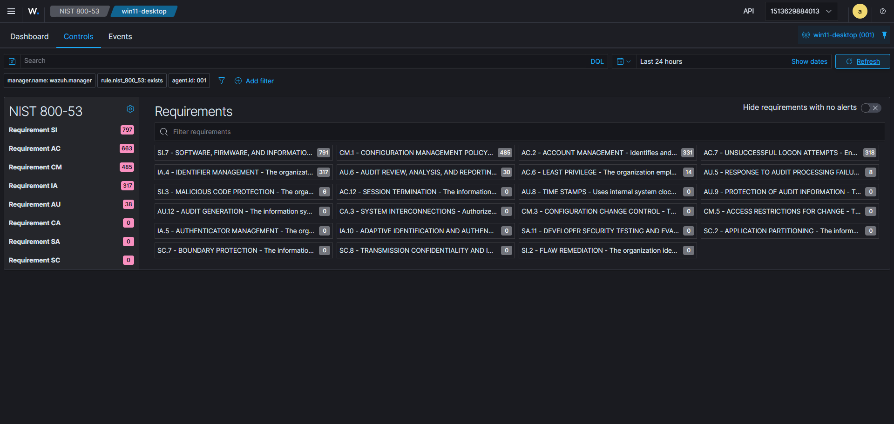

    <br>

    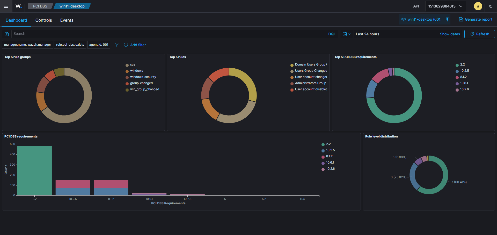

---

#### Repeated logon failures - Win10

On July 12, between 10:55:21.553 and 10:55:47.888, six alerts were triggered for a repeated incorrect password being entered.

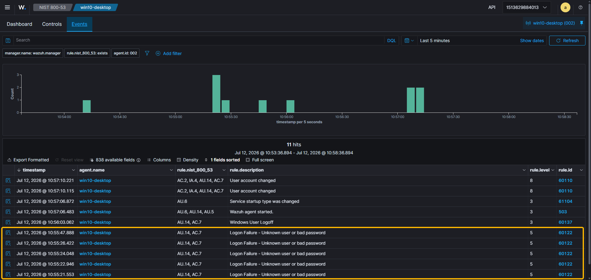

| | |
|---|---|
| **Severity** | Low to Medium (would escalate if a login succeeded) |
| **Observation** | Six failed logon attempts against one account in about 26 seconds. No successful logon followed. |
| **Assessment** | On its own this is low risk, but it would escalate sharply if a successful logon followed the failures (a possible successful brute force). The Windows login screen locked (rate-limited) during the attempts, which is a control working as intended. |
| **MITRE ATT&CK** | T1110 (Brute Force). |
| **Violates** | ISO 27001 A.8.5 (secure authentication); NIST 800-53 AC-7 (unsuccessful logon attempts). |

**Recommended response**

- Confirm the source (local console vs network/RDP)
- Check whether any attempt succeeded
- Verify the account is not compromised
- Confirm account-lockout and rate-limiting are enforced
- Consider MFA

**Preventive:** account-lockout policy, MFA, and monitoring for password spraying (a few attempts spread across many accounts).

---

#### Possible reverse shell - macOS

On July 12, at 17:16:41.708 an alert came through about a change of listened-ports status (a generic built-in netstat rule). Following this, at 17:34:46.069, a level 13 alert was triggered by my custom rule for a shell/tool holding an established outbound TCP connection.

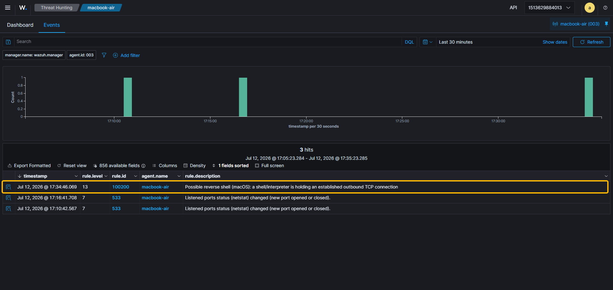

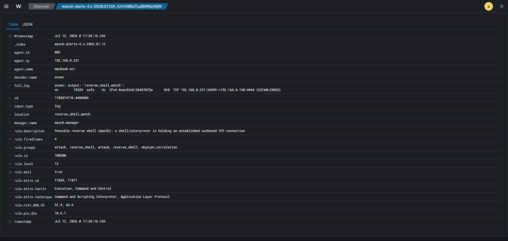

| | |
|---|---|
| **Severity** | Critical |
| **Observation** | The process `nc` (netcat) on the Mac was holding an established outbound TCP connection to 192.168.0.150:4444, the classic relay used by a reverse shell. A shell or a tool like netcat holding an outbound connection is a strong indicator, though not proof on its own (some tools hold connections legitimately), so it needs investigating. A custom command-monitoring rule caught it (macOS has no built-in for this); a generic netstat alert had noticed the connection first, but without identifying the process. |
| **Assessment** | If confirmed, this is active remote control of the host (a live reverse shell). Contain first, investigate second. |
| **MITRE ATT&CK** | T1059 (Command and Scripting Interpreter), T1071 (Application Layer Protocol / C2), T1571 (non-standard port). |
| **Violates** | ISO 27001 A.8.20 / A.8.21 (network security), A.8.16 (monitoring activities); NIST 800-53 SC-7 (boundary protection), SI-4 (system monitoring). |

**Recommended response**

- Isolate the host from the network immediately to cut the C2
- Capture volatile evidence (process tree, `lsof`/netstat, memory) before killing the process if feasible
- Terminate the shell process and its parent
- Identify and block the C2 endpoint
- Determine the initial access, and hunt for persistence and lateral movement
- Reimage

**Preventive:** egress/outbound filtering, EDR, application allowlisting, network segmentation.

??? note "Alert JSON (rule 100200)"

    ```json
    {
      "agent": { "id": "003", "name": "macbook-air", "ip": "192.168.0.231" },
      "rule": {
        "id": "100200", "level": 13,
        "description": "Possible reverse shell (macOS): a shell/interpreter is holding an established outbound TCP connection",
        "mitre": { "id": ["T1059","T1071"], "tactic": ["Execution","Command and Control"] },
        "nist_800_53": ["SI.4","AU.6"], "pci_dss": ["10.6.1"]
      },
      "decoder": { "name": "ossec" },
      "location": "reverse_shell_watch",
      "full_log": "ossec: output: 'reverse_shell_watch':\nnc  79339  safe  3u  IPv4 0xac95cb153497bf3a  0t0  TCP 192.168.0.231:54399->192.168.0.150:4444 (ESTABLISHED)"
    }
    ```

---

#### Service created, then logs cleared - Win10

On July 12, at 21:05:46.059 a new Windows service was created. At 21:12:21.638, the audit log was cleared.

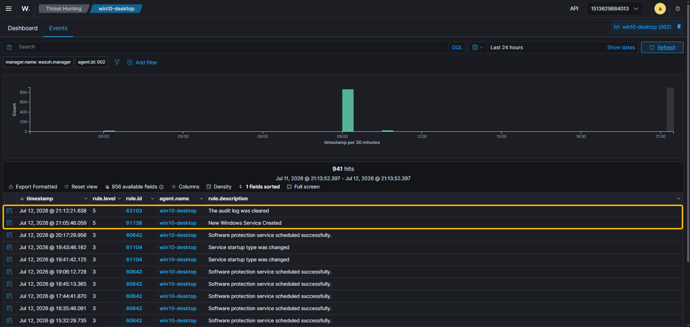

| | |
|---|---|
| **Severity** | High (as a pair) |
| **Observation** | A new auto-start Windows service was created, and about 7 minutes later the Security audit log was cleared: a persist-then-cover-tracks sequence. Log clearing is rarely legitimate and is a strong anti-forensic indicator. |
| **Assessment** | Each rule is only level 5 on its own, but the combination (establishing persistence, then destroying evidence) is what an analyst would escalate on. Because logs were forwarded to the SIEM, the log-clearing destroyed nothing: the off-host copy kept the full record. |
| **MITRE ATT&CK** | T1543.003 (Create/Modify System Process: Windows Service), T1070.001 (Indicator Removal: Clear Windows Event Logs). Tactics: Persistence, Privilege Escalation, Defense Evasion. |
| **Violates** | Service: ISO 27001 A.8.9 (configuration management), NIST 800-53 CM-7 (least functionality). Log clearing: ISO 27001 A.8.15 (logging), NIST 800-53 AU-9 (protection of audit information). |

**Recommended response**

- Investigate the new service (binary path and signature; is it legitimate?)
- Remove it if malicious
- Treat the log clearing as a strong sign of active intrusion
- Preserve remaining logs and rely on the SIEM's off-host copy
- Hunt for the actor, persistence, and lateral movement

**Preventive:** off-host log forwarding (already in place, which is why the clearing hid nothing), restricting service-install rights, and alerting on both service creation and log clearing.

??? note "Alert JSON (rules 61138 and 63103)"

    ```json
    // 61138 - new Windows service created
    {
      "agent": { "id": "002", "name": "win10-desktop", "ip": "192.168.0.26" },
      "data": { "win": { "eventdata": {
        "serviceName": "AtomicTestService_CMD",
        "imagePath": "C:\\AtomicRedTeam\\atomics\\T1543.003\\bin\\AtomicService.exe",
        "startType": "auto start", "accountName": "LocalSystem"
      }, "system": { "eventID": "7045", "channel": "System" } } },
      "rule": { "id": "61138", "level": 5, "description": "New Windows Service Created",
        "mitre": { "id": ["T1543.003"], "tactic": ["Persistence","Privilege Escalation"] } }
    }

    // 63103 - the audit log was cleared
    {
      "agent": { "id": "002", "name": "win10-desktop", "ip": "192.168.0.26" },
      "data": { "win": {
        "system": { "eventID": "1102", "channel": "Security" },
        "logFileCleared": { "subjectUserName": "jenni", "subjectDomainName": "DESKTOP-KOIUNTC" }
      } },
      "rule": { "id": "63103", "level": 5, "description": "The audit log was cleared",
        "mitre": { "id": ["T1070"], "tactic": ["Defense Evasion"] } }
    }
    ```

---

#### Dashboard

I created a custom dashboard that brings every detection above into a single pane across all three hosts: a metric summary (detection types, hosts, top severity), a per-host breakdown, a detail table (attack, host, severity), and a timeline of activity. Having everything in one view makes it easier to spot activity across the estate and to summarise it for stakeholders:

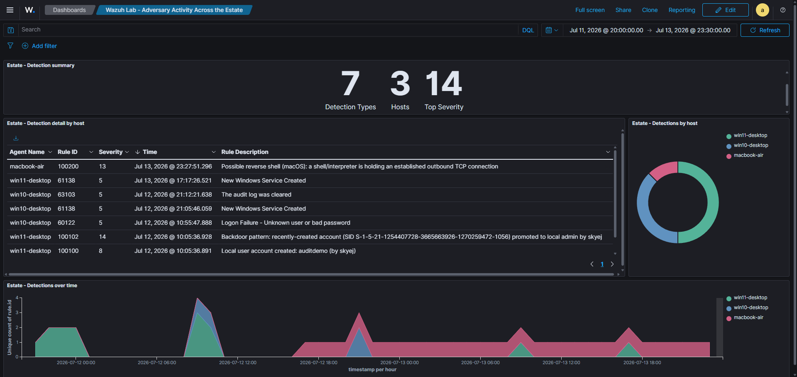

---

### SIEM setup and configuration

A short overview of what was set up. The full step-by-step (Docker deployment, certificate generation, agent enrolment, rule authoring) lives in the separate learning write-up.

- **Platform:** Wazuh 4.14.5 single-node stack (manager, indexer and dashboard) running in Docker on a Windows 11 host (WSL2 backend).
- **Estate:** three native agents enrolled across three operating systems (Windows 11, Windows 10 and macOS), giving real multi-OS coverage on physical machines rather than everything running as virtual machines on one host.
- **Detection engineering:** two custom rules written in [`local_rules.xml`](#local-rules-xml) (AI-assisted): a Windows create-then-elevate backdoor correlation, and a macOS reverse-shell detector built on command monitoring. Both are mapped to MITRE ATT&CK and tagged so they show up in the compliance dashboards.
- **Log sources:** beyond the defaults, I added the Windows Defender event channel (Win11) and a macOS command-monitoring watch, and enabled the relevant Windows audit policies (account management, logon).
- **Compliance:** the built-in NIST 800-53 and PCI DSS dashboards were captured as evidence (shown in the relevant incidents above), with ISO 27001 Annex A mapped manually (Wazuh has no native ISO 27001 dashboard). Full generated reports: [NIST 800-53 (PDF)](reports/wazuh-module-agents-001-nist-1783849787.pdf), [PCI DSS (PDF)](reports/wazuh-module-agents-001-pci-1783849794.pdf).

<a id="local-rules-xml"></a>

??? note "`local_rules.xml` (AI-assisted)"

    ```xml
    <!--
      Custom detection rules - Wazuh home lab
      Author: Jennifer Skye
      Use case (feeds Linear SHA-18): detect the "create-then-elevate" local
      backdoor account pattern - a local account is created for persistence, then
      added to the local Administrators group for privilege escalation, usually
      within the same logon session.
    
      DESIGN NOTES (all learned by testing + confirmed against the Wazuh docs):
    
      1. A composite/correlation rule (if_matched_*) REPLACES the alert of the event
         that triggers it - this is documented, intentional behaviour to reduce alert
         fatigue (many signals collapse into one high-fidelity alert). So on a
         create-then-elevate, the elevate event surfaces the correlation (100102),
         not the component (100101). 100101 surfaces on its own for a standalone
         admin-group add.
    
      2. Atomic child rules (if_sid) otherwise fire ALONGSIDE their parent, which
         produced duplicate alerts (e.g. 60109 + 100100 for one account creation).
         For consistency, the two relevant built-ins are overwritten to level 0:
         they still MATCH (so the custom child rules keep working via if_sid) but no
         longer ALERT. Result - exactly one custom alert per event:
            create              -> 100100
            standalone admin add -> 100101
            create-then-elevate  -> 100100 + 100102
    -->
    <group name="local,windows,">
    
      <!-- ===== Silence the built-ins (still match, level 0 = no alert) ===== -->
    
      <!-- 60109: "User account enabled or created" - superseded by 100100 -->
      <rule id="60109" level="0" overwrite="yes">
        <if_sid>60103</if_sid>
        <field name="win.system.eventID">^624$|^626$|^4720$|^4722$</field>
        <description>User account enabled or created (silenced: superseded by custom rule 100100)</description>
        <options>no_full_log</options>
        <group>adduser,account_changed,</group>
      </rule>
    
      <!-- 60154: "Administrators Group Changed" - superseded by 100101 / 100102 -->
      <rule id="60154" level="0" overwrite="yes">
        <if_sid>60144,60145</if_sid>
        <field name="win.eventdata.targetSid">^S-1-5-32-544$</field>
        <description>Administrators Group Changed (silenced: superseded by custom rules 100101 / 100102)</description>
        <options>no_full_log</options>
        <group>group_changed,win_group_changed,</group>
      </rule>
    
      <!-- ===== Custom detection rules ===== -->
    
      <!-- 100100: a local user account was created (Event 4720).
           Adds the precise technique the built-in omitted: T1136.001. -->
      <rule id="100100" level="8">
        <if_sid>60109</if_sid>
        <field name="win.system.eventID">^4720$</field>
        <description>Local user account created: $(win.eventdata.targetUserName) (by $(win.eventdata.subjectUserName))</description>
        <mitre>
          <id>T1136.001</id>
        </mitre>
        <group>adduser,skyejen_accountwatch,nist_800_53_AC.2,nist_800_53_IA.4,nist_800_53_AU.14,pci_dss_8.1.2,pci_dss_10.2.5,</group>
      </rule>
    
      <!-- 100101: a member was added to the LOCAL Administrators group (Event 4732).
           Matches the language-independent group SID S-1-5-32-544. Corrects the
           built-in's ATT&CK mapping (60154 mis-tagged T1484) and raises severity.
           Atomic child of 60154 - surfaces on its own for a standalone admin add. -->
      <rule id="100101" level="13">
        <if_sid>60154</if_sid>
        <field name="win.system.eventID">^4732$</field>
        <field name="win.eventdata.targetSid">^S-1-5-32-544$</field>
        <description>Member added to the local Administrators group by $(win.eventdata.subjectUserName): privilege escalation / persistence</description>
        <mitre>
          <id>T1098</id>
          <id>T1078.003</id>
        </mitre>
        <group>win_group_changed,privilege_escalation,skyejen_accountwatch,nist_800_53_AC.2,nist_800_53_AC.6,nist_800_53_AU.14,pci_dss_8.1.2,pci_dss_10.2.5,</group>
      </rule>
    
      <!-- 100102: CORRELATION - create-then-elevate. Sibling of 100101 (also if_sid
           60154). Fires on the admin-group add only if a second skyejen_accountwatch
           event (the earlier 100100 creation) occurred in the same logon session
           within 5 minutes. As a composite rule it supersedes 100101 on the shared
           event - by design. The if_sid gate on 4732 prevents it false-firing on two
           account creations alone. -->
      <rule id="100102" level="14" frequency="2" timeframe="300">
        <if_sid>60154</if_sid>
        <field name="win.system.eventID">^4732$</field>
        <field name="win.eventdata.targetSid">^S-1-5-32-544$</field>
        <if_matched_group>skyejen_accountwatch</if_matched_group>
        <same_field>win.eventdata.subjectLogonId</same_field>
        <description>Backdoor pattern: recently-created account (SID $(win.eventdata.memberSid)) promoted to local admin by $(win.eventdata.subjectUserName)</description>
        <mitre>
          <id>T1136.001</id>
          <id>T1098</id>
          <id>T1078.003</id>
        </mitre>
        <group>correlation,privilege_escalation,skyejen_correlation,nist_800_53_AC.2,nist_800_53_AC.6,nist_800_53_AC.7,nist_800_53_AU.14,nist_800_53_SI.4,pci_dss_10.2.5,pci_dss_10.6.1,</group>
      </rule>
    
    </group>
    
    <!--
      macOS reverse-shell detection (command monitoring).
      The agent runs, every 30s: lsof of ESTABLISHED TCP connections held by a
      shell/interpreter (bash/sh/zsh/nc/python/perl/ruby/socat/php) - processes that
      should never hold a network socket. Output is tagged 'reverse_shell_watch'.
      Rule 530 is Wazuh's silent (level 0) base rule for all command output; this
      child rule fires when that watch returns an ESTABLISHED connection - the
      reverse-shell IOC. Built because macOS has no auditd and no built-in
      reverse-shell rule; the built-in netstat rule 533 only flags a generic port
      change.
    -->
    <group name="attack,reverse_shell,">
    
      <rule id="100200" level="13">
        <if_sid>530</if_sid>
        <match>reverse_shell_watch</match>
        <regex>ESTABLISHED</regex>
        <description>Possible reverse shell (macOS): a shell/interpreter is holding an established outbound TCP connection</description>
        <mitre>
          <id>T1059</id>
          <id>T1071</id>
        </mitre>
        <group>attack,reverse_shell,skyejen_correlation,nist_800_53_SI.4,nist_800_53_AU.6,pci_dss_10.6.1,</group>
      </rule>
    
    </group>
    ```
