# #️⃣ Burp Suite: The Basics

**Path:** Cyber Security 101 > Web Hacking > Burp Suite: The Basics  
**Date:** 19/06/2026  
**Difficulty:** Easy

## 📋 What this room covers

This room was devoted to the basics of the Burp Suite. Burp Suite is a Java-based web application security testing framework. It's designed for conducting hands-on and manual web and mobile application penetration testing (including API support). There was a lot of theory in this room, software overview, comparison between different editions, and some practical follow-alongs using Burp Suite Community edition.

## 💻 What I did

Burp Suite captures and enables manipulation of all the HTTP/HTTPS traffic between a browser and a web server. By intercepting requests, users are able to route them to various components within the Burp Suite framework, to view, modify web requests before they reach the server as well as manipulate responses before they are received by the browser.

There are different editions of Burp Suite:
- **Burp Suite Professional** - unrestricted version of Burp Suite Community as well as an automated vulnerability scanner, a fuzzer/brute-forcer without rate limits, saving projects for later use and reporting, a built-in API for integration with other tools, unrestricted access to add new extensions to expand functionality and access to the Burp Suite Collaborator to be able to self-host a unique request catcher or run it on a Portswigger-owned server)
- **Burp Suite Enterprise** - primarily used for continuous scanning as it features an automated scanner that periodically scans web applications for vulnerabilities (like Nessus does for infrastructure). Also, unlike the other editions that allow manual attacks on a local machine, Burp Suite Enterprise resides on a server and constantly scans the target web applications for potential vulnerabilities.
- **Burp Suite Community** - a free edition that is, while limited in features, provides a great set of tools valuable for web application Testing. Since this is the edition that we used in this room, I will cover it separately below.

### Burp Suite Community

#### Feature Overview

This edition contains the following tools:
- **Proxy** - enables interception and modification of requests and responses while interacting with web applications
- **Repeater** - allows capturing, modifying, and resending the same request multiple times (useful when crafting payloads through trial and error, for example, via SQLi, or testing the functionality of an endpoint for vulnerabilities)
- **Intruder** - despite limitations imposed by the community edition, Intruder allows spraying endpoints with requests (useful for brute-force attacks or fuzzing endpoints)
- **Decoder** - can decode captured information or encode payloads before sending them to the target
- **Comparer** - enables comparison of two pieces of data at either the word or byte level
- **Sequencer** - helps to assess randomness of tokens (session cookies or other supposedly random generated data)

Some of these tools are not exclusive to Burp Suite, but can be using such functionalities within the suite itself can make assessments highly efficient.

Apart from the native features, the Java codebase of the Burp Suite allows development of extensions to enhance the frameworks' functionalities. The extensions can be written in Java, Python (via Java Jython interpreter), or Ruby (via Java JRuby interpreter). Burp Suite Extender helps with loading these extensions into the framework, and BApp Store marketplace enables downloading of third-party modules. Some extensions require a professional licence to be used inside the Burp Suite, but some other ones are available for this free edition (for example, Logger++).

#### The Dashboard

The dashboard is divided into four quadrants:
- **Tasks** - allows to define background tasks (with "Live Passive Crawl" on by default, a feature that automatically logs the pages visited)
- **Event Log** - provides information about the actions performed by Burp Suite (starting proxy, details on connections made via Burp)
- **Issue Activity** - displays vulnerabilities identified by the automated scanner, ranked by severity and filterable based on the certainty of said vulnerability (available only on Burp Suite Professional)
- **Advisory** - provides more details about identified vulnerabilities (references, suggested remediations), can be exported into a report (this section may not be populated in the community edition)

#### Navigation

Top menu bars allow to switch between modules and access different module-specific subtabs within each module (e.g. "Proxy" main tab would have "Intercept" subtab).

Navigation is possible within the main window or detaching windows into separate ones.

There is also a great variety of keyboard shortcuts (yay!) for quick navigation.

The Settings menu covers two types of settings, global and project. Configuring settings per project is not available in the community edition. Settings menu is quite extensive and, thankfully, it allows searching, filtering (user & project options), accessing categories (selecting settings by category) for efficient navigation. It's worth mentioning that many tools within the framework have tool-specific settings (e.g. Proxy's own settings).

#### Proxy

##### Overview

Now since we are done with the basics of navigation and feature overview, we can look into some features of Burp Proxy more closely.

- **Intercepting Requests** - requests made via the proxy are held back from reaching the target server for the purpose of forwarding, dropping, editing or sending them to other Burp modules (can be disabled)
- **Capture and Logging** - requests made through the proxy are captured and logged even when the interception is off (available in "HTTP History")
- **WebSocket Support** - WebSocket communication is also captured and logged as additional assistance for further analysis (available in "WebSockets history")
- **Proxy-Specific Settings** - allows extensive control over proxy's behaviour and functionality, notable features include, but not limited to **response interception** (proxy doesn't intercept server responses unless this is explicitly requested on a per-request basis) and **match and replace** (regex support to modify incoming and outgoing requests, such as dynamically changing user agent or cookies)

##### FoxyProxy

Configuring local web browser to redirect traffic through Burp Suite is required to use Burp Suite Proxy. In this room we used FoxyProxy extension in Firefox to achieve that.

The instructions seemed quite intuitive, but I will record them here in case I need to refer to them later.
- Install Foxyproxy extension for Firefox
- Access Options -> +Add
- Fill in the following info: Title - `Burp`, Proxy IP - `127.0.0.1`, Port - `8080` (for our case)
- Save configuration
- Activate configuration by hitting a FoxyProxy icon at the top-right of the Firefox browser and selecting the newly created `Burp` configuration
- Ensure to enable **Intercept is on** in Burp itself (Proxy -> Intercept -> Intercept is on)
- Test (of course!) -> try accessing a website -> (read a book while it's thinking and logging) -> check HTTP requests

**NB!**
- Browser will hang just before the HTTP request is intercepted, this is expected
- Make sure to disable intercept when it's not needed
- Right-clicking on a request in Burp Suite allows request manipulation (forwarding, dropping, etc)

**Result of the setup & steps:** I just intercepted my first request! :party:

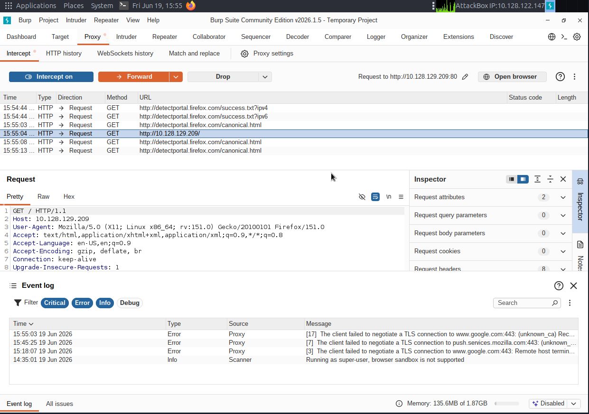

Oh look, my first intercepted response too! :galaxy_wow:

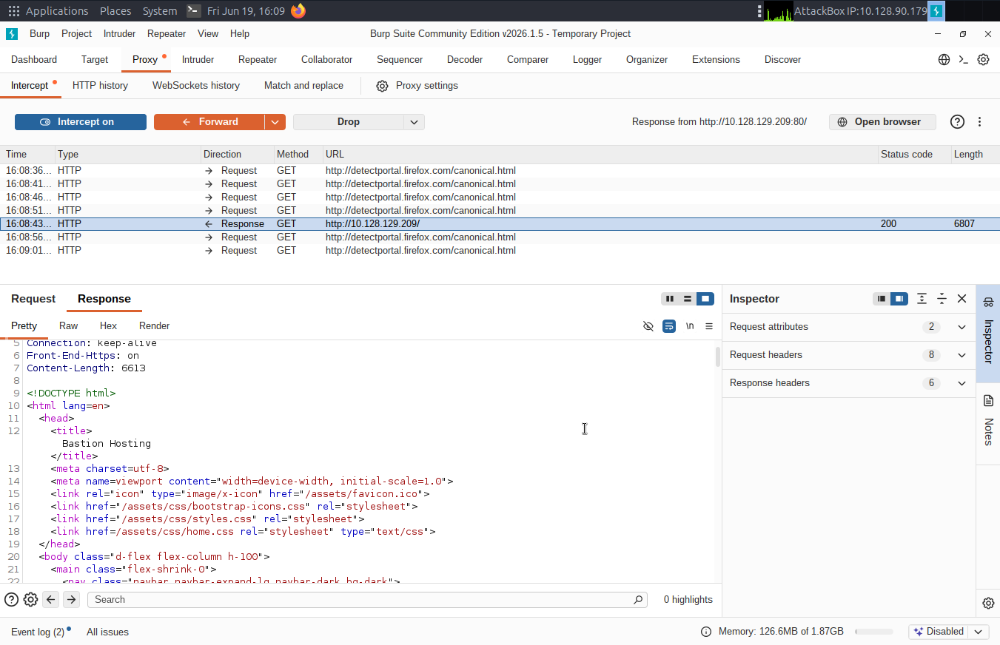

OK now I'm officially overwhelmed and overexcited and need a run:

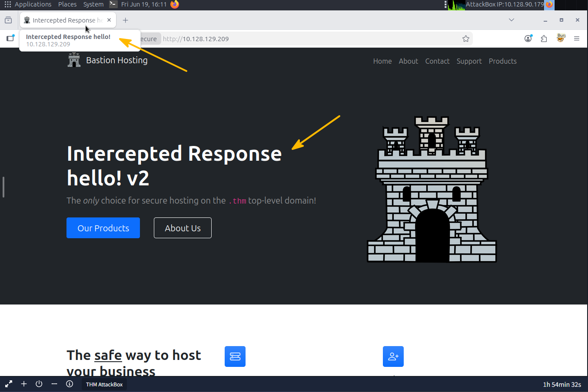

This is my first man-in-the-middle attack. Woah.

OK, I took another detour to explore the possibilities of Burp and related concepts and this is the outcome:

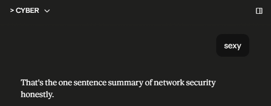

#### Site Map and Issue Definitions

The next thing to go over is the Target tab. It provides control over the scope of our testing as well as other wonderful features. The tab consists of the following three subtabs:
- **Site map** - this allows mapping out a target web application and its API endpoints in a tree structure while visiting its web pages. In professional edition this can be done automatically.
- **Issue definition** - an extensive list of web vulnerabilities (although not the full one that the professional edition has), complete with descriptions and references, that Burp would be scanning for.
- **Scope testing** - controls the target scope, enables the user to include or exclude specific domains/IPs to help them focus on the web applications they are targeting and avoid unnecessary noise (unrelated traffic).

This section finished with a small challenge where I needed to walk through a website to map it out (very cool site map feature!) and then find a suspicious looking response where I found my flag.

P.S. I got sucked in by the Issues tab. Reminds me of my time on compliance for console submissions (video games, yes but) and all the first party requirements. That was my heaven.

#### Burp Suite Browser

Turns out Burp Suite has a built-in browser which doesn't require any configuration (like we did in FoxyProxy). Saying that it cannot be run on Linux as a root user without some modifications. You either create a low-privilege user or you disable sandbox requirement for the browser (potential dangerzone).

So, interesting thing. I was nearly ready to move... but honestly I can't move without testing things myself. I didn't want to follow the easy path (disabling sandbox), so I decided to create a user. I know it sounds funny as I've completed the full learning path, but I couldn't remember how to create a new user. Quick google fixed that, I set up a new user with lower privileges, switched to that in the terminal and then was looking how to launch Burp from there. Google search was giving me weird commands while Claude was like "eh, just `burpsuite` lol". So... I launched it and got this error:

```
synthmaev3@ip-10-128-83-93:/$ burpsuite
Authorization required, but no authorization protocol specified
Authorization required, but no authorization protocol specified
Could not start Burp: java.awt.AWTError: Can't connect to X11 window server using ':0' as the value of the DISPLAY variable.
```

I didn't know what X11 was, although I think I've seen it at work at some point. Anyway, it turned out that X11 is referred to the graphical display that root is running. And this error message referred to the X11 display issue, here, specifically, meaning that the new user doesn't have permissions to use this graphical display.

The way to bypass it was to execute this command:

```
xhost +local:
```

`xhost` controls who can connect to the X11 display server (the thing that renders graphical windows). `+local:` tells it to allow any local user to connect to it, not just root. So once I executed it as root, I could run `burpsuite` command as my new user!

And... tada!

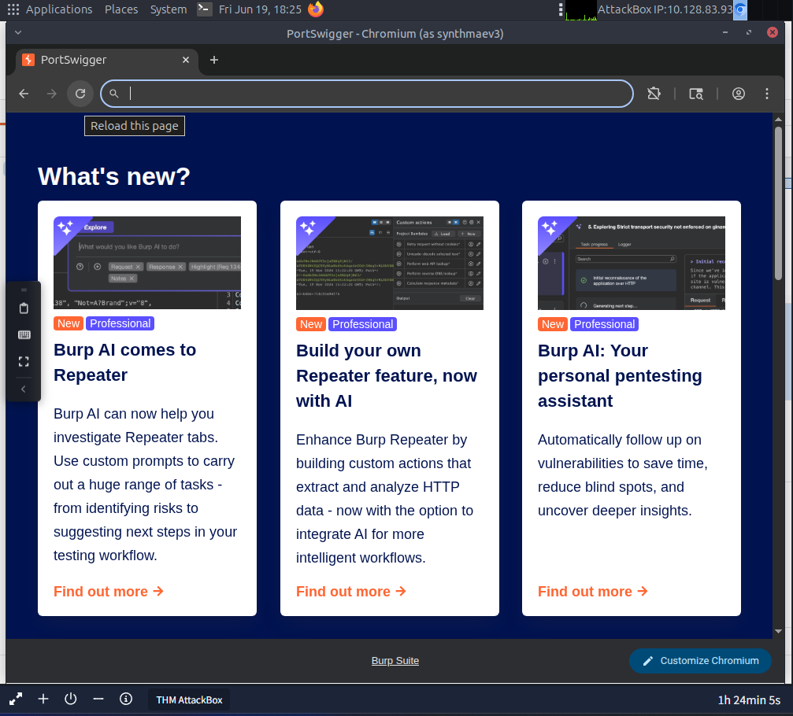

#### Scoping and Targeting

Not sure why this section is split from the scoping stuff we discussed before (I guess to look into it in detail), but we are back to scoping in the Target tab. Here we can filter out unnecessary/unrelated requests and focus our efforts specifically on our target applications.

Worth mentioning that disabling out-of-scope traffic doesn't prevent the proxy from intercepting everything, to prevent this we need to adjust this in the Proxy settings.

Interestingly, the only thing that the theory of this room mentioned was "filtering out the noise". I would assume this would also be defined in the contract/test requirements. Like surely I can be lurking around capturing everything? I guess maybe that's not how it works in a real environment and on a lab machine I will solely have the specific target app.

This section finished with a little practical task where I needed to add the target web application into scope and disable intercepting its traffic within the Proxy settings.

#### Proxying HTTPS

This section went over an issue that may occur when intercepting HTTPS traffic, specifically navigating to sites with TLS enabled (e.g., Google). The error triggered will mention that the PortSwigger Certificate Authority (CA) is not authorised to secure the connection, which occurs because the browser does not trust the certificate presented by Burp Suite. To bypass this issue, we can manually add the PortSwigger CA certificate to our browser's list of trusted certificate authorities (requires downloading the certificate, importing it into browser settings and setting "Trust this CA to identify websites").

#### Example Attack

Finally, the practical. Like a proper one! The coolest thing, I needed to do an XSS injection (Cross-Site Scripting)! This is what I did:
- launched AttackBox and the website VM
- configured and enabled FoxyProxy on Firefox
- enabled Burp to intercept requests (but also set up scope to avoid extra noise)
- accessed /ticket webpage, I forwarded this GET request as I didn't need it
- checked if the client-side validation definitely rejects XSS code in the form itself

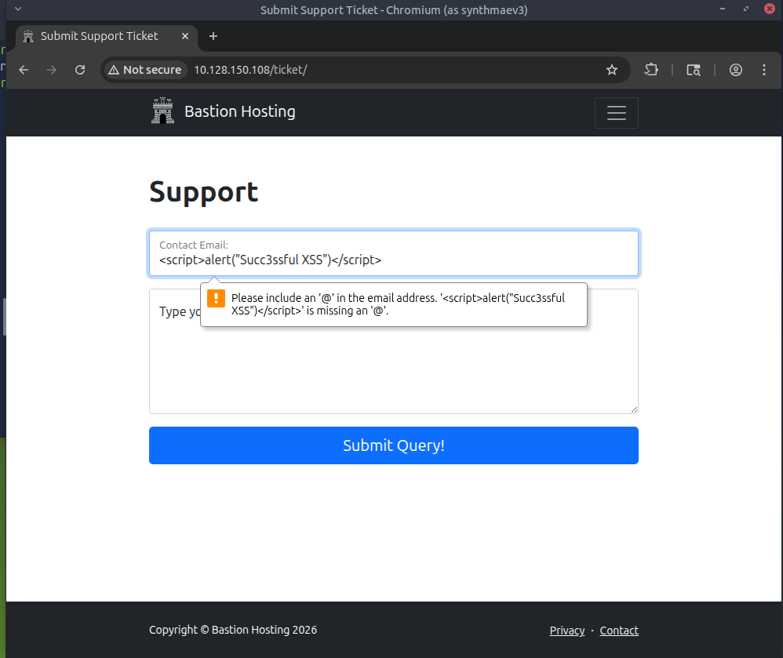

<br>

- submitted the form with values that would be accepted by the client-side validation

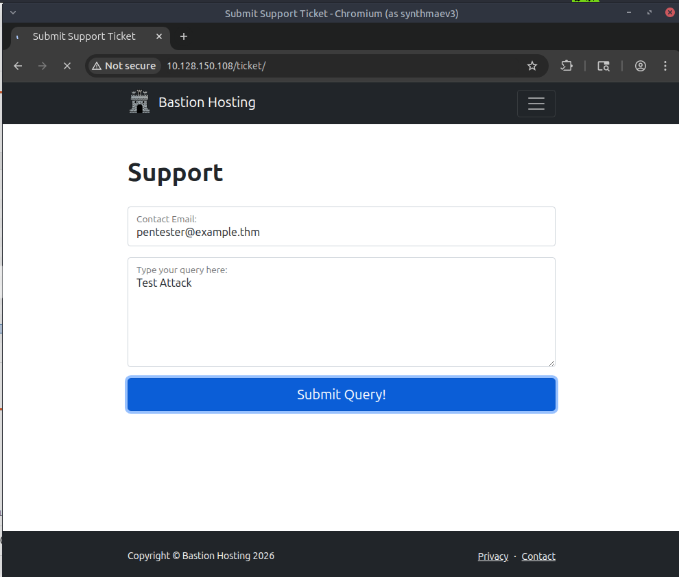

<br>

- intercepted the POST request

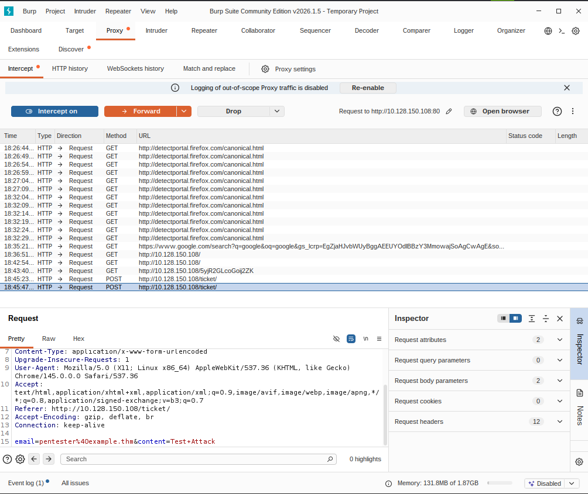

<br>

- modified the POST request in Burp replacing the normal email with a XSS injection

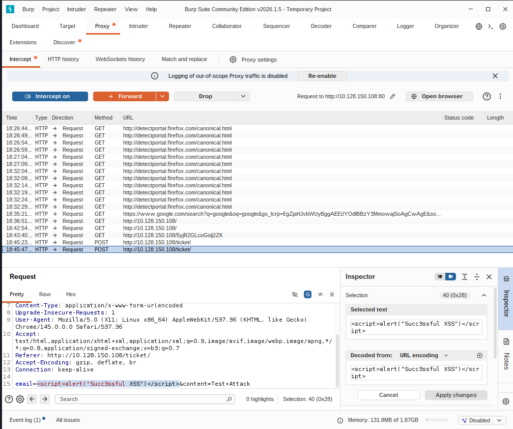

<br>

- encoded the XSS injection

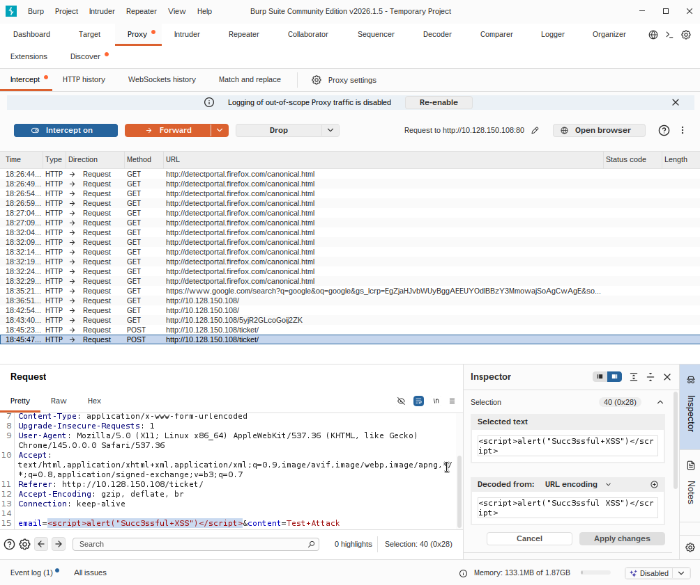

<br>

- forwarded the POST request (the browser was still hanging as an additional GET request was needed to rerender the results)
- forwarded the GET request with the results and got my XSS alert!

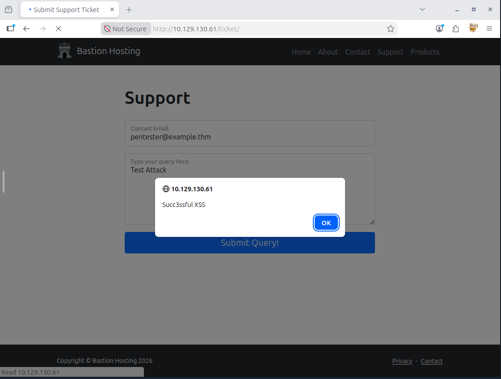

## 🔍 What tripped me up

- My curiosity again... As soon as I intercepted my first request... and then intercepted and modified my first request... it all kind of went downhill from there. After a very much needed walking (doggo time), my boyfriend came back from work, so I had to tell him, but he is from a different industry and not super technical, so I had to explain to him how web applications (browsers and servers, requests and responses) work so I could tell what Burp could do. He was so excited and started asking about random scenarios (it was funny and cute as we thought about the same sneaky scenarios). Then I showed him at my desk (I modified one of the strings to "HELLO {his name}") and he was blown away. Before that and especially after I had a long session with Claude with my million questions about related concepts. I meant to come back to this room to make sure I understood everything and ended up geeking about it for hours haha
- I got a little bit stuck doing the practical (a.k.a. "Example Attack). I did everything according to the instructions (and now my own understanding): configured and enabled FoxyProxy, enabled interception on Burp, accessed /ticket webpage, let that GET request through as I didn't need it, submitted a form on Firefox, changed the email to the XSS injection code, encoded it, and the forwarded. No alert. Where is it? So I redid this several times trying to figure out if I missed a step. Still nothing. Then I noticed a GET request which I didn't expect, so I forwarded it. I got my alert. What is this GET request? I had suspected perhaps this was my browsers way to say "you submitted a form, I got a response from the server, and now I need to rerender the page for you, this is a cheeky GET you didn't technically initiatied". Claude confirmed, so happy days (and makes total sense).

## 💡 Key takeaways

- Client-side validation is basically decorative - the moment you intercept the request after the browser sends it, you can put whatever you want in the fields. Server-side validation is the thing that does the heavy lifting.
- Intercept = request frozen in time, you decide what happens. Passive log = already gone, but you can still grab it and replay it via Repeater. Different workflows, both useful, but for different purposes (e.g., form submission vs brute-force attack).
- Form submission is two requests - POST to send the data, then a GET to load the result page. If you're intercepting, you need to forward both.
- Scope isn't just noise reduction - in a real pentest it defines what you're legally authorised to touch.
- Burp's CA cert trick is why the HTTPS interception works on your own machine, but an attacker can't pull the same move on you without your browser warning you (thankfully).
- Verdict: Burp is a kind of magic that allows you to squeeze in between browser and server, intercept and modify a request or a response, and it's honestly one of the most mindblowing things I've done in this Cyber Security 101 learning path (and I just finished the whole thing, came back to redo Burp).

## 🌟 Bonus!

<details>
<summary>Claude's Wisdom</summary>

I got overexcited intercepting and modifying requests and responses so had a lot to ask Claude. I want to dump it here as I found it super useful:

As an attacker: What you did only works because YOU are the proxy - you're sitting between your own browser and the server. To do this to someone else, you'd need to actually be in the middle of their traffic. That's where things like ARP spoofing come in - you trick devices on the same network into routing their traffic through your machine. So yes, same network is the most common scenario. You become their proxy without them knowing.

The big catch though: this worked because the site is HTTP. If it were HTTPS, the browser would verify the server's certificate. An attacker in the middle can't fake that certificate without the browser screaming at the user. Burp gets around this on YOUR machine because it installs its own CA certificate that your browser is told to trust.

As a pentester: You're not exploiting a vulnerability IN the app here - you're testing the transport layer. So findings would be things like: site not enforcing HTTPS, no HSTS header (which forces browsers to always use HTTPS and refuse downgrades), cookies missing the Secure flag. You'd report those.

If protection is in place: HTTPS with proper cert validation means an attacker's MITM attempt causes the browser to throw a certificate warning. HSTS goes further - it prevents even attempting HTTP in the first place.

The short version: what you just did is exactly why HTTP sites are considered insecure and why HTTPS exists.
</details>