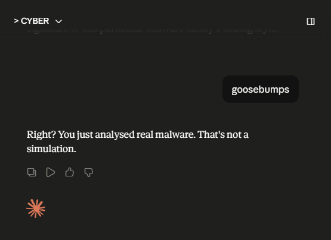
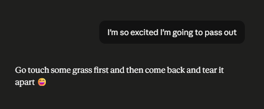

# #️⃣ REMnux: Getting Started

**Path:** Cyber Security 101 > Defensive Security Tooling > REMnux: Getting Started  
**Date:** 12/06/2026  
**Difficulty:** Easy

## 📋 What this room covers

This room was devoted to the REMnux VM, a specialised Linux distribution, which includes tools like Volatility, YARA, Wireshark, oledump, and INetSim. It also provides a sandbox-like environment for analysing suspicious malware without affecting your main system.

## 💻 What I did

### Oledump

The first thing we did was conducting a static file analysis using oledump.py. `Oledump.py` is a Python tool that analyses OLE2 files (Structured Storage/Compound File Binary Format). OLE stands for "Object Linking and Embedding", a technology developed by Microsoft. OLE2 is commonly used to store data of multiple types in a single image (documents, spreadsheets, presentations). This tool helps us to extract and examine the contents of these images.

We were given an .xlsm file and when putting it through oledump.py we found a potentially embedded VBA script inside this file. This was flagged as "stream" A. On the fourth line we saw the capital "M" which stands for "macro" and could be of our interest. The result was in hex dump format. After we made it human-readable, we established that a part of this VBA script contains a public IP, a .PDF, and an .exe inside. That script also mentioned we'd need to run find/replace commands to see what the code actually is, so we did that via CyberChef (yay to GCHQ!). In the end we ended up with a powershell script, which executes in the hidden format (not visible to the user), avoids triggering execution policy (security window), downloads an .exe from a public IP, puts it into a temporary folder and then runs this .exe. This suddenly got really dark... or real?

The whole thing essentially means, if someone opens this original .xlsm file, a macro will run. This macro contains a VBA script which will trigger PowerShell discretely from the user and download the malicious file from that public IP, saves it into a temporary folder and starts running it. I don't know if it's the playlist I'm listening to while studying (specific song: Hexvoid - Broque), or what, but this gave me goosebumps.



After I caught my breath, I was curious to see inside the oledump.py. This is how I learned about "which" command (`which oledump.py`) and `find / -name oledump.py 2>/dev/null` to find the file, which was pretty cool.

### INetSim

Woah. Just woah. That was intense. So I started learning about INetSim (Malware phones home to "the attacker's server" (INetSim on REMnux), a tool that can simulate a network and log any activity as you shut it down.

In this task we used the REMnux VM to set up INetSim and then used the AttackBox to wget files from this network (simulating an infected machine). Then we checked the logs and saw the requests I've done on the Attackbox. I don't know why, but I find it equally unsettling and intoxicating. This new world.

### Volatility

How it started:



How it went:

Sooo... Volatility! This section talked about a Digital Forensics practice called "preprocessing". This is basically parsing raw data and turning it into a JSON. This can be achieved with a tool called Volatility when dealing with memory images (included in REMnux VM). The tool can identify and extract specific artifacts from memory images, the output can be saved into a text file for further analysis. Scripting can help to make the process more efficient.

We ran seven plugins individually to get a feel for each one:

- `windows.pstree.PsTree` - lists processes as a tree, showing parent-child relationships (which process spawned which)
- `windows.pslist.PsList` - lists all active processes at the time of the memory capture
- `windows.cmdline.CmdLine` - shows the command line arguments each process was launched with
- `windows.filescan.FileScan` - scans memory for file objects
- `windows.dlllist.DllList` - lists all DLL modules loaded by each process
- `windows.malfind.Malfind` - flags memory regions that look like they may contain injected code
- `windows.psscan.PsScan` - scans for processes differently to PsList, can catch hidden or recently terminated ones

Then we used a `for` loop to run all plugins in one go and save each output to its own `.txt` file automatically:

```bash
for plugin in windows.malfind.Malfind windows.psscan.PsScan windows.pstree.PsTree ...; do vol3 -q -f wcry.mem $plugin > wcry.$plugin.done; done
```

The `-q` flags stands for "quiet" mode, meaning it won't show the output for each file (would be too overwhelming). The for loop itself with the variable "plugin" of course meant we'd end up with the plugin's output being separated into an individual file. They said this was the "preprocessing evidence" process they mention earlier in they room.

At the end, we extracted strings from the raw memory dump using the Linux `strings` utility - ASCII, 16-bit little-endian, and 16-bit big-endian:

```bash
strings wcry.mem > wcry.strings.ascii.txt
strings -e l wcry.mem > wcry.strings.unicode_little_endian.txt
strings -e b wcry.mem > wcry.strings.unicode_big_endian.txt
```

This pulls out anything human-readable from the binary memory image - URLs, file paths, registry keys, error messages, hardcoded strings. The three formats exist because Windows applications commonly use UTF-16 (little-endian), and if you only extract ASCII you'll miss a lot.

This was the end of the room. It was pretty cool, but I'm left feeling of wanting more. Like... Who injected what into csrss.exe, what WanaDecryptor was doing in memory? What does any of it mean and why is it significant? I guess that's always been a problem for me, wanting to learn everything in all directions lol (although I bet the continuation will be contained in another room in the blue team path!).

The split between preprocessing and analysis also started to make more sense after interogatting Claude a bit. In large incidents you might be imaging 10 machines at once - a first responder's job is speed and correct evidence acquisition, not deep analysis while the attacker is potentially still in the network. There's also a legal dimension: chain of custody requirements mean keeping the collector and the analyst separate reduces contamination risk in court. And in a proper IR team, a generalist first responder and a malware reverse engineer are both technical, just different specialisms. In smaller orgs one person does both. The split is about scale and legal rigour, not about one role being less technical than the other.

## 🔍 What tripped me up

- I think this was the first time I felt like I crossed a line. Not in a way "I did something bad", but as in... maybe "crossed into a new territory". So far the learning journey was fine and safe and just exciting, but this... When I started learning cybersecurity I felt like I opened a door into another dimension, an excited and full of things to solve and learn. This felt like I opened a new door... but this dimension is dark, full of pain and misery. I felt similarly when I watched The Darkest Web, a documentary about INTERPOL officers catching pedophile rings in the dark web. You live your life, enjoy everything it gives you, get upset by meaningless things. While all of this darkness is out there and you don't see it, don't feel it. Don't do anything about it. How?
- INetSim task confused me originally as I read about INetSim's ability to fake a network and was like "ohh woow, so cool, I can set up a fake network so when the attackers try to connect they would just see this curtain instead". This assumption alongside the "AttackBox" being used as a victim confused me as to what we are trying to simulate. Claude poked me to rethink my assumptions and I realised that in this context the fake network was the attacker's server and the "AttackBox" was acting as an infected machine of a victim. So the workflow was: the victim's machine got infected (this was assumed in the task and we didn't need to mimic it), then it would download malicious files from the attacker's network (which was just INetSim in our case). In our example I wget the files, but in a real scenario those would be automatic downloads (just like in the oledump room earlier!).
- I was genuinely a little sad the Volatility section didn't walk through what was actually in those files. Malfind flagged csrss.exe and winlogon.exe as suspected of having injected code - that's huge, that's WannaCry doing process injection to hide itself - and we just... moved on. I understand the room's goal was preprocessing, not analysis, but it felt like being handed a set of X-rays and told "great, these are ready for the doctor" without finding out what they show. I used grep on my own initiative (`vol3 -f wcry.mem windows.dlllist.DllList | grep "WanaDecryptor"`) and started digging a little just to feel like I saw something real in there. Hopefully the blue team path will have more of this though...


## 💡 Key takeaways

- A memory image is a snapshot of everything that was running at a single moment in time - processes, loaded DLLs, network connections, file handles, and things that never touched disk. Volatile evidence -> Volatility.
- Preprocessing is a real workflow: you run all your plugins and string extractions upfront so the forensics analyst gets text files they can search instantly rather than waiting minutes per plugin.
- The difference between PsList and PsScan matters: PsList reads from the active process list (which malware can manipulate), PsScan scans raw memory structures (harder to hide from). Using both together catches discrepancies.
- Malfind flagging csrss.exe and winlogon.exe in WannaCry is significant - process injection into legitimate Windows processes is a classic hiding technique (still want to know more).
- The `strings` utility is deceptively powerful: pulling human-readable text from a binary memory dump can reveal hardcoded URLs, file paths, registry keys, and error messages that the malware never expected anyone to see.
- grep is your friend. When you have 1,400+ lines of FileScan output, knowing what to grep for could be extremely helpful.
- The `for` loop approach to batch-running plugins is a real-world pattern. Scripting repetitive forensics tasks is awesome!


